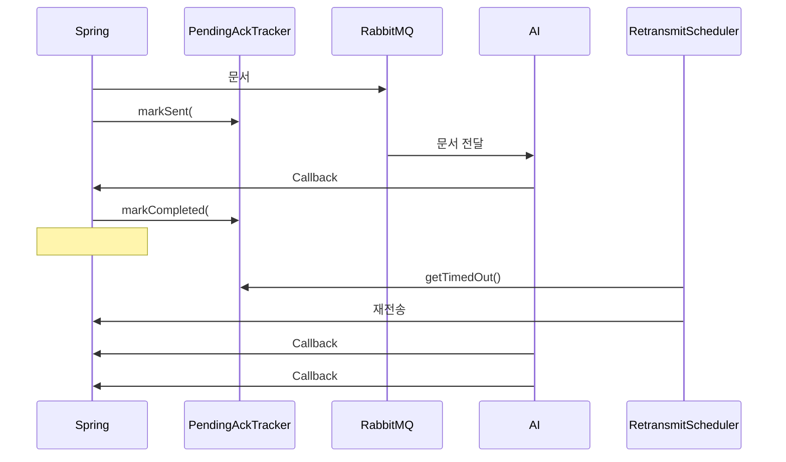

# ACK Timeout & Retransmit Feature - Walkthrough

문서 분석 신뢰성 보장을 위한 ACK 기반 타임아웃 및 재전송 기능 구현

---

## New Components

| File | Description |
|------|-------------|
| `PendingAckTracker.java` | ACK 대기 추적 (ConcurrentHashMap 기반) |
| `RetransmitScheduler.java` | 1분마다 타임아웃 체크, 최대 3회 재시도 |

---

## Message Fields

### DocumentAnalysisMessage (Spring → AI)

| 필드 | 타입 | 필수 | 설명 |
|------|------|------|------|
| `message_type` | String | ✅ | `"DOCUMENT_ANALYSIS_REQUEST"` |
| `document_id` | String | ✅ | 문서 ID (UUID) |
| `project_id` | String | ✅ | 프로젝트 ID |
| `document_order` | Integer | ✅ | **순서 번호 (1, 2, 3...)** |
| `job_id` | String | ✅ | 작업 ID |
| `callback_url` | String | ✅ | 결과 콜백 URL |
| `content` | String | ✅ | 분석할 문서 내용 |
| `trace_id` | String | ✅ | 추적 ID |
| **`batch_id`** | String | ⭕ | 배치 식별자 (null이면 즉시 처리) |
| **`total_documents`** | Integer | ⭕ | **배치 내 총 문서 수** |
| **`batch_timeout_seconds`** | Integer | ⭕ | 배치 타임아웃 (기본 300초) |

> [!NOTE]
> AI Backend는 `batch_id`가 있으면 `total_documents`개가 모두 도착할 때까지 대기합니다.
> 예: `document_order=3`, `total_documents=3` → 마지막 문서임을 인식

### DocumentAnalysisCallback (AI → Spring)

| 필드 | 타입 | 설명 |
|------|------|------|
| `document_id` | String | 처리된 문서 ID |
| `status` | String | `COMPLETED` 또는 `FAILED` |
| `trace_id` | String | 추적 ID (Job 매칭용) |
| `error` | Object | 실패 시 에러 정보 (`code`, `message`) |
| `processing_time_ms` | Long | 처리 시간 (ms) |

---

### PendingAckTracker 상세

**자료구조**: 2단계 중첩 `ConcurrentHashMap`으로 스레드 안전한 ACK 추적

```java
// projectId -> (documentOrder -> 전송 시각)
private final Map<String, Map<Integer, Instant>> pendingAcks = new ConcurrentHashMap<>();
```

**핵심 메서드**:

```java
// 1. 문서 전송 시 등록
public void markSent(String projectId, int documentOrder) {
    pendingAcks
        .computeIfAbsent(projectId, k -> new ConcurrentHashMap<>())
        .put(documentOrder, Instant.now());
}

// 2. Callback 수신 시 완료 처리
public void markCompleted(String projectId, int documentOrder) {
    Map<Integer, Instant> projectAcks = pendingAcks.get(projectId);
    if (projectAcks != null) {
        projectAcks.remove(documentOrder);
        if (projectAcks.isEmpty()) {
            pendingAcks.remove(projectId);  // 메모리 정리
        }
    }
}

// 3. 타임아웃된 문서 조회
public List<PendingDocument> getTimedOut(Duration timeout) {
    Instant cutoff = Instant.now().minus(timeout);
    // cutoff 이전에 전송된 문서 필터링
}
```

---

### RetransmitScheduler 상세

**설정값**:
- `TIMEOUT = 5분` - Callback 대기 시간
- `MAX_RETRIES = 3` - 최대 재시도 횟수
- `fixedRate = 60000` - 1분마다 체크

**핵심 로직**:

```java
@Scheduled(fixedRate = 60000)
public void checkTimeouts() {
    List<PendingDocument> timedOut = ackTracker.getTimedOut(TIMEOUT);
    
    for (PendingDocument pending : timedOut) {
        processTimedOutDocument(pending);
    }
}

private void processTimedOutDocument(PendingDocument pending) {
    Document doc = documentRepository.findByProjectIdAndOrder(...);
    
    // Skip 조건들
    if (doc == null) { ackTracker.markCompleted(...); return; }
    if (doc.getAnalysisStatus() == COMPLETED) { ... return; }
    if (doc.getAnalysisStatus() == PERMANENTLY_FAILED) { ... return; }
    
    // 최대 재시도 초과 → 영구 실패
    if (doc.getAnalysisRetryCount() >= MAX_RETRIES) {
        doc.updateAnalysisStatus(PERMANENTLY_FAILED);
        return;
    }
    
    // 재전송
    doc.resetAnalysisForRetry();  // retryCount++ & QUEUED
    ackTracker.markCompleted(...);  // 기존 pending 제거
    analysisPublisher.publishAnalysisForDocument(doc, "full_manuscript");
}
```

---

## Architecture Flow



---

## Error Handling

| Error Type | Example | Action |
|------------|---------|--------|
| **Retryable** | `LLM_OVERLOAD`, `TIMEOUT`, `NETWORK_ERROR` | ACK 안 함 → 타임아웃 시 재전송 |
| **Permanent** | `INVALID_CONTENT`, `PARSING_ERROR` | ACK 완료 → `PERMANENTLY_FAILED` |
