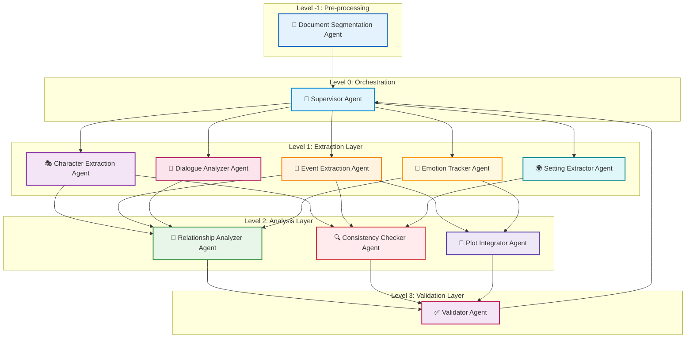
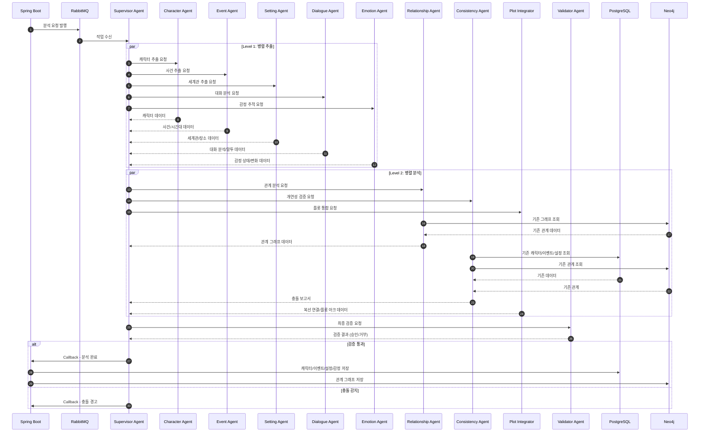
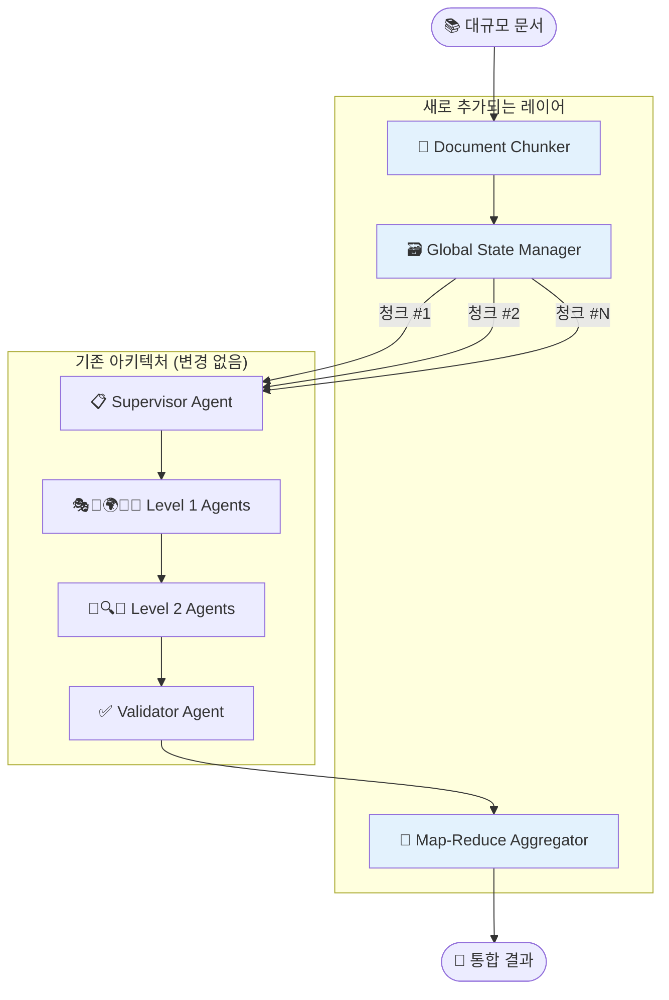
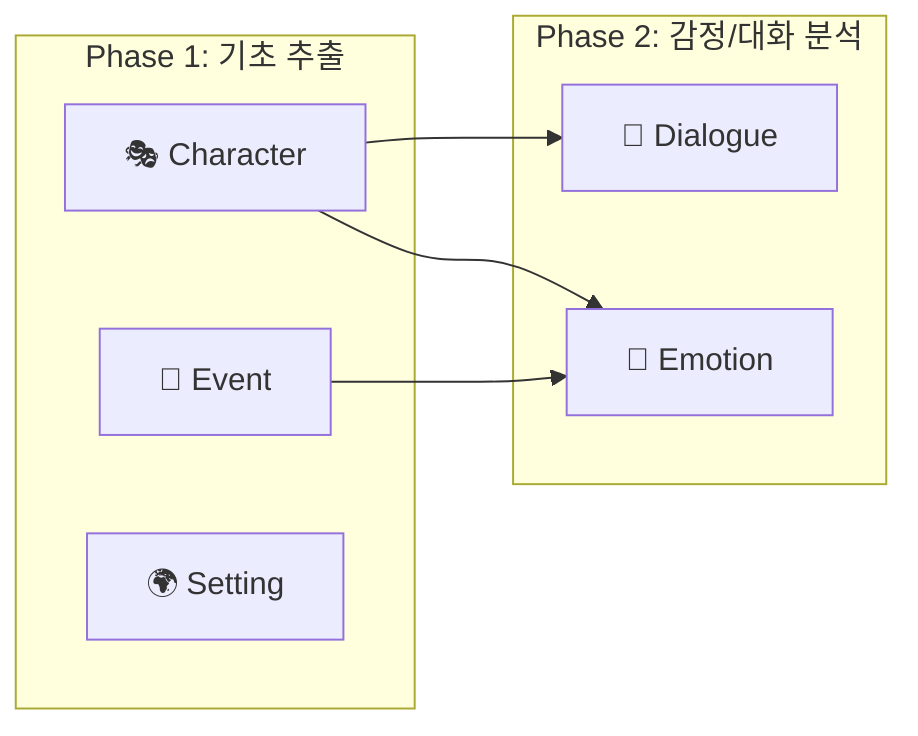

# StoLink Multi-Agent Architecture

> **Version**: 2.0.0  
> **Last Updated**: 2025-12-25  
> **Architecture Type**: Hierarchical (Supervisor Pattern)  
> **Total Agents**: 10 (5 Extraction + 3 Analysis + 1 Validation + 1 Orchestration)

---

## 목차

1. [아키텍처 개요](#1-아키텍처-개요)
2. [에이전트 계층 구조](#2-에이전트-계층-구조)
3. [에이전트 상세 명세](#3-에이전트-상세-명세)
4. [데이터 흐름](#4-데이터-흐름)
5. [State 관리](#5-state-관리)
6. [개연성 검증 메커니즘](#6-개연성-검증-메커니즘)
7. [LangGraph 구현 가이드](#7-langgraph-구현-가이드)
8. [확장성 고려사항](#8-확장성-고려사항)
9. [구현 시 고려사항](#9-구현-시-고려사항) ✨ NEW

---

## 1. 아키텍처 개요

### 1.1 설계 철학

StoLink AI 분석 시스템은 **Hierarchical Supervisor Architecture**를 채택합니다. 이 아키텍처는 다음과 같은 이점을 제공합니다:

1. **Task 격리**: 각 에이전트가 특화된 역할을 수행하여 정확도 향상
2. **할루시네이션 방지**: 검증 단계를 통한 데이터 무결성 보장
3. **확장성**: 새로운 에이전트를 독립적으로 추가 가능
4. **디버깅 용이**: 각 단계별 결과를 추적 가능

### 1.2 전체 아키텍처 다이어그램

```
                    ┌─────────────────────────────────────────────────┐
                    │  📑 DOCUMENT SEGMENTATION AGENT (Pre-processor) │
                    │    - 대용량 문서를 섹션 단위로 분할                │
                    │    - Chapter → Episode → Scene 계층화            │
                    └─────────────────────────────────────────────────┘
                                          │
                                          ▼
┌─────────────────────────────────────────────────────────────────────────────┐
│                        🎯 SUPERVISOR AGENT (Orchestrator)                   │
│                     - 섹션별 작업 분배 및 실행 순서 제어                      │
│                     - 에이전트 간 결과 전달 조정                               │
│                     - 최종 결과 통합                                          │
└─────────────────────────────────────────────────────────────────────────────┘
                                      │
        ┌─────────────────────────────┼─────────────────────────────┐
        │               │             │             │               │
        ▼               ▼             ▼             ▼               ▼
┌─────────────┐ ┌─────────────┐ ┌─────────────┐ ┌─────────────┐ ┌─────────────┐
│ 🎭 CHARACTER│ │ 📅 EVENT   │ │ 🌍 SETTING │ │ 💬 DIALOGUE │ │ 💖 EMOTION │
│  EXTRACTION │ │  EXTRACTION │ │  EXTRACTOR  │ │  ANALYZER   │ │  TRACKER    │
├─────────────┤ ├─────────────┤ ├─────────────┤ ├─────────────┤ ├─────────────┤
│ - 인물 추출 │  │ - 사건 추출 │ │ - 세계관     │ │ - 대화 패턴  │ │ - 감정 상태 │
│ - 특성 분석 │  │ - 시간대    │ │ - 장소/배경  │ │ - 말투/어조  │ │ - 감정 변화 │
│ - 동기 파악 │  │ - 복선 탐지 │ │ - 규칙/법칙  │ │ - 대화 관계  │ │ - 심리 추적 │
└─────────────┘ └─────────────┘ └─────────────┘ └─────────────┘ └─────────────┘
        │               │             │             │               │
        └───────────────┴─────────────┼─────────────┴───────────────┘
                                      │
              ┌───────────────────────┼───────────────────────┐
              │                       │                       │
              ▼                       ▼                       ▼
┌─────────────────────┐  ┌─────────────────────┐  ┌─────────────────────┐
│ 🔗 RELATIONSHIP     │  │ 🔍 CONSISTENCY     │  │ 🎯 PLOT             │
│    ANALYZER         │  │    CHECKER          │  │    INTEGRATOR       │
├─────────────────────┤  ├─────────────────────┤  ├─────────────────────┤
│ - 관계 추론          │  │ - 개연성 검증        │  │ - 복선 연결         │
│ - 관계 변화 추적     │  │ - 설정 충돌 감지     │  │ - 플롯 요약          │
│ - 그래프 생성        │  │ - 모순 경고          │  │ - 스토리 아크       │
└─────────────────────┘  └─────────────────────┘  └─────────────────────┘
              │                       │                       │
              └───────────────────────┼───────────────────────┘
                                      ▼
              ┌─────────────────────────────────────────────────┐
              │      ✅ VALIDATOR AGENT (Quality Gate)          │
              │    - 최종 데이터 검증                             │
              │    - 형식 유효성 확인                             │
              │    - 피드백 루프 제어                             │
              └─────────────────────────────────────────────────┘
```

### 1.3 아키텍처 타입: Hierarchical Supervisor



---

## 2. 에이전트 계층 구조

### 2.1 계층 정의

| 계층 | 레벨 | 에이전트 | 역할 |
|------|------|----------|------|
| **Pre-processing** | Level -1 | 📑 Document Segmentation Agent | 대용량 문서를 의미 단위 섹션으로 분할 |
| **Orchestration** | Level 0 | 🎯 Supervisor Agent | 섹션별 워크플로우 관리 및 라우팅 |
| **Extraction** | Level 1 | 🎭 Character Extraction Agent | 캐릭터 정보 추출 |
| **Extraction** | Level 1 | 📅 Event Extraction Agent | 사건/시간대 추출 |
| **Extraction** | Level 1 | 🌍 Setting Extractor Agent | 세계관/장소/배경 설정 추출 |
| **Extraction** | Level 1 | 💬 Dialogue Analyzer Agent | 대화 패턴 및 말투 분석 |
| **Extraction** | Level 1 | 💖 Emotion Tracker Agent | 캐릭터 감정 상태 및 변화 추적 |
| **Analysis** | Level 2 | 🔗 Relationship Analyzer Agent | 관계 분석 및 그래프 생성 |
| **Analysis** | Level 2 | 🔍 Consistency Checker Agent | 개연성 검증 |
| **Analysis** | Level 2 | 🎯 Plot Integrator Agent | 복선 연결 및 플롯 통합 |
| **Validation** | Level 3 | ✅ Validator Agent | 최종 검증 및 품질 보증 |

### 2.2 실행 순서

```
0. Document Segmentation (문서 분할 - 전체 문서에 대해 1회)
       │
       ▼ (섹션 목록 생성: Chapter → Episode → Scene)
1. Supervisor 수신 → 섹션별 작업 분배
       │
       ├──→ [섹션 1 분석]
       │         ├──→ 2a-e. Extraction 에이전트들 (병렬)
       │         ├──→ 3a-c. Analysis 에이전트들 (병렬)
       │         └──→ 섹션 검증
       │
       ├──→ [섹션 2 분석] (병렬 또는 순차 선택 가능)
       │         └── ...
       │
       └──→ [섹션 N 분석]
                  │
                  ▼
       4. Validator (전체 통합 검증)
                  │
                  ▼
       5. Supervisor → 전체 결과 집계 및 반환
```

**분석 모드 옵션**:
- **병렬 모드**: 모든 섹션을 동시에 분석 (빠르지만 비용 증가)
- **순차 모드**: 섹션별로 순차 분석 (이전 컨텍스트 활용 가능)

---

## 2.5 AWS Bedrock 모델 설정

> [!IMPORTANT]
> 모든 에이전트는 **AWS Bedrock** 모델을 사용합니다. 리전은 **us-east-1 (버지니아)** 를 사용하여 비용 절감과 모델 가용성을 극대화합니다.

### 모델 티어 전략

| 티어 | 모델 | 모델 ID | 용도 | 비용 (입력/출력 per 1K tokens) |
|------|------|---------|------|------------------------------|
| 🥉 **Basic** | Nova Micro | `amazon.nova-micro-v1:0` | 라우팅, 간단한 분류 | $0.000035 / $0.00014 |
| 🥈 **Standard** | Nova Lite | `amazon.nova-lite-v1:0` | 정보 추출, 요약 | $0.00006 / $0.00024 |
| 🥇 **Advanced** | Claude 3.5 Haiku | `anthropic.claude-3-5-haiku-20241022-v1:0` | 복잡한 추론, 핵심 분석 | $0.001 / $0.005 |

### 에이전트별 모델 배정

| 에이전트 | 티어 | 모델 | 이유 |
|---------|------|------|------|
| 📑 DocumentSegmentationAgent | **Advanced** | Claude 3.5 Haiku | 긴 문맥 + 복잡한 구조 분석 |
| 🎯 SupervisorAgent | Basic | Nova Micro | 단순 라우팅 |
| 🎭 CharacterExtractionAgent | Standard | Nova Lite | 정보 추출 |
| 📅 EventExtractionAgent | Standard | Nova Lite | 정보 추출 |
| 🌍 SettingExtractorAgent | Standard | Nova Lite | 정보 추출 |
| 💬 DialogueAnalyzerAgent | Basic | Nova Micro | 단순 분류 |
| 💖 EmotionTrackerAgent | Basic | Nova Micro | 감정 분류 |
| 🔗 RelationshipAnalyzerAgent | **Advanced** | Claude 3.5 Haiku | 복잡한 관계 추론 |
| 🔍 ConsistencyCheckerAgent | **Advanced** | Claude 3.5 Haiku | **핵심! 충돌 감지** |
| 🎯 PlotIntegratorAgent | Standard | Nova Lite | 통합/요약 |
| ✅ ValidatorAgent | Basic | Nova Micro | 단순 검증 |

### Bedrock 클라이언트 초기화

```python
import boto3
from langchain_aws import ChatBedrock

# AWS Bedrock 클라이언트 (us-east-1 리전)
bedrock_runtime = boto3.client(
    service_name="bedrock-runtime",
    region_name="us-east-1"
)

# 모델 팩토리 함수
def get_bedrock_llm(tier: str = "standard", temperature: float = 0):
    """티어별 Bedrock 모델 반환"""
    model_config = {
        "basic": {
            "model_id": "amazon.nova-micro-v1:0",
            "model_kwargs": {"temperature": temperature}
        },
        "standard": {
            "model_id": "amazon.nova-lite-v1:0", 
            "model_kwargs": {"temperature": temperature}
        },
        "advanced": {
            "model_id": "anthropic.claude-3-5-haiku-20241022-v1:0",
            "model_kwargs": {"temperature": temperature, "max_tokens": 4096}
        }
    }
    
    config = model_config.get(tier, model_config["standard"])
    
    return ChatBedrock(
        client=bedrock_runtime,
        model_id=config["model_id"],
        model_kwargs=config["model_kwargs"]
    )

# 사전 정의된 모델 인스턴스
BASIC_LLM = get_bedrock_llm("basic")      # Nova Micro
STANDARD_LLM = get_bedrock_llm("standard") # Nova Lite  
ADVANCED_LLM = get_bedrock_llm("advanced") # Claude 3.5 Haiku
```

---

## 3. 에이전트 상세 명세

### 3.0 Document Segmentation Agent (📑 문서 분할) ✨ NEW

> [!NOTE]
> 이 에이전트는 **Level -1 (Pre-processing)** 에서 실행되며, 다른 모든 에이전트보다 **먼저** 실행됩니다.

**역할**: 대용량 문서를 의미 단위 섹션으로 분할

| 항목 | 설명 |
|------|------|
| **입력** | 전체 소설 텍스트, 문서 메타데이터 |
| **출력** | 계층 구조화된 섹션 데이터 (Chapter → Episode → Scene) |
| **실행 시점** | 전체 문서에 대해 1회만 실행 |

**섹션 계층 구조**:

```
📖 삼국지 (전체 문서)
├── 1화: 황건적의 난 (Chapter)
│   ├── 1-1: 유비의 등장 (Episode)
│   │   ├── 1-1-1: 도원에서의 만남 (Scene)
│   │   └── 1-1-2: 결의 장면 (Scene)
│   └── 1-2: 황건적 토벌 시작 (Episode)
└── 2화: 동탁의 등장 (Chapter)
```

**도구 (Tools)**:

| 도구명 | 타입 | 설명 |
|--------|------|------|
| `PydanticOutputParser` | LangChain 내장 | DocumentStructure 스키마로 파싱 |

**Pydantic 스키마**:
```python
from pydantic import BaseModel, Field
from typing import List, Optional
from enum import Enum

class SectionLevel(str, Enum):
    DOCUMENT = "document"      # 전체 문서
    CHAPTER = "chapter"        # 화/장
    EPISODE = "episode"        # 에피소드/소섹션
    SCENE = "scene"            # 장면 (최소 단위)

class Section(BaseModel):
    """의미 단위 섹션"""
    section_id: str = Field(description="섹션 고유 ID (예: 1, 1-1, 1-1-1)")
    level: SectionLevel = Field(description="섹션 레벨")
    title: str = Field(description="섹션 제목 (예: '황건적의 난')")
    summary: str = Field(description="섹션 요약 (1-2문장)")
    content: str = Field(description="섹션 원문 내용")
    
    # 메타데이터
    start_position: int = Field(description="원문에서의 시작 위치")
    end_position: int = Field(description="원문에서의 끝 위치")
    word_count: int = Field(description="글자 수")
    
    # 계층 관계
    parent_id: Optional[str] = Field(None, description="상위 섹션 ID")
    children: List["Section"] = Field(default_factory=list, description="하위 섹션")
    
    # 스토리 요소
    key_characters: List[str] = Field(default_factory=list, description="주요 등장인물")
    key_events: List[str] = Field(default_factory=list, description="주요 사건")
    mood: Optional[str] = Field(None, description="분위기 (예: 긴장, 평화)")

class DocumentStructure(BaseModel):
    """전체 문서 계층 구조"""
    document_id: str
    document_title: str
    total_sections: int
    total_chapters: int
    total_episodes: int
    total_scenes: int
    sections: List[Section]  # 트리 구조
    table_of_contents: List[dict]  # 목차 형태
```

**LCEL 체인 구현**:
```python
from langchain import hub
from langchain_core.output_parsers import PydanticOutputParser
from langchain_core.prompts import ChatPromptTemplate
# AWS Bedrock 모델 사용 (섹션 2.5 참조)

# 1. 출력 파서 설정
segmentation_parser = PydanticOutputParser(pydantic_object=DocumentStructure)

# 2. 프롬프트 정의
try:
    segmentation_prompt = hub.pull("stolink/document-segmentation")
except:
    segmentation_prompt = ChatPromptTemplate.from_messages([
        ("system", """당신은 소설/시나리오 구조 분석 전문가입니다.
주어진 텍스트를 **이야기의 의미 단위**로 분할하세요.

분할 기준:
1. **Chapter (화/장)**: 주요 스토리 전환점, 시간적 도약, 장소 대대적 변경
2. **Episode (에피소드)**: 하나의 사건이나 갈등의 시작과 해결
3. **Scene (장면)**: 연속적인 시공간에서의 행동 단위

주의사항:
- 글자 수가 아닌 **이야기 맥락**으로 분할
- 각 섹션에 명확한 제목과 요약 부여
- 주요 등장인물과 핵심 사건 식별
- 계층 구조 유지 (document > chapter > episode > scene)

{format_instructions}"""),
        ("human", """[분석할 소설 텍스트]
{document_content}

[문서 정보]
제목: {document_title}

위 텍스트를 의미 단위로 분할하세요.""")
    ])

# 3. 모델 설정: Claude 3.5 Haiku (긴 문맥 + 복잡한 구조 분석)
segmentation_llm = ADVANCED_LLM  # anthropic.claude-3-5-haiku-20241022-v1:0

# 4. LCEL 체인 구성
document_segmentation_chain = (
    {
        "document_content": lambda x: x["content"],
        "document_title": lambda x: x.get("title", "Untitled"),
        "format_instructions": lambda _: segmentation_parser.get_format_instructions()
    }
    | segmentation_prompt
    | segmentation_llm
    | segmentation_parser
)

# 5. 에이전트 노드 함수
async def document_segmentation_node(state: StoryAnalysisState) -> dict:
    """문서 분할 에이전트 노드"""
    result = await document_segmentation_chain.ainvoke({
        "content": state["content"],
        "title": state.get("document_title", "")
    })
    
    return {
        "document_structure": result.model_dump(),
        "sections": [s.model_dump() for s in result.sections],
        "segmentation_done": True
    }
```

**대용량 문서 처리 (계층적 분석)**:
```python
async def hierarchical_document_processing(content: str, title: str):
    """계층적 문서 처리 - 대용량 문서용"""
    
    # Phase 1: 구조 스캔 (저비용 모델 사용)
    structure = await scan_document_structure(
        content,
        model=BASIC_LLM  # Nova Micro - 목차/챕터만 추출
    )
    
    # Phase 2: 챕터별 상세 분석
    for chapter in structure.chapters:
        chapter_content = content[chapter.start:chapter.end]
        
        # 에피소드/씬 분할 (고성능 모델)
        detailed = await segment_chapter(
            chapter_content,
            model=ADVANCED_LLM  # Claude 3.5 Haiku
        )
        
        chapter.episodes = detailed.episodes
```

---

### 3.1 Supervisor Agent (🎯 조율자)

**역할**: 전체 워크플로우 오케스트레이션 및 에이전트 간 조율

| 항목 | 설명 |
|------|------|
| **입력** | 원본 스토리 텍스트, 프로젝트 ID, 기존 컨텍스트 |
| **출력** | 최종 통합 분석 결과 (JSON) |
| **책임** | Task 분배, 결과 수집, 에러 핸들링, 재시도 로직 |

**State 정의**:
```python
from typing import TypedDict, List, Dict, Any, Optional, Annotated
from langgraph.graph import add_messages

class StoryAnalysisState(TypedDict):
    """전체 분석 파이프라인의 공유 상태"""
    # 입력
    content: str                          # 원본 스토리 텍스트
    project_id: str                       # 프로젝트 ID
    job_id: str                           # 분석 작업 ID
    
    # 추출 결과 (Level 1)
    extracted_characters: List[Dict]      # 캐릭터 추출 결과
    extracted_events: List[Dict]          # 사건 추출 결과
    extracted_settings: Dict              # 세계관 설정 결과
    analyzed_dialogues: Dict              # 대화 분석 결과
    tracked_emotions: Dict                # 감정 추적 결과
    
    # 분석 결과 (Level 2)
    relationship_graph: Dict              # 관계 그래프
    consistency_report: Dict              # 개연성 검증 보고서
    plot_integration: Dict                # 플롯 통합 결과
    
    # 검증 결과 (Level 3)
    validation_result: Dict               # 최종 검증 결과
    
    # 기존 데이터 (참조용)
    existing_characters: List[Dict]       # 기존 캐릭터 DB
    existing_events: List[Dict]           # 기존 사건 DB
    existing_relationships: List[Dict]    # 기존 관계 그래프
    
    # 제어 플래그
    extraction_done: bool
    analysis_done: bool
    validation_done: bool
    
    # 메시지 히스토리 (에이전트 간 통신)
    messages: Annotated[List, add_messages]
    
    # 에러 처리
    errors: List[str]
    partial_failure: bool
```

**도구 (Tools)**:

| 도구명 | 타입 | 설명 |
|--------|------|------|
| `Command` | LangGraph 내장 | 다음 실행할 에이전트 라우팅 |
| `Send` | LangGraph 내장 | 병렬 에이전트 호출 (fan-out) |

**의사 결정 로직 (LangGraph Command 사용)**:
```python
from langgraph.types import Command, Send
from langgraph.graph import END
from typing import Literal

def supervisor_node(state: StoryAnalysisState) -> Command[
    Literal["parallel_extraction", "parallel_analysis", "validation", "__end__"]
]:
    """Supervisor: 다음 실행할 에이전트를 결정"""
    
    if not state.get("extraction_done", False):
        # Phase 1: 추출 에이전트들 병렬 실행
        return Command(
            goto="parallel_extraction",
            update={"messages": [{"role": "system", "content": "Phase 1: Extraction started"}]}
        )
    
    elif not state.get("analysis_done", False):
        # Phase 2: 분석 에이전트들 실행
        return Command(
            goto="parallel_analysis",
            update={"messages": [{"role": "system", "content": "Phase 2: Analysis started"}]}
        )
    
    elif not state.get("validation_done", False):
        # Phase 3: 검증 에이전트 실행
        return Command(
            goto="validation",
            update={"messages": [{"role": "system", "content": "Phase 3: Validation started"}]}
        )
    
    else:
        # 완료
        return Command(goto=END)

def parallel_extraction_node(state: StoryAnalysisState) -> list[Send]:
    """Level 1 에이전트들을 병렬로 호출 (Fan-out)"""
    return [
        Send("character_extraction", state),
        Send("event_extraction", state),
        Send("setting_extraction", state),
        Send("dialogue_analysis", state),
        Send("emotion_tracking", state),
    ]
```

**LCEL 체인 - 라우팅 결정**:
```python
from langchain import hub
from langchain_core.output_parsers import StrOutputParser
from langchain_core.prompts import ChatPromptTemplate
# AWS Bedrock 모델 사용 (섹션 2.5 참조)

# LangSmith Hub에서 라우팅 프롬프트 로드 (없으면 커스텀 사용)
try:
    supervisor_agent_prompt = hub.pull("stolink/supervisor-router")
except:
    supervisor_agent_prompt = ChatPromptTemplate.from_messages([
        ("system", """당신은 스토리 분석 파이프라인의 관리자입니다.
현재 상태를 분석하고 다음 단계를 결정하세요.

가능한 선택지:
- extraction: 추출 단계 필요
- analysis: 분석 단계 필요  
- validation: 검증 단계 필요
- complete: 모든 단계 완료

현재 상태:
{state_summary}"""),
        ("human", "다음 단계를 선택하세요. 단어 하나만 응답하세요.")
    ])

# 모델: AWS Bedrock Nova Micro (Basic Tier)
supervisor_agent_llm = BASIC_LLM  # amazon.nova-micro-v1:0

# LCEL 라우팅 체인 (SupervisorAgent)
supervisor_agent_chain = (
    supervisor_agent_prompt
    | supervisor_agent_llm
    | StrOutputParser()
)
```

---

### 3.2 Character Extraction Agent (🎭 캐릭터 추출)

**역할**: 텍스트에서 캐릭터 정보 추출 및 구조화

| 항목 | 설명 |
|------|------|
| **입력** | 스토리 텍스트, 기존 캐릭터 DB (참조용) |
| **출력** | 캐릭터 리스트 (속성 포함) |

**추출 항목**:

| 필드 | 타입 | 설명 | 예시 |
|------|------|------|------|
| `name` | string | 캐릭터 이름 | "톰", "로미오" |
| `role` | enum | 역할 타입 | protagonist, antagonist, supporting |
| `traits` | string[] | 성격 특성 | ["충성스러움", "정의로움"] |
| `motivation` | string | 주요 동기 | "왕국을 지키기 위해" |
| `secret` | string | 숨겨진 비밀/동기 | "사실은 배신자" |
| `physical` | object | 외모 특징 | { hair: "금발", eyes: "파란색" } |
| `status` | string | 현재 상태 | "생존", "부상", "사망" |

**도구 (Tools)**:

| 도구명 | 타입 | 설명 |
|--------|------|------|
| `PydanticOutputParser` | LangChain 내장 | 구조화된 캐릭터 스키마로 파싱 |
| `JsonOutputParser` | LangChain 내장 | JSON 포맷 검증 |

**Pydantic 스키마**:
```python
from pydantic import BaseModel, Field
from typing import List, Optional
from enum import Enum

class CharacterRole(str, Enum):
    PROTAGONIST = "protagonist"
    ANTAGONIST = "antagonist"
    SUPPORTING = "supporting"
    CAMEO = "cameo"

class PhysicalDescription(BaseModel):
    hair: Optional[str] = None
    eyes: Optional[str] = None
    height: Optional[str] = None
    distinctive_features: List[str] = Field(default_factory=list)

class CharacterExtraction(BaseModel):
    """추출된 캐릭터 정보"""
    name: str = Field(description="캐릭터 이름")
    aliases: List[str] = Field(default_factory=list, description="별명/호칭")
    role: CharacterRole = Field(description="역할 타입")
    traits: List[str] = Field(max_length=5, description="성격 특성 (최대 5개)")
    motivation: Optional[str] = Field(None, description="주요 동기")
    secret: Optional[str] = Field(None, description="숨겨진 비밀")
    physical: Optional[PhysicalDescription] = None
    status: str = Field(default="생존", description="현재 상태")
    first_appearance: Optional[str] = Field(None, description="첫 등장 위치")

class CharacterExtractionResult(BaseModel):
    """캐릭터 추출 결과 전체"""
    characters: List[CharacterExtraction]
    extraction_confidence: float = Field(ge=0, le=1)
```

**LCEL 체인 구현**:
```python
from langchain import hub
from langchain_core.output_parsers import PydanticOutputParser
from langchain_core.prompts import ChatPromptTemplate
from langchain_core.runnables import RunnablePassthrough
# AWS Bedrock 모델 사용 (섹션 2.5 참조)

# 1. 출력 파서 설정
character_parser = PydanticOutputParser(pydantic_object=CharacterExtractionResult)

# 2. LangSmith Hub에서 프롬프트 로드 (없으면 커스텀 사용)
try:
    character_extraction_prompt = hub.pull("stolink/character-extraction")
except:
    character_extraction_prompt = ChatPromptTemplate.from_messages([
        ("system", """당신은 소설 텍스트 분석 전문가입니다.
텍스트에서 등장하는 모든 캐릭터를 추출하세요.

각 캐릭터에 대해 분석:
1. 이름 (정확한 명칭) 및 별명/호칭
2. 역할 (protagonist/antagonist/supporting/cameo)
3. 성격 특성 (최대 5개 키워드)
4. 동기 및 목표
5. 외모 특징 (언급된 경우)
6. 숨겨진 의도 (암시된 경우)
7. 현재 상태 (생존/부상/사망)

{format_instructions}"""),
        ("human", """[분석할 텍스트]
{story_text}

[기존 캐릭터 정보 - 참조용]
{existing_characters}

위 텍스트에서 캐릭터를 추출하세요.""")
    ])

# 3. 모델 설정: AWS Bedrock Nova Lite (Standard Tier)
character_extraction_agent_llm = STANDARD_LLM  # amazon.nova-lite-v1:0

# 4. LCEL 체인 구성
character_extraction_chain = (
    {
        "story_text": RunnablePassthrough(),
        "existing_characters": lambda x: x.get("existing_characters", "없음"),
        "format_instructions": lambda _: character_parser.get_format_instructions()
    }
    | character_extraction_prompt
    | character_extraction_model
    | character_parser
)

# 5. 에이전트 노드 함수
async def character_extraction_node(state: StoryAnalysisState) -> dict:
    """캐릭터 추출 에이전트 노드"""
    result = await character_extraction_chain.ainvoke({
        "story_text": state["content"],
        "existing_characters": state.get("existing_characters", [])
    })
    
    return {
        "extracted_characters": [c.model_dump() for c in result.characters]
    }
```

---

### 3.3 Event Extraction Agent (📅 사건/시간대 추출)

**역할**: 스토리에서 사건과 시간 흐름 추출

| 항목 | 설명 |
|------|------|
| **입력** | 스토리 텍스트, 기존 타임라인 (참조용) |
| **출력** | 사건 리스트, 시간대 정보, 복선 후보 |

**추출 항목**:

| 필드 | 타입 | 설명 | 예시 |
|------|------|------|------|
| `event_id` | string | 사건 식별자 | "E001" |
| `description` | string | 사건 설명 | "톰이 로미오를 배신함" |
| `participants` | string[] | 관련 캐릭터 | ["톰", "로미오"] |
| `timestamp` | object | 시간 정보 | { relative: "3일 후", chapter: 5 } |
| `location` | string | 장소 | "성 안의 비밀 통로" |
| `type` | enum | 사건 유형 | action, dialogue, revelation |
| `foreshadowing` | boolean | 복선 여부 | true/false |
| `foreshadowing_tag` | string | 복선 태그 | "#배신의_복선" |

**도구 (Tools)**:

| 도구명 | 타입 | 설명 |
|--------|------|------|
| `PydanticOutputParser` | LangChain 내장 | 구조화된 이벤트 스키마로 파싱 |
| `create_extractor` | LangChain 내장 | 정보 추출 도구 |

**Pydantic 스키마**:
```python
from pydantic import BaseModel, Field
from typing import List, Optional
from enum import Enum

class EventType(str, Enum):
    ACTION = "action"
    DIALOGUE = "dialogue"
    REVELATION = "revelation"
    FLASHBACK = "flashback"
    FORESHADOWING = "foreshadowing"

class TimeStamp(BaseModel):
    relative: Optional[str] = Field(None, description="상대적 시간 (예: '3일 후')")
    absolute: Optional[str] = Field(None, description="절대적 시간 (예: '1492년 10월')")
    chapter: Optional[int] = Field(None, description="챕터 번호")
    sequence_order: int = Field(description="사건 순서")

class EventExtraction(BaseModel):
    """추출된 사건 정보"""
    event_id: str = Field(description="사건 식별자")
    description: str = Field(description="사건 설명")
    participants: List[str] = Field(description="참여 캐릭터들")
    timestamp: TimeStamp
    location: Optional[str] = Field(None, description="장소")
    event_type: EventType = Field(description="사건 유형")
    is_foreshadowing: bool = Field(default=False, description="복선 여부")
    foreshadowing_tag: Optional[str] = Field(None, description="복선 태그")
    importance: int = Field(ge=1, le=10, description="중요도 (1-10)")

class EventExtractionResult(BaseModel):
    """사건 추출 결과 전체"""
    events: List[EventExtraction]
    timeline_summary: str = Field(description="타임라인 요약")
```

**LCEL 체인 구현**:
```python
from langchain import hub
from langchain_core.output_parsers import PydanticOutputParser
from langchain_core.prompts import ChatPromptTemplate
from langchain_core.runnables import RunnablePassthrough, RunnableLambda
# AWS Bedrock 모델 사용 (섹션 2.5 참조)

# 1. 출력 파서 설정
event_parser = PydanticOutputParser(pydantic_object=EventExtractionResult)

# 2. LangSmith Hub에서 프롬프트 로드 (없으면 커스텀 사용)
try:
    event_extraction_agent_prompt = hub.pull("stolink/event-extraction")
except:
    event_extraction_agent_prompt = ChatPromptTemplate.from_messages([
        ("system", """당신은 스토리 분석 전문가입니다.
텍스트에서 발생하는 모든 사건을 추출하고 시간순으로 정렬하세요.

각 사건에 대해 분석:
1. 사건 ID (E001, E002... 형식)
2. 사건 설명 (간결하게)
3. 참여 캐릭터
4. 시간 정보 (상대적/절대적)
5. 장소
6. 사건 유형 (action/dialogue/revelation/flashback/foreshadowing)
7. 복선 여부 및 태그
8. 중요도 (1-10)

복선 탐지 규칙:
- 캐릭터의 의미심장한 행동/대사
- 향후 사건을 암시하는 묘사
- 미해결 상태로 남겨진 갈등

{format_instructions}"""),
        ("human", """[분석할 텍스트]
{story_text}

[기존 타임라인 - 참조용]
{existing_timeline}

위 텍스트에서 사건을 추출하세요.""")
    ])

# 3. 모델 설정: AWS Bedrock Nova Lite (Standard Tier)
event_extraction_agent_llm = STANDARD_LLM  # amazon.nova-lite-v1:0

# 4. LCEL 체인 구성
event_extraction_chain = (
    {
        "story_text": RunnablePassthrough(),
        "existing_timeline": lambda x: x.get("existing_timeline", "없음"),
        "format_instructions": lambda _: event_parser.get_format_instructions()
    }
    | event_extraction_prompt
    | event_extraction_model
    | event_parser
)

# 5. 에이전트 노드 함수
async def event_extraction_node(state: StoryAnalysisState) -> dict:
    """사건 추출 에이전트 노드"""
    result = await event_extraction_chain.ainvoke({
        "story_text": state["content"],
        "existing_timeline": state.get("existing_events", [])
    })
    
    return {
        "extracted_events": [e.model_dump() for e in result.events]
    }
```

---

### 3.4 Relationship Analyzer Agent (🔗 관계 분석)

**역할**: 캐릭터 간 관계를 분석하고 Neo4j 그래프 데이터 생성

| 항목 | 설명 |
|------|------|
| **입력** | 추출된 캐릭터, 추출된 사건, 기존 관계 그래프 |
| **출력** | 관계 그래프 데이터 (Neo4j 형식) |

**관계 타입 정의**:

| 관계 타입 | 설명 | 방향성 |
|-----------|------|--------|
| `FRIENDLY` | 우호적 관계 | 양방향 |
| `RIVAL` | 적대적/라이벌 관계 | 양방향 |
| `FAMILY` | 가족 관계 | 양방향 |
| `ROMANTIC` | 연인/로맨스 관계 | 양방향 |
| `MENTOR` | 스승-제자 관계 | 단방향 |
| `SUBORDINATE` | 상하 관계 | 단방향 |
| `BETRAYED` | 배신 관계 | 단방향 |

**도구 (Tools)**:

| 도구명 | 타입 | 설명 |
|--------|------|------|
| `PydanticOutputParser` | LangChain 내장 | 관계 스키마로 파싱 |
| `neo4j_query_tool` | 커스텀 | Neo4j 기존 관계 조회 |
| `neo4j_write_tool` | 커스텀 | Neo4j 관계 생성/업데이트 |

**Pydantic 스키마**:
```python
from pydantic import BaseModel, Field
from typing import List, Optional, Dict, Any
from enum import Enum

class RelationType(str, Enum):
    FRIENDLY = "FRIENDLY"
    RIVAL = "RIVAL"
    FAMILY = "FAMILY"
    ROMANTIC = "ROMANTIC"
    MENTOR = "MENTOR"
    SUBORDINATE = "SUBORDINATE"
    BETRAYED = "BETRAYED"
    UNKNOWN = "UNKNOWN"

class RelationshipNode(BaseModel):
    """그래프 노드 (캐릭터)"""
    id: str = Field(description="캐릭터 고유 ID")
    name: str = Field(description="캐릭터 이름")
    properties: Dict[str, Any] = Field(default_factory=dict)

class Relationship(BaseModel):
    """캐릭터 간 관계"""
    source: str = Field(description="출발 캐릭터 ID")
    target: str = Field(description="도착 캐릭터 ID")
    relation_type: RelationType = Field(description="관계 유형")
    strength: int = Field(ge=1, le=10, description="관계 강도")
    description: str = Field(description="관계 설명")
    bidirectional: bool = Field(default=True, description="양방향 여부")
    revealed_in_chapter: Optional[int] = None

class RelationshipChange(BaseModel):
    """관계 변화 추적"""
    source: str
    target: str
    previous_type: Optional[RelationType] = None
    new_type: RelationType
    change_trigger: str = Field(description="변화 원인 이벤트")
    chapter: int

class RelationshipAnalysisResult(BaseModel):
    """관계 분석 결과"""
    nodes: List[RelationshipNode]
    relationships: List[Relationship]
    relationship_changes: List[RelationshipChange] = Field(default_factory=list)
```

**커스텀 Neo4j 도구**:
```python
from langchain.tools import tool
from neo4j import GraphDatabase
from typing import List, Dict

class Neo4jTools:
    def __init__(self, uri: str, user: str, password: str):
        self.driver = GraphDatabase.driver(uri, auth=(user, password))
    
    @tool
    def query_existing_relationships(self, character_names: List[str]) -> Dict:
        """기존 캐릭터 관계 조회"""
        query = """
        MATCH (c1:Character)-[r]->(c2:Character)
        WHERE c1.name IN $names OR c2.name IN $names
        RETURN c1.name as source, c2.name as target, 
               type(r) as relation_type, r.strength as strength
        """
        with self.driver.session() as session:
            result = session.run(query, names=character_names)
            return [dict(record) for record in result]
    
    @tool
    def create_relationship(self, source: str, target: str, 
                           relation_type: str, properties: Dict) -> str:
        """Neo4j에 새 관계 생성"""
        query = f"""
        MATCH (c1:Character {{name: $source}})
        MATCH (c2:Character {{name: $target}})
        MERGE (c1)-[r:{relation_type}]->(c2)
        SET r += $properties
        RETURN id(r) as rel_id
        """
        with self.driver.session() as session:
            result = session.run(query, source=source, target=target, properties=properties)
            return f"Relationship created: {result.single()['rel_id']}"

neo4j_tools = Neo4jTools(
    uri="bolt://localhost:7687",
    user="neo4j", 
    password="${NEO4J_PASSWORD}"
)
```

**LCEL 체인 구현**:
```python
from langchain import hub
from langchain_core.output_parsers import PydanticOutputParser
from langchain_core.prompts import ChatPromptTemplate
from langchain_core.runnables import RunnablePassthrough, RunnableLambda
import json
# AWS Bedrock 모델 사용 (섹션 2.5 참조)

# 1. 출력 파서 설정
relationship_parser = PydanticOutputParser(pydantic_object=RelationshipAnalysisResult)

# 2. LangSmith Hub에서 프롬프트 로드 (없으면 커스텀 사용)
try:
    relationship_analyzer_agent_prompt = hub.pull("stolink/relationship-analysis")
except:
    relationship_analyzer_agent_prompt = ChatPromptTemplate.from_messages([
        ("system", """당신은 스토리 관계 분석 전문가입니다.
캐릭터 정보와 사건을 분석하여 캐릭터 간의 관계를 추론하세요.

관계 유형:
- FRIENDLY: 우호적 관계 (친구, 동료)
- RIVAL: 적대적/라이벌 관계
- FAMILY: 가족 관계 (부모, 형제, 친척)
- ROMANTIC: 연인/로맨틱 관계
- MENTOR: 스승-제자 관계 (단방향)
- SUBORDINATE: 상하 관계 (단방향)
- BETRAYED: 배신 관계 (단방향)

분석 시 고려사항:
1. 대화 어조와 호칭에서 관계 추론
2. 행동과 상호작용에서 관계 강도 판단
3. 사건으로 인한 관계 변화 추적
4. 기존 관계와의 일관성 확인

{format_instructions}"""),
        ("human", """[추출된 캐릭터]
{characters}

[추출된 사건]
{events}

[기존 관계 그래프]
{existing_relationships}

위 정보를 바탕으로 관계를 분석하세요.""")
    ])

# 3. 모델 설정: AWS Bedrock Claude 3.5 Haiku (Advanced Tier) - 복잡한 관계 추론
relationship_analyzer_agent_llm = ADVANCED_LLM  # anthropic.claude-3-5-haiku-20241022-v1:0

# 4. LCEL 체인 구성
relationship_analysis_chain = (
    {
        "characters": lambda x: json.dumps(x.get("extracted_characters", []), ensure_ascii=False),
        "events": lambda x: json.dumps(x.get("extracted_events", []), ensure_ascii=False),
        "existing_relationships": lambda x: json.dumps(x.get("existing_relationships", []), ensure_ascii=False),
        "format_instructions": lambda _: relationship_parser.get_format_instructions()
    }
    | relationship_analysis_prompt
    | relationship_model
    | relationship_parser
)

# 5. 에이전트 노드 함수
async def relationship_analysis_node(state: StoryAnalysisState) -> dict:
    """관계 분석 에이전트 노드"""
    result = await relationship_analysis_chain.ainvoke({
        "extracted_characters": state.get("extracted_characters", []),
        "extracted_events": state.get("extracted_events", []),
        "existing_relationships": state.get("existing_relationships", [])
    })
    
    return {
        "relationship_graph": {
            "nodes": [n.model_dump() for n in result.nodes],
            "relationships": [r.model_dump() for r in result.relationships],
            "changes": [c.model_dump() for c in result.relationship_changes]
        }
    }
```

---

### 3.5 Consistency Checker Agent (🔍 개연성 검증)

> [!IMPORTANT]
> **이 에이전트가 핵심 기능입니다**: 새로 들어온 상태와 기존 상태 간의 개연성/설정 충돌을 감지합니다.

**역할**: 스토리의 논리적 일관성 및 설정 충돌 검증

| 항목 | 설명 |
|------|------|
| **입력** | 새 분석 상태, 기존 캐릭터 DB, 기존 이벤트 DB, 기존 관계 그래프 |
| **출력** | 충돌 보고서, 경고 리스트, 개연성 점수 |

**검증 규칙 체계**:

| 규칙 ID | 검증 항목 | 심각도 | 설명 |
|---------|-----------|--------|------|
| `R001` | 캐릭터 성격 일관성 | HIGH | 기존 traits와 행동의 모순 검사 |
| `R002` | 관계 설정 충돌 | HIGH | ex) 친구가 갑자기 적이 됨 (복선 없이) |
| `R003` | 시간대 모순 | MEDIUM | 과거 사건과 현재 사건의 시간 충돌 |
| `R004` | 캐릭터 상태 모순 | CRITICAL | ex) 죽은 캐릭터가 재등장 |
| `R005` | 물리적 설정 충돌 | MEDIUM | ex) 외모, 능력치의 갑작스러운 변경 |
| `R006` | 복선 미회수 경고 | LOW | 설정된 복선의 해소 여부 |

**도구 (Tools)**:

| 도구명 | 타입 | 설명 |
|--------|------|------|
| `PydanticOutputParser` | LangChain 내장 | 충돌 보고서 스키마로 파싱 |
| `vector_similarity_tool` | 커스텀 | 벡터 유사도 기반 성격-행동 일치 검증 |
| `rag_foreshadowing_tool` | 커스텀 | RAG 기반 복선 탐색 |
| `rule_based_checker` | 커스텀 | 규칙 기반 검증 로직 |

**Pydantic 스키마**:
```python
from pydantic import BaseModel, Field
from typing import List, Optional, Dict
from enum import Enum

class Severity(str, Enum):
    CRITICAL = "CRITICAL"
    HIGH = "HIGH"
    MEDIUM = "MEDIUM"
    LOW = "LOW"

class ConflictType(str, Enum):
    PERSONALITY_CONFLICT = "PERSONALITY_CONFLICT"
    RELATIONSHIP_CONFLICT = "RELATIONSHIP_CONFLICT"
    TIMELINE_CONFLICT = "TIMELINE_CONFLICT"
    STATUS_CONFLICT = "STATUS_CONFLICT"
    PHYSICAL_CONFLICT = "PHYSICAL_CONFLICT"
    SETTING_CONFLICT = "SETTING_CONFLICT"

class Evidence(BaseModel):
    existing_setting: str = Field(description="기존 설정 내용")
    new_content: str = Field(description="새로운 내용")
    chapter_reference: Optional[str] = None

class Conflict(BaseModel):
    """감지된 충돌"""
    id: str = Field(description="충돌 ID")
    rule_id: str = Field(description="위반된 규칙 ID")
    severity: Severity
    conflict_type: ConflictType
    title: str = Field(description="충돌 제목")
    description: str = Field(description="충돌 설명")
    affected_characters: List[str] = Field(default_factory=list)
    evidence: Evidence
    suggestions: List[str] = Field(description="해결 제안")

class Warning(BaseModel):
    """경고 사항"""
    id: str
    warning_type: str
    message: str

class ConsistencyReport(BaseModel):
    """개연성 검증 보고서"""
    overall_score: int = Field(ge=0, le=100, description="전체 일관성 점수")
    status: str = Field(description="OK, WARNING, ERROR 중 하나")
    conflicts: List[Conflict] = Field(default_factory=list)
    warnings: List[Warning] = Field(default_factory=list)
    checked_rules: List[str] = Field(description="검사한 규칙 목록")
```

**커스텀 RAG 및 벡터 도구**:
```python
from langchain.tools import tool
from langchain_openai import OpenAIEmbeddings
from langchain_community.vectorstores import Chroma
from sklearn.metrics.pairwise import cosine_similarity
import numpy as np

class ConsistencyTools:
    def __init__(self, vector_store: Chroma):
        self.vector_store = vector_store
        self.embeddings = OpenAIEmbeddings()
        self.SIMILARITY_THRESHOLD = 0.3  # 낮을수록 충돌 가능성
    
    @tool
    def check_personality_consistency(self, character_name: str, 
                                       action_description: str,
                                       existing_traits: List[str]) -> Dict:
        """캐릭터 행동과 기존 성격의 일관성 검증"""
        # 행동과 성격 임베딩
        action_embed = self.embeddings.embed_query(action_description)
        traits_embed = self.embeddings.embed_query(" ".join(existing_traits))
        
        # 코사인 유사도 계산
        similarity = cosine_similarity(
            [action_embed], 
            [traits_embed]
        )[0][0]
        
        is_consistent = similarity >= self.SIMILARITY_THRESHOLD
        
        return {
            "character": character_name,
            "action": action_description,
            "traits": existing_traits,
            "similarity_score": float(similarity),
            "is_consistent": is_consistent,
            "message": f"일관성 점수: {similarity:.2f}" if is_consistent 
                       else f"⚠️ 성격 충돌 감지! (점수: {similarity:.2f})"
        }
    
    @tool
    def search_foreshadowing(self, actor: str, target: str, 
                             action_type: str) -> List[Dict]:
        """RAG 기반 복선 탐색"""
        query = f"'{actor}'가 '{target}'에게 {action_type}을 암시하는 장면"
        
        results = self.vector_store.similarity_search_with_score(query, k=5)
        
        foreshadowing_evidence = []
        for doc, score in results:
            if score > 0.7:  # 관련성 임계값
                foreshadowing_evidence.append({
                    "chapter": doc.metadata.get("chapter", "unknown"),
                    "content": doc.page_content[:200],
                    "relevance_score": float(score),
                    "is_potential_foreshadowing": True
                })
        
        return foreshadowing_evidence
    
    @tool  
    def check_character_status(self, character_name: str,
                                current_status: str,
                                existing_status: str) -> Dict:
        """캐릭터 상태 모순 검사 (예: 죽은 캐릭터 재등장)"""
        IMPOSSIBLE_TRANSITIONS = {
            ("사망", "생존"),
            ("사망", "부상"),
        }
        
        transition = (existing_status, current_status)
        is_conflict = transition in IMPOSSIBLE_TRANSITIONS
        
        return {
            "character": character_name,
            "existing_status": existing_status,
            "new_status": current_status,
            "is_conflict": is_conflict,
            "severity": "CRITICAL" if is_conflict else "OK",
            "message": f"⛔ 상태 모순: {existing_status} → {current_status}" if is_conflict else "OK"
        }

# 초기화
consistency_tools = ConsistencyTools(
    vector_store=Chroma(persist_directory="./chroma_db", embedding_function=OpenAIEmbeddings())
)
```

**LCEL 체인 구현**:
```python
from langchain import hub
from langchain_core.output_parsers import PydanticOutputParser
from langchain_core.prompts import ChatPromptTemplate
from langchain_core.runnables import RunnablePassthrough, RunnableLambda, RunnableParallel
import json
# AWS Bedrock 모델 사용 (섹션 2.5 참조)

# 1. 출력 파서 설정
consistency_parser = PydanticOutputParser(pydantic_object=ConsistencyReport)

# 2. LangSmith Hub에서 프롬프트 로드 (없으면 커스텀 사용)
try:
    consistency_checker_agent_prompt = hub.pull("stolink/consistency-checker")
except:
    consistency_checker_agent_prompt = ChatPromptTemplate.from_messages([
        ("system", """당신은 스토리 개연성 검증 전문가입니다.
새로운 스토리 상태와 기존 상태를 비교하여 설정 충돌을 감지하세요.

검증 규칙:
- R001: 캐릭터 성격 일관성 (HIGH)
- R002: 관계 설정 충돌 (HIGH)
- R003: 시간대 모순 (MEDIUM)
- R004: 캐릭터 상태 모순 (CRITICAL) - 죽은 캐릭터 재등장 등
- R005: 물리적 설정 충돌 (MEDIUM)
- R006: 복선 미회수 경고 (LOW)

충돌 감지 시:
1. 충돌 유형과 심각도 분류
2. 증거 (기존 설정 vs 새 내용) 명시
3. 해결 제안 제공

복선 검증 결과도 참조하세요:
{foreshadowing_results}

{format_instructions}"""),
        ("human", """[새로운 분석 상태]
캐릭터: {new_characters}
사건: {new_events}
관계: {new_relationships}

[기존 상태 - DB에서 조회]
기존 캐릭터: {existing_characters}
기존 사건: {existing_events}
기존 관계: {existing_relationships}

위 정보를 비교하여 충돌을 감지하고 개연성 점수를 산출하세요.""")
    ])

# 3. 모델 설정: AWS Bedrock Claude 3.5 Haiku (Advanced Tier) - 핵심 기능!
consistency_checker_agent_llm = ADVANCED_LLM  # anthropic.claude-3-5-haiku-20241022-v1:0

# 4. 전처리: 복선 탐색 수행
async def run_foreshadowing_check(state: dict) -> str:
    """관계 변화에 대한 복선 탐색"""
    relationship_changes = state.get("relationship_graph", {}).get("changes", [])
    
    results = []
    for change in relationship_changes:
        evidence = consistency_tools.search_foreshadowing.invoke({
            "actor": change["source"],
            "target": change["target"],
            "action_type": change["new_type"]
        })
        results.append({
            "change": change,
            "foreshadowing_found": len(evidence) > 0,
            "evidence": evidence
        })
    
    return json.dumps(results, ensure_ascii=False)

# 5. LCEL 체인 구성
consistency_check_chain = (
    RunnableParallel(
        new_characters=lambda x: json.dumps(x.get("extracted_characters", []), ensure_ascii=False),
        new_events=lambda x: json.dumps(x.get("extracted_events", []), ensure_ascii=False),
        new_relationships=lambda x: json.dumps(x.get("relationship_graph", {}), ensure_ascii=False),
        existing_characters=lambda x: json.dumps(x.get("existing_characters", []), ensure_ascii=False),
        existing_events=lambda x: json.dumps(x.get("existing_events", []), ensure_ascii=False),
        existing_relationships=lambda x: json.dumps(x.get("existing_relationships", []), ensure_ascii=False),
        foreshadowing_results=RunnableLambda(run_foreshadowing_check),
        format_instructions=lambda _: consistency_parser.get_format_instructions()
    )
    | consistency_check_prompt
    | consistency_model
    | consistency_parser
)

# 6. 에이전트 노드 함수
async def consistency_check_node(state: StoryAnalysisState) -> dict:
    """개연성 검증 에이전트 노드"""
    result = await consistency_check_chain.ainvoke({
        "extracted_characters": state.get("extracted_characters", []),
        "extracted_events": state.get("extracted_events", []),
        "relationship_graph": state.get("relationship_graph", {}),
        "existing_characters": state.get("existing_characters", []),
        "existing_events": state.get("existing_events", []),
        "existing_relationships": state.get("existing_relationships", [])
    })
    
    return {
        "consistency_report": result.model_dump()
    }
```

---

### 3.6 Setting Extractor Agent (🌍 세계관/배경 추출)

**역할**: 스토리의 세계관, 장소, 배경 설정, 규칙/법칙 추출 및 구조화

| 항목 | 설명 |
|------|------|
| **입력** | 스토리 텍스트, 기존 세계관 설정 (참조용) |
| **출력** | 세계관 설정, 장소 정보, 규칙/법칙 리스트 |

**추출 항목**:

| 필드 | 타입 | 설명 | 예시 |
|------|------|------|------|
| `world_name` | string | 세계관 이름 | "아스가르드", "현대 서울" |
| `era` | string | 시대 배경 | "중세 판타지", "2045년 근미래" |
| `locations` | Location[] | 장소 목록 | 성, 마을, 숲 등 |
| `rules` | Rule[] | 세계관 규칙/법칙 | 마법 체계, 사회 구조 |
| `technology_level` | string | 기술 수준 | "중세", "스팀펑크", "SF" |
| `culture` | Culture[] | 문화/관습 정보 | 종족별 관습, 축제 등 |
| `restrictions` | string[] | 세계관 제약사항 | "마법은 달빛 아래서만 사용 가능" |

**Location 스키마**:
```json
{
  "location_id": "L001",
  "name": "크리스탈 성",
  "type": "castle",
  "description": "왕국의 중심부에 위치한 수정으로 만들어진 성",
  "parent_location": "아스텔 왕국",
  "notable_features": ["마법 결계", "비밀 통로"],
  "first_mentioned": "1화"
}
```

**Rule 스키마**:
```json
{
  "rule_id": "R001",
  "category": "magic_system",
  "name": "마나 소모 법칙",
  "description": "마법 사용 시 마나를 소모하며, 마나가 고갈되면 생명력을 소모",
  "exceptions": ["정령 계약자는 정령의 마나를 빌릴 수 있음"],
  "importance": "HIGH"
}
```

**도구 (Tools)**:

| 도구명 | 타입 | 설명 |
|--------|------|------|
| `PydanticOutputParser` | LangChain 내장 | 세계관 스키마로 파싱 |
| `JsonOutputParser` | LangChain 내장 | JSON 포맷 검증 |

**Pydantic 스키마**:
```python
from pydantic import BaseModel, Field
from typing import List, Optional
from enum import Enum

class LocationType(str, Enum):
    CASTLE = "castle"
    CITY = "city"
    VILLAGE = "village"
    FOREST = "forest"
    MOUNTAIN = "mountain"
    SEA = "sea"
    DUNGEON = "dungeon"
    OTHER = "other"

class Location(BaseModel):
    """장소 정보"""
    location_id: str = Field(description="장소 고유 ID")
    name: str = Field(description="장소 이름")
    location_type: LocationType
    description: str = Field(description="장소 설명")
    parent_location: Optional[str] = Field(None, description="상위 장소")
    notable_features: List[str] = Field(default_factory=list)
    first_mentioned: Optional[str] = Field(None, description="첫 언급 챕터")

class WorldRule(BaseModel):
    """세계관 규칙/법칙"""
    rule_id: str
    category: str = Field(description="규칙 카테고리 (magic_system, physics, society...)")
    name: str
    description: str
    exceptions: List[str] = Field(default_factory=list)
    importance: str = Field(description="HIGH, MEDIUM, LOW")

class SettingExtractionResult(BaseModel):
    """세계관 추출 결과"""
    world_name: Optional[str] = None
    era: Optional[str] = None
    technology_level: Optional[str] = None
    locations: List[Location] = Field(default_factory=list)
    rules: List[WorldRule] = Field(default_factory=list)
    restrictions: List[str] = Field(default_factory=list)
```

**LCEL 체인 구현**:
```python
from langchain import hub
from langchain_core.output_parsers import PydanticOutputParser
from langchain_core.prompts import ChatPromptTemplate
from langchain_core.runnables import RunnablePassthrough
# AWS Bedrock 모델 사용 (섹션 2.5 참조)

# 1. 출력 파서 설정
setting_parser = PydanticOutputParser(pydantic_object=SettingExtractionResult)

# 2. LangSmith Hub에서 프롬프트 로드
try:
    setting_extraction_prompt = hub.pull("stolink/setting-extraction")
except:
    setting_extraction_prompt = ChatPromptTemplate.from_messages([
        ("system", """당신은 판타지/SF 세계관 분석 전문가입니다.
텍스트에서 세계관 설정을 추출하세요.

분석 항목:
1. 세계관 기본 정보 (이름, 시대, 기술 수준)
2. 등장하는 장소들 (이름, 특징, 위치 관계)
3. 세계관의 규칙/법칙 (마법 체계, 물리 법칙, 사회 규범)
4. 문화/관습 정보
5. 세계관의 제약사항이나 금기

{format_instructions}"""),
        ("human", """[텍스트]
{story_text}

[기존 세계관 설정 - 참조용]
{existing_settings}

위 텍스트에서 세계관 설정을 추출하세요.""")
    ])

# 3. 모델 설정
setting_extractor_agent_llm = STANDARD_LLM  # amazon.nova-lite-v1:0

# 4. LCEL 체인 구성
setting_extraction_chain = (
    {
        "story_text": RunnablePassthrough(),
        "existing_settings": lambda x: x.get("existing_settings", "없음"),
        "format_instructions": lambda _: setting_parser.get_format_instructions()
    }
    | setting_extraction_prompt
    | setting_model
    | setting_parser
)

# 5. 에이전트 노드 함수
async def setting_extraction_node(state: StoryAnalysisState) -> dict:
    """세계관 추출 에이전트 노드"""
    result = await setting_extraction_chain.ainvoke({
        "story_text": state["content"],
        "existing_settings": state.get("extracted_settings", {})
    })
    
    return {"extracted_settings": result.model_dump()}
```

---

### 3.7 Dialogue Analyzer Agent (💬 대화 분석)

**역할**: 캐릭터 간 대화 패턴, 말투, 어조 분석 및 대화를 통한 관계 추론

| 항목 | 설명 |
|------|------|
| **입력** | 스토리 텍스트, 추출된 캐릭터 정보 |
| **출력** | 대화 분석 결과, 말투 패턴, 대화 기반 관계 추론 |

**추출 항목**:

| 필드 | 타입 | 설명 | 예시 |
|------|------|------|------|
| `character_speech_pattern` | SpeechPattern | 캐릭터별 말투 패턴 | 존댓말, 사투리, 특이 어미 |
| `dialogue_relationships` | DialogueRel[] | 대화 기반 관계 | 상하관계, 친밀도 |
| `key_dialogues` | KeyDialogue[] | 중요 대화 | 복선, 갈등 핵심 대화 |
| `subtext_analysis` | Subtext[] | 숨겨진 의미 분석 | 거짓말, 회피 패턴 |

**SpeechPattern 스키마**:
```json
{
  "character_name": "톰",
  "formality_level": "informal",
  "speech_characteristics": [
    "~지 말입니다 어미 사용",
    "군대식 경어 사용",
    "명령문 선호"
  ],
  "vocabulary_level": "formal",
  "emotional_expression": "suppressed",
  "unique_phrases": ["그건 내 관할이 아니야", "명령에 따르겠습니다"],
  "dialect": null
}
```

**DialogueRelationship 스키마**:
```json
{
  "speaker": "톰",
  "listener": "로미오",
  "formality_to_listener": "informal",
  "power_dynamic": "equal",
  "intimacy_level": 8,
  "communication_style": "direct",
  "evidence": [
    { "chapter": 3, "quote": "야, 뭐하냐?" },
    { "chapter": 5, "quote": "네가 아니면 누가 하겠어" }
  ]
}
```

**KeyDialogue 스키마**:
```json
{
  "dialogue_id": "D001",
  "participants": ["톰", "로미오"],
  "chapter": 3,
  "content": """톰: 난 항상 네 편이야.
로미오: 정말? 끝까지?
톰: ...끝까지.""",
  "significance": "foreshadowing",
  "subtext": "톰의 망설임이 향후 배신의 복선",
  "tags": ["#복선", "#배신_암시"]
}
```

**Subtext Analysis**:
```json
{
  "character": "톰",
  "dialogue_context": "로미오와의 대화",
  "surface_meaning": "충성 서약",
  "hidden_meaning": "내적 갈등, 완전한 확신 부재",
  "indicators": ["...으로 말 끊김", "시선 회피 묘사"],
  "confidence": 0.75
}
```

**도구 (Tools)**:

| 도구명 | 타입 | 설명 |
|--------|------|------|
| `PydanticOutputParser` | LangChain 내장 | 대화 분석 스키마로 파싱 |
| `dialogue_extractor` | 커스텀 | 텍스트에서 대화만 추출 |

**LCEL 체인 구현**:
```python
from langchain import hub
# AWS Bedrock 모델 사용 (섹션 2.5 참조)
from langchain_core.output_parsers import PydanticOutputParser
from langchain_core.prompts import ChatPromptTemplate
from langchain_core.runnables import RunnablePassthrough
import json

# Pydantic 스키마 (간략화)
class DialogueAnalysisResult(BaseModel):
    speech_patterns: List[dict]      # 캐릭터별 말투 패턴
    dialogue_relationships: List[dict]  # 대화 기반 관계
    key_dialogues: List[dict]        # 중요 대화
    subtext_analysis: List[dict]     # 숨겨진 의미

# 1. 출력 파서 설정
dialogue_parser = PydanticOutputParser(pydantic_object=DialogueAnalysisResult)

# 2. LangSmith Hub에서 프롬프트 로드
try:
    dialogue_analysis_prompt = hub.pull("stolink/dialogue-analysis")
except:
    dialogue_analysis_prompt = ChatPromptTemplate.from_messages([
        ("system", """당신은 대화 분석 및 캐릭터 심리 전문가입니다.
텍스트에서 대화를 분석하세요.

분석 항목:
1. 각 캐릭터의 말투 패턴 (존댓말, 반말, 특이 어미, 방언)
2. 대화를 통해 드러나는 관계 (상하관계, 친밀도, 권력 역학)
3. 중요한 대화 (복선, 갈등의 핵심이 되는 대화)
4. 숨겨진 의미 분석 (표면적 의미 vs 진짜 의도)
5. 거짓말이나 회피 패턴

{format_instructions}"""),
        ("human", """[텍스트]
{story_text}

[캐릭터 정보]
{extracted_characters}

위 텍스트에서 대화를 분석하세요.""")
    ])

# 3. 모델 및 LCEL 체인 구성
dialogue_analyzer_agent_llm = BASIC_LLM  # amazon.nova-micro-v1:0

dialogue_analysis_chain = (
    {
        "story_text": RunnablePassthrough(),
        "extracted_characters": lambda x: json.dumps(x.get("extracted_characters", []), ensure_ascii=False),
        "format_instructions": lambda _: dialogue_parser.get_format_instructions()
    }
    | dialogue_analysis_prompt
    | dialogue_model
    | dialogue_parser
)

# 4. 에이전트 노드 함수
async def dialogue_analysis_node(state: StoryAnalysisState) -> dict:
    """대화 분석 에이전트 노드"""
    result = await dialogue_analysis_chain.ainvoke({
        "story_text": state["content"],
        "extracted_characters": state.get("extracted_characters", [])
    })
    return {"analyzed_dialogues": result.model_dump()}
```

---

### 3.8 Emotion Tracker Agent (💖 감정 추적)

**역할**: 캐릭터의 감정 상태와 감정 변화를 추적하고 심리 아크 분석

| 항목 | 설명 |
|------|------|
| **입력** | 스토리 텍스트, 추출된 캐릭터, 추출된 사건 |
| **출력** | 감정 상태, 감정 변화 타임라인, 심리 분석 |

**추출 항목**:

| 필드 | 타입 | 설명 | 예시 |
|------|------|------|------|
| `emotion_states` | EmotionState[] | 장면별 감정 상태 | 기쁨, 분노, 슬픔 등 |
| `emotion_arcs` | EmotionArc[] | 감정 변화 곡선 | 캐릭터별 감정 여정 |
| `psychological_notes` | PsychNote[] | 심리 분석 노트 | 트라우마, 동기 분석 |
| `emotional_triggers` | Trigger[] | 감정 유발 요인 | 사건-감정 연결 |

**EmotionState 스키마**:
```json
{
  "character": "로미오",
  "chapter": 7,
  "scene": "톰의 배신 직후",
  "primary_emotion": "shock",
  "secondary_emotions": ["betrayal", "anger", "sadness"],
  "intensity": 9,
  "physical_manifestation": ["몸이 굳음", "눈이 커짐"],
  "internal_monologue": "어떻게... 톰이...?",
  "coping_mechanism": "denial"
}
```

**EmotionArc 스키마**:
```json
{
  "character": "로미오",
  "arc_type": "tragedy",
  "phases": [
    { "chapter": 1, "emotion": "hope", "intensity": 7 },
    { "chapter": 3, "emotion": "joy", "intensity": 9 },
    { "chapter": 5, "emotion": "anxiety", "intensity": 5 },
    { "chapter": 7, "emotion": "devastation", "intensity": 10 }
  ],
  "turning_points": [
    { "chapter": 7, "event": "톰의 배신", "before": "trust", "after": "betrayal" }
  ]
}
```

**EmotionalTrigger 스키마**:
```json
{
  "character": "로미오",
  "trigger_event": "E007 - 톰의 배신",
  "triggered_emotion": "rage",
  "trigger_type": "external",
  "vulnerability": "신뢰에 대한 의존성",
  "predicted_behavior": ["복수 시도", "자기 고립"],
  "chapter": 7
}
```

**PsychologicalNote 스키마**:
```json
{
  "character": "톰",
  "note_type": "motivation_analysis",
  "content": "톰의 배신은 로미오에 대한 열등감과 인정받고자 하는 욕구에서 비롯됨",
  "evidence": [
    { "chapter": 2, "text": "톰은 항상 로미오의 그림자에 있었다" },
    { "chapter": 4, "text": "'언제나 2등이야'라고 중얼거림" }
  ],
  "psychological_concept": "inferiority complex",
  "confidence": 0.85
}
```

**도구 (Tools)**:

| 도구명 | 타입 | 설명 |
|--------|------|------|
| `PydanticOutputParser` | LangChain 내장 | 감정 분석 스키마로 파싱 |
| `emotion_classifier` | 커스텀 | 감정 분류 도구 |

**LCEL 체인 구현**:
```python
from langchain import hub
# AWS Bedrock 모델 사용 (섹션 2.5 참조)
from langchain_core.output_parsers import PydanticOutputParser
from langchain_core.prompts import ChatPromptTemplate
from langchain_core.runnables import RunnablePassthrough
import json

# Pydantic 스키마 (간략화)
class EmotionTrackingResult(BaseModel):
    emotion_states: List[dict]       # 장면별 감정 상태
    emotion_arcs: List[dict]         # 감정 변화 곡선
    psychological_notes: List[dict]  # 심리 분석 노트
    emotional_triggers: List[dict]   # 감정 유발 요인

# 1. 출력 파서 설정
emotion_parser = PydanticOutputParser(pydantic_object=EmotionTrackingResult)

# 2. LangSmith Hub에서 프롬프트 로드
try:
    emotion_tracking_prompt = hub.pull("stolink/emotion-tracking")
except:
    emotion_tracking_prompt = ChatPromptTemplate.from_messages([
        ("system", """당신은 캐릭터 심리 및 감정 분석 전문가입니다.
텍스트에서 캐릭터들의 감정을 분석하세요.

분석 항목:
1. 각 장면에서 캐릭터의 감정 상태 (주요 감정, 강도, 신체적 표현)
2. 감정 변화 추적 (어떤 사건이 어떤 감정 변화를 일으켰는지)
3. 캐릭터별 감정 아크 (희망 → 절망 등의 전체 여정)
4. 심리적 트라우마나 취약점
5. 감정 유발 요인과 대처 방식

{format_instructions}"""),
        ("human", """[텍스트]
{story_text}

[캐릭터 정보]
{extracted_characters}

[사건 정보]
{extracted_events}

위 텍스트에서 캐릭터들의 감정을 분석하세요.""")
    ])

# 3. 모델 및 LCEL 체인 구성
emotion_tracker_agent_llm = BASIC_LLM  # amazon.nova-micro-v1:0

emotion_tracking_chain = (
    {
        "story_text": RunnablePassthrough(),
        "extracted_characters": lambda x: json.dumps(x.get("extracted_characters", []), ensure_ascii=False),
        "extracted_events": lambda x: json.dumps(x.get("extracted_events", []), ensure_ascii=False),
        "format_instructions": lambda _: emotion_parser.get_format_instructions()
    }
    | emotion_tracking_prompt
    | emotion_model
    | emotion_parser
)

# 4. 에이전트 노드 함수
async def emotion_tracking_node(state: StoryAnalysisState) -> dict:
    """감정 추적 에이전트 노드"""
    result = await emotion_tracking_chain.ainvoke({
        "story_text": state["content"],
        "extracted_characters": state.get("extracted_characters", []),
        "extracted_events": state.get("extracted_events", [])
    })
    return {"tracked_emotions": result.model_dump()}
```

---

### 3.9 Plot Integrator Agent (🎯 플롯 통합)

**역할**: 복선 연결, 사건 연결, 플롯 요약 및 스토리 아크 생성

> [!NOTE]
> 이 에이전트는 Event Extraction과 Emotion Tracker의 결과를 통합하여 전체 스토리 구조를 분석합니다.

| 항목 | 설명 |
|------|------|
| **입력** | 추출된 사건, 감정 변화, 복선 정보 |
| **출력** | 복선 연결 맵, 플롯 요약, 스토리 아크 |

**추출 항목**:

| 필드 | 타입 | 설명 | 예시 |
|------|------|------|------|
| `foreshadowing_links` | ForeshadowLink[] | 복선-회수 연결 | 복선과 결과 매핑 |
| `plot_summary` | PlotSummary | 플롯 요약 | 장별/파트별 요약 |
| `story_arcs` | StoryArc[] | 스토리 아크 | 캐릭터/테마별 아크 |
| `tension_curve` | TensionPoint[] | 긴장감 곡선 | 장면별 긴장도 |

**도구 (Tools)**:

| 도구명 | 타입 | 설명 |
|--------|------|------|
| `PydanticOutputParser` | LangChain 내장 | 플롯 스키마로 파싱 |
| `foreshadowing_linker` | 커스텀 | 복선-결과 매칭 도구 |

**LCEL 체인 구현**:
```python
from langchain import hub
# AWS Bedrock 모델 사용 (섹션 2.5 참조)
from langchain_core.output_parsers import PydanticOutputParser
from langchain_core.prompts import ChatPromptTemplate
import json

# Pydantic 스키마 (간략화)
class PlotIntegrationResult(BaseModel):
    foreshadowing_links: List[dict]  # 복선-회수 연결
    plot_summary: dict               # 플롯 요약
    story_arcs: List[dict]           # 스토리 아크
    tension_curve: List[dict]        # 긴장감 곡선

# 1. 출력 파서 설정
plot_parser = PydanticOutputParser(pydantic_object=PlotIntegrationResult)

# 2. LangSmith Hub에서 프롬프트 로드
try:
    plot_integration_prompt = hub.pull("stolink/plot-integration")
except:
    plot_integration_prompt = ChatPromptTemplate.from_messages([
        ("system", """당신은 스토리 구조 분석 전문가입니다.
사건과 감정 정보를 통합하여 플롯을 분석하세요.

분석 항목:
1. 복선-회수 연결 (설치된 복선과 그 결과 매핑)
2. 플롯 요약 (장별/파트별 핵심 사건)
3. 스토리 아크 (캐릭터별/테마별 전개)
4. 긴장감 곡선 (장면별 긴장도 1-10)

{format_instructions}"""),
        ("human", """[추출된 사건]
{extracted_events}

[감정 변화]
{tracked_emotions}

위 정보를 통합하여 플롯을 분석하세요.""")
    ])

# 3. 모델 및 LCEL 체인 구성
plot_integrator_agent_llm = STANDARD_LLM  # amazon.nova-lite-v1:0

plot_integration_chain = (
    {
        "extracted_events": lambda x: json.dumps(x.get("extracted_events", []), ensure_ascii=False),
        "tracked_emotions": lambda x: json.dumps(x.get("tracked_emotions", {}), ensure_ascii=False),
        "format_instructions": lambda _: plot_parser.get_format_instructions()
    }
    | plot_integration_prompt
    | plot_model
    | plot_parser
)

# 4. 에이전트 노드 함수
async def plot_integration_node(state: StoryAnalysisState) -> dict:
    """플롯 통합 에이전트 노드"""
    result = await plot_integration_chain.ainvoke({
        "extracted_events": state.get("extracted_events", []),
        "tracked_emotions": state.get("tracked_emotions", {})
    })
    return {"plot_integration": result.model_dump()}
```

---

### 3.10 Validator Agent (✅ 검증자)

**역할**: 최종 데이터 품질 검증 및 형식 유효성 확인

| 항목 | 설명 |
|------|------|
| **입력** | 모든 에이전트의 출력 결과 |
| **출력** | 검증 완료된 최종 결과 또는 재처리 요청 |

**검증 항목**:

| 검증 타입 | 설명 |
|-----------|------|
| **스키마 검증** | JSON 스키마 준수 여부 |
| **참조 무결성** | 캐릭터 ID, 이벤트 ID, 장소 ID 참조 유효성 |
| **데이터 완전성** | 필수 필드 존재 여부 |
| **중복 검사** | 동일 캐릭터/이벤트/장소 중복 추출 방지 |
| **크로스 검증** | 에이전트 간 결과 일관성 (예: 감정과 대화의 일치) |

**도구 (Tools)**:

| 도구명 | 타입 | 설명 |
|--------|------|------|
| `PydanticOutputParser` | LangChain 내장 | 검증 결과 스키마로 파싱 |
| `schema_validator` | 커스텀 | JSON 스키마 검증 |
| `reference_checker` | 커스텀 | 참조 무결성 검사 |
| `cross_agent_validator` | 커스텀 | 에이전트 간 일관성 검증 |

**LCEL 체인 구현**:
```python
from langchain import hub
# AWS Bedrock 모델 사용 (섹션 2.5 참조)
from langchain_core.output_parsers import PydanticOutputParser
from langchain_core.prompts import ChatPromptTemplate
from langgraph.types import Command
import json

# Pydantic 스키마
class ValidationResult(BaseModel):
    is_valid: bool = Field(description="전체 검증 통과 여부")
    quality_score: int = Field(ge=0, le=100, description="품질 점수")
    schema_errors: List[dict] = Field(default_factory=list)
    reference_errors: List[dict] = Field(default_factory=list)
    cross_validation_errors: List[dict] = Field(default_factory=list)
    warnings: List[str] = Field(default_factory=list)
    action: str = Field(description="approve, retry_extraction, human_review 중 하나")

# 1. 출력 파서 설정
validator_parser = PydanticOutputParser(pydantic_object=ValidationResult)

# 2. LangSmith Hub에서 프롬프트 로드
try:
    validation_prompt = hub.pull("stolink/validator")
except:
    validation_prompt = ChatPromptTemplate.from_messages([
        ("system", """당신은 데이터 품질 검증 전문가입니다.
모든 에이전트의 출력 결과를 검증하세요.

검증 항목:
1. 스키마 검증: 각 결과가 정의된 스키마를 준수하는지
2. 참조 무결성: 캐릭터/이벤트 ID가 실제로 존재하는지
3. 데이터 완전성: 필수 필드가 모두 존재하는지
4. 중복 검사: 동일 엔티티가 중복 추출되지 않았는지
5. 크로스 검증: 에이전트 간 결과가 일관되는지

결과에 따라:
- approve: 모든 검증 통과
- retry_extraction: 심각한 오류로 재추출 필요
- human_review: 경고 수준 문제로 인간 검토 필요

{format_instructions}"""),
        ("human", """[모든 에이전트 결과]
{all_results}

위 결과를 검증하세요.""")
    ])

# 3. 모델 및 LCEL 체인 구성
validator_agent_llm = BASIC_LLM  # amazon.nova-micro-v1:0

validation_chain = (
    {
        "all_results": lambda x: json.dumps({
            "characters": x.get("extracted_characters", []),
            "events": x.get("extracted_events", []),
            "settings": x.get("extracted_settings", {}),
            "dialogues": x.get("analyzed_dialogues", {}),
            "emotions": x.get("tracked_emotions", {}),
            "relationships": x.get("relationship_graph", {}),
            "consistency": x.get("consistency_report", {}),
            "plot": x.get("plot_integration", {})
        }, ensure_ascii=False, indent=2),
        "format_instructions": lambda _: validator_parser.get_format_instructions()
    }
    | validation_prompt
    | validator_model
    | validator_parser
)

# 4. 에이전트 노드 함수 (LangGraph Command 반환)
async def validator_node(state: StoryAnalysisState) -> Command:
    """검증 에이전트 노드 - 피드백 루프 제어"""
    result = await validation_chain.ainvoke(state)
    
    new_state = {
        "validation_result": result.model_dump(),
        "validation_done": True
    }
    
    # 결과에 따른 라우팅
    if result.action == "retry_extraction":
        return Command(
            goto="parallel_extraction",
            update={**new_state, "extraction_done": False}
        )
    elif result.action == "human_review":
        return Command(goto="__end__", update=new_state)
    else:  # approve
        return Command(goto="__end__", update=new_state)
```

---

## 4. 데이터 흐름

### 4.1 전체 파이프라인 시퀀스



### 4.2 입력/출력 데이터 스키마

**입력 (RabbitMQ Message)**:
```json
{
  "job_id": "uuid",
  "project_id": "uuid",
  "document_id": "uuid",
  "content": "스토리 텍스트...",
  "context": {
    "previous_chapters": ["ch1_content", "ch2_content"],
    "existing_characters_count": 5,
    "existing_events_count": 20
  },
  "callback_url": "http://spring:8080/api/internal/ai/callback"
}
```

**출력 (Callback Payload)**:
```json
{
  "job_id": "uuid",
  "status": "COMPLETED | WARNING | FAILED",
  "results": {
    "characters": [...],
    "events": [...],
    "relationships": [...],
    "timeline": [...],
    "foreshadowing": [...],
    "settings": {
      "world_name": "...",
      "locations": [...],
      "rules": [...]
    },
    "dialogues": {
      "speech_patterns": [...],
      "key_dialogues": [...]
    },
    "emotions": {
      "emotion_states": [...],
      "emotion_arcs": [...]
    },
    "plot_integration": {
      "foreshadowing_links": [...],
      "story_arcs": [...]
    }
  },
  "consistency_report": {
    "overall_score": 85,
    "conflicts": [...],
    "warnings": [...]
  },
  "metadata": {
    "processing_time_ms": 5500,
    "tokens_used": 8200,
    "agents_executed": ["character", "event", "setting", "dialogue", "emotion", "relationship", "consistency", "plot", "validator"]
  }
}
```

---

## 5. State 관리

### 5.1 LangGraph State Schema

```python
from typing import TypedDict, List, Optional, Literal
from pydantic import BaseModel

class CharacterData(BaseModel):
    name: str
    role: Literal["protagonist", "antagonist", "supporting", "mentor", "sidekick", "other"]
    traits: List[str]
    motivation: Optional[str]
    secret: Optional[str]
    status: str

class EventData(BaseModel):
    event_id: str
    description: str
    participants: List[str]
    timestamp: dict
    type: Literal["action", "dialogue", "revelation"]
    foreshadowing: bool

class RelationshipData(BaseModel):
    source: str
    target: str
    type: str
    strength: int
    description: Optional[str]

class ConflictData(BaseModel):
    id: str
    severity: Literal["LOW", "MEDIUM", "HIGH", "CRITICAL"]
    type: str
    description: str
    suggestions: List[str]

# NEW: Setting Data Models
class LocationData(BaseModel):
    location_id: str
    name: str
    type: str
    description: str
    parent_location: Optional[str]
    notable_features: List[str]

class WorldRuleData(BaseModel):
    rule_id: str
    category: str
    name: str
    description: str
    exceptions: List[str]
    importance: Literal["LOW", "MEDIUM", "HIGH"]

class SettingData(BaseModel):
    world_name: Optional[str]
    era: Optional[str]
    locations: List[LocationData]
    rules: List[WorldRuleData]
    technology_level: Optional[str]

# NEW: Dialogue Data Models
class SpeechPatternData(BaseModel):
    character_name: str
    formality_level: Literal["formal", "informal", "mixed"]
    speech_characteristics: List[str]
    unique_phrases: List[str]
    dialect: Optional[str]

class KeyDialogueData(BaseModel):
    dialogue_id: str
    participants: List[str]
    chapter: int
    content: str
    significance: str
    subtext: Optional[str]
    tags: List[str]

class DialogueAnalysisData(BaseModel):
    speech_patterns: List[SpeechPatternData]
    key_dialogues: List[KeyDialogueData]

# NEW: Emotion Data Models
class EmotionStateData(BaseModel):
    character: str
    chapter: int
    scene: str
    primary_emotion: str
    secondary_emotions: List[str]
    intensity: int  # 1-10
    coping_mechanism: Optional[str]

class EmotionArcData(BaseModel):
    character: str
    arc_type: str
    phases: List[dict]
    turning_points: List[dict]

class EmotionTrackingData(BaseModel):
    emotion_states: List[EmotionStateData]
    emotion_arcs: List[EmotionArcData]

# NEW: Plot Integration Data Models
class ForeshadowLinkData(BaseModel):
    foreshadow_id: str
    setup_chapter: int
    setup_content: str
    payoff_chapter: Optional[int]
    payoff_content: Optional[str]
    connection_strength: Literal["weak", "moderate", "strong"]
    status: Literal["unresolved", "resolved"]

class PlotIntegrationData(BaseModel):
    foreshadowing_links: List[ForeshadowLinkData]
    story_arcs: List[dict]
    tension_curve: List[dict]

class AgentState(TypedDict):
    # 입력 데이터
    job_id: str
    project_id: str
    document_id: str
    content: str
    
    # 기존 데이터 (컨텍스트)
    existing_characters: List[CharacterData]
    existing_events: List[EventData]
    existing_relationships: List[RelationshipData]
    existing_settings: Optional[SettingData]
    
    # Level 1 에이전트 출력
    extracted_characters: List[CharacterData]
    extracted_events: List[EventData]
    extracted_settings: Optional[SettingData]
    analyzed_dialogues: Optional[DialogueAnalysisData]
    tracked_emotions: Optional[EmotionTrackingData]
    
    # Level 2 에이전트 출력
    analyzed_relationships: List[RelationshipData]
    plot_integration: Optional[PlotIntegrationData]
    
    # 개연성 검증 결과
    consistency_score: float
    conflicts: List[ConflictData]
    warnings: List[str]
    
    # 워크플로우 제어
    extraction_done: bool
    analysis_done: bool
    validation_done: bool
    final_status: Literal["PENDING", "COMPLETED", "WARNING", "FAILED"]
    
    # 메타데이터
    messages: List[str]  # 에이전트 간 통신 로그
    errors: List[str]
```

### 5.2 State 업데이트 패턴

```python
def character_extraction_node(state: AgentState) -> AgentState:
    """캐릭터 추출 노드"""
    # LLM 호출하여 캐릭터 추출
    extracted = extract_characters_llm(
        content=state["content"],
        existing=state["existing_characters"]
    )
    
    # State 업데이트
    return {
        **state,
        "extracted_characters": extracted,
        "messages": state["messages"] + [f"Extracted {len(extracted)} characters"]
    }
```

---

## 6. 개연성 검증 메커니즘

### 6.1 검증 아키텍처

```
┌─────────────────────────────────────────────────────────────────────────┐
│                    CONSISTENCY CHECKER AGENT                            │
├─────────────────────────────────────────────────────────────────────────┤
│                                                                         │
│  ┌────────────────┐    ┌────────────────┐    ┌────────────────┐         │
│  │ Rule-based     │    │ Vector         │    │ RAG-based      │         │
│  │ Validator      │    │ Similarity     │    │ Foreshadowing  │         │
│  │                │    │ Checker        │    │ Search         │         │
│  └───────┬────────┘    └───────┬────────┘    └───────┬────────┘         │
│          │                     │                     │                  │
│          └─────────────────────┼─────────────────────┘                  │
│                                ▼                                        │
│                    ┌────────────────────┐                               │
│                    │ Conflict Aggregator│                               │
│                    └─────────┬──────────┘                               │
│                              │                                          │
│                              ▼                                          │
│                    ┌────────────────────┐                               │
│                    │ Report Generator   │                               │
│                    └────────────────────┘                               │
└─────────────────────────────────────────────────────────────────────────┘
```

### 6.2 예시 시나리오: "톰이 로미오를 배신"

**기존 데이터**:
```json
{
  "character": {
    "name": "톰",
    "traits": ["충성스러움", "정의로움", "우정을 중시함"],
    "relationships": [
      { "target": "로미오", "type": "FRIENDLY", "strength": 10, "note": "피의 맹세로 영원한 우정" }
    ]
  }
}
```

**새 입력**:
```
"톰은 검을 뽑아 로미오의 등을 찔렀다."
```

**검증 프로세스**:

1. **행동 추출**: `{ actor: "톰", action: "공격", target: "로미오" }`

2. **성격 일관성 체크**:
   ```python
   action_embedding = embed("로미오의 등을 찌름")
   traits_embedding = embed("충성스러움, 정의로움, 우정을 중시함")
   similarity = cosine_similarity(action_embedding, traits_embedding)
   # 결과: 0.12 (매우 낮음 → 충돌)
   ```

3. **관계 설정 체크**:
   ```python
   existing_relation = get_relationship("톰", "로미오")
   # type: FRIENDLY, strength: 10
   new_action_implies = "HOSTILE"
   # 충돌 감지!
   ```

4. **복선 탐색 (RAG)**:
   ```python
   foreshadowing = vector_db.search(
       "톰이 로미오에게 수상한 행동을 하는 장면",
       filter={"chapters": [1, 2, 3, 4, 5, 6]}
   )
   # 결과: 복선 없음
   ```

5. **충돌 보고서 생성**:
   ```json
   {
     "conflict": {
       "severity": "HIGH",
       "type": "RELATIONSHIP_AND_PERSONALITY_CONFLICT",
       "message": "톰은 '충성스러움' 성격과 로미오와의 '피의 맹세' 관계가 있습니다. 갑작스러운 배신은 개연성이 부족합니다.",
       "evidence": {
         "chapter_3": "피의 맹세 장면",
         "personality_score": 0.12
       },
       "suggestions": [
         "톰의 숨겨진 동기(secret)를 설정하세요",
         "이전 챕터에 복선을 추가하세요",
         "이 전개가 의도적이라면, 톰을 '배신자'로 재설정하세요"
       ]
     }
   }
   ```

### 6.3 작가 피드백 플로우

```
┌──────────┐     충돌 감지        ┌──────────┐      경고 표시      ┌──────────┐
│  에이전   │ ──────────────────▶│  Spring  │ ──────────────────▶│   작가   │
└──────────┘                     └──────────┘                     └─────┬────┘
                                                                        │
     ┌──────────────────────────────────────────────────────────────────┘
     │ 작가 선택:
     │
     ├─▶ A) "톰은 사실 배신자야" 
     │       → 캐릭터 설정에 secret 추가
     │       → 관계를 BETRAYED로 업데이트
     │
     ├─▶ B) "복선을 추가할게"
     │       → 이전 챕터에 복선 태그 추가
     │       → 시스템이 복선 추적
     │
     └─▶ C) "이 충돌 무시"
             → 충돌 무시 처리
             → 향후 동일 충돌 경고 억제
```

---

## 7. LangGraph 구현 가이드

### 7.1 그래프 정의

```python
from langgraph.graph import StateGraph, END

def create_analysis_graph():
    workflow = StateGraph(AgentState)
    
    # Level 0: Supervisor
    workflow.add_node("supervisor", supervisor_node)
    
    # Level 1: Extraction Layer
    workflow.add_node("character_extraction", character_extraction_node)
    workflow.add_node("event_extraction", event_extraction_node)
    workflow.add_node("setting_extraction", setting_extraction_node)
    workflow.add_node("dialogue_analysis", dialogue_analysis_node)
    workflow.add_node("emotion_tracking", emotion_tracking_node)
    
    # Level 2: Analysis Layer
    workflow.add_node("relationship_analysis", relationship_analysis_node)
    workflow.add_node("consistency_check", consistency_check_node)
    workflow.add_node("plot_integration", plot_integration_node)
    
    # Level 3: Validation Layer
    workflow.add_node("validator", validator_node)
    
    # 시작점
    workflow.set_entry_point("supervisor")
    
    # 조건부 라우팅
    workflow.add_conditional_edges(
        "supervisor",
        router,
        {
            "parallel_extraction": "parallel_level1",
            "parallel_analysis": "parallel_level2",
            "validation": "validator",
            "finish": END
        }
    )
    
    # Level 1 병렬 실행 후 합류
    workflow.add_node("parallel_level1", parallel_extraction_node)
    workflow.add_edge("parallel_level1", "parallel_level2")
    
    # Level 2 병렬 실행 후 합류
    workflow.add_node("parallel_level2", parallel_analysis_node)
    workflow.add_edge("parallel_level2", "validator")
    
    workflow.add_edge("validator", "supervisor")
    
    return workflow.compile()
```

### 7.2 병렬 실행 패턴 (확장된 버전)

```python
from langgraph.graph import StateGraph
from langgraph.prebuilt import ToolExecutor
import asyncio
from typing import Optional

async def parallel_extraction_node(state: AgentState) -> AgentState:
    """
    Level 1: 5개 에이전트 병렬 실행
    - Character, Event, Setting, Dialogue, Emotion
    """
    # 선택적 에이전트 실행 (분석 모드에 따라)
    analysis_mode = state.get("analysis_mode", "full")
    
    tasks = [
        asyncio.create_task(character_extraction_async(state)),
        asyncio.create_task(event_extraction_async(state)),
    ]
    
    if analysis_mode in ["full", "detailed"]:
        tasks.extend([
            asyncio.create_task(setting_extraction_async(state)),
            asyncio.create_task(dialogue_analysis_async(state)),
            asyncio.create_task(emotion_tracking_async(state)),
        ])
    
    results = await asyncio.gather(*tasks, return_exceptions=True)
    
    # 결과 집계 및 에러 처리
    updated_state = {**state}
    errors = []
    
    for i, result in enumerate(results):
        if isinstance(result, Exception):
            errors.append(f"Agent {i} failed: {str(result)}")
        else:
            updated_state.update(result)
    
    updated_state["extraction_done"] = True
    updated_state["errors"] = state.get("errors", []) + errors
    
    return updated_state


async def parallel_analysis_node(state: AgentState) -> AgentState:
    """
    Level 2: 3개 에이전트 병렬 실행
    - Relationship, Consistency, Plot Integration
    """
    tasks = [
        asyncio.create_task(relationship_analysis_async(state)),
        asyncio.create_task(consistency_check_async(state)),
        asyncio.create_task(plot_integration_async(state)),
    ]
    
    results = await asyncio.gather(*tasks, return_exceptions=True)
    
    updated_state = {**state}
    errors = []
    
    for i, result in enumerate(results):
        if isinstance(result, Exception):
            errors.append(f"Analysis Agent {i} failed: {str(result)}")
        else:
            updated_state.update(result)
    
    updated_state["analysis_done"] = True
    updated_state["errors"] = state.get("errors", []) + errors
    
    return updated_state
```

### 7.3 에러 핸들링 및 부분 재시도

```python
from functools import wraps
import logging

logger = logging.getLogger(__name__)

def safe_node_execution(max_retries: int = 2):
    """에러 핸들링 및 재시도 데코레이터"""
    def decorator(node_func):
        @wraps(node_func)
        async def wrapper(state: AgentState):
            retries = 0
            last_error = None
            
            while retries <= max_retries:
                try:
                    result = await node_func(state)
                    # 성공 메트릭 로깅
                    logger.info(f"{node_func.__name__} completed successfully")
                    return result
                except Exception as e:
                    last_error = e
                    retries += 1
                    logger.warning(f"{node_func.__name__} failed (attempt {retries}): {e}")
                    
                    if retries <= max_retries:
                        await asyncio.sleep(1 * retries)  # Exponential backoff
            
            # 모든 재시도 실패
            logger.error(f"{node_func.__name__} failed after {max_retries} retries")
            return {
                **state,
                "errors": state.get("errors", []) + [f"{node_func.__name__}: {str(last_error)}"],
                "partial_failure": True
            }
        return wrapper
    return decorator


@safe_node_execution(max_retries=2)
async def character_extraction_async(state: AgentState):
    """Safe character extraction with retry"""
    # 실제 LLM 호출 로직
    pass
```

### 7.4 선택적 에이전트 실행 설정

```python
from enum import Enum
from typing import Set

class AnalysisMode(Enum):
    QUICK = "quick"        # 기본 추출만 (Character, Event)
    STANDARD = "standard"  # + Setting, Relationship
    DETAILED = "detailed"  # + Dialogue, Emotion
    FULL = "full"          # 모든 에이전트

AGENT_CONFIG = {
    AnalysisMode.QUICK: {
        "level1": {"character", "event"},
        "level2": {"relationship"},
    },
    AnalysisMode.STANDARD: {
        "level1": {"character", "event", "setting"},
        "level2": {"relationship", "consistency"},
    },
    AnalysisMode.DETAILED: {
        "level1": {"character", "event", "setting", "dialogue", "emotion"},
        "level2": {"relationship", "consistency", "plot"},
    },
    AnalysisMode.FULL: {
        "level1": {"character", "event", "setting", "dialogue", "emotion"},
        "level2": {"relationship", "consistency", "plot"},
    },
}

def get_enabled_agents(mode: AnalysisMode, level: str) -> Set[str]:
    return AGENT_CONFIG.get(mode, AGENT_CONFIG[AnalysisMode.FULL])[level]
```

---

## 8. 확장성 고려사항

### 8.1 향후 추가 가능한 에이전트

| 에이전트 | 역할 | 우선순위 |
|----------|------|----------|
| **Plot Suggester** | 스토리 전개 제안 (AI 기반 추천) | MEDIUM |
| **Theme Analyzer** | 테마/모티프 분석 | LOW |
| **Pacing Analyzer** | 스토리 페이싱 분석 | LOW |
| **Reader Perspective** | 독자 관점 예측 분석 | LOW |

### 8.2 성능 최적화 전략

1. **캐싱**: 반복 분석되는 챕터의 결과 캐싱
2. **청크 분할**: 긴 텍스트를 청크로 분할하여 병렬 처리
3. **모델 선택**: 간단한 태스크는 경량 모델, 복잡한 추론은 대형 모델

### 8.3 모니터링

```python
# 각 에이전트별 메트릭 수집
metrics = {
    "agent_name": "character_extraction",
    "execution_time_ms": 1200,
    "tokens_used": 850,
    "success": True,
    "output_count": 5
}
```

---

### 8.4 대규모 문서 처리 (Map-Reduce 아키텍처)

> [!IMPORTANT]
> 대규모 문학 작품(성경, 삼국지, 오즈의 마법사 등)을 한 번에 업로드할 경우를 위한 **확장 아키텍처**입니다.
> 기존 에이전트 아키텍처는 **그대로 유지**되며, 전처리/후처리 레이어만 추가됩니다.

#### 8.4.1 기존 아키텍처의 한계

대규모 문서를 단일 요청으로 처리할 경우 다음 문제가 발생합니다:

| 문제점 | 설명 |
|--------|------|
| **컨텍스트 윈도우 초과** | LLM의 토큰 제한(128K~200K)을 초과하는 텍스트 처리 불가 |
| **등장인물 과부하** | 삼국지(1,000+ 인물), 성경(3,000+ 인물)의 중복/혼동 가능성 |
| **메모리/상태 관리 한계** | 단일 State로 모든 정보를 추적하기 어려움 |
| **병렬 처리 병목** | Level 1 에이전트가 전체 텍스트를 각각 처리하면 비용/시간 폭증 |
| **할루시네이션 위험 증가** | 정보량이 많을수록 LLM의 환각 발생률 증가 |

#### 8.4.2 확장 아키텍처 다이어그램

```
┌─────────────────────────────────────────────────────────────────────────────────────┐
│                     📋 MASTER SUPERVISOR (Orchestrator)                             │
│                  - 전체 작업 관리, 청크 분배, 최종 통합                                │
└─────────────────────────────────────────────────────────────────────────────────────┘
                                         │
          ┌──────────────────────────────┼──────────────────────────────┐
          ▼                              ▼                              ▼
┌──────────────────────┐    ┌──────────────────────┐    ┌────────────────────── ┐
│ 📖 DOCUMENT CHUNKER  │    │ 🧭 CONTEXT ROUTER   │    │ 🗃️ GLOBAL STATE       │
│   (전처리 레이어)     │    │   (문맥 라우터)       │    │   MANAGER             │
├──────────────────────┤    ├──────────────────────┤    ├────────────────────── ┤
│ - 지능형 청킹         │    │ - 청크별 처리 전략    │    │ - 전역 엔티티 레지스트리│
│ - 장/절 단위 분할     │    │ - 복잡도 기반 분배    │    │ - 중복 제거            │
│ - 오버랩 윈도우       │    │ - 우선순위 할당       │    │ - 크로스-레퍼런스 관리  │
└──────────────────────┘    └──────────────────────┘    └────────────────────── ┘
                                         │
        ┌────────────────────────────────┼────────────────────────────────┐
        ▼                                ▼                                ▼
┌────────────────┐              ┌────────────────┐              ┌────────────────┐
│ 🔄 CHUNK      │              │ 🔄 CHUNK       │              │ 🔄 CHUNK       │
│ PROCESSOR #1   │              │ PROCESSOR #2   │              │ PROCESSOR #N   │
│ (기존 에이전트) │              │ (기존 에이전트) │              │ (기존 에이전트) │
└───────┬────────┘              └───────┬────────┘              └───────┬────────┘
        │                               │                               │
        │         ┌─────────────────────────────────────────┐           │
        │         │ 기존 Supervisor + 10개 에이전트 파이프라인│           │
        │         │ Character → Event → Setting → ...       │           │
        │         │ → Relationship → Consistency → Validator│           │
        │         └─────────────────────────────────────────┘           │
        │                               │                               │
        └───────────────────────────────┼───────────────────────────────┘
                                        ▼
               ┌─────────────────────────────────────────────────┐
               │           🔀 MAP-REDUCE AGGREGATOR              │
               │      - 부분 결과 병합 및 충돌 해소                │
               │      - Entity Resolution (동일 인물 통합)        │
               │      - 관계 그래프 병합                          │
               └─────────────────────────────────────────────────┘
                                        │
                                        ▼
               ┌─────────────────────────────────────────────────┐
               │         ✅ GLOBAL VALIDATOR + CONSISTENCY       │
               │      - 전체 문맥 일관성 검증                      │
               │      - 크로스-청크 모순 탐지                      │
               └─────────────────────────────────────────────────┘
```

#### 8.4.3 핵심 컴포넌트 명세

**1. Document Chunker (지능형 문서 분할기)**

```python
from dataclasses import dataclass
from typing import List, Optional
import tiktoken

@dataclass
class ChunkConfig:
    max_tokens: int = 8000          # 청크당 최대 토큰
    overlap_tokens: int = 500       # 오버랩 크기
    respect_boundaries: bool = True  # 장/회 경계 존중

@dataclass
class Chunk:
    content: str
    chunk_id: str
    chapter_range: tuple  # (시작 장, 끝 장)
    overlap_prev: Optional[str] = None
    overlap_next: Optional[str] = None

class IntelligentChunker:
    """장/절 경계를 인식하는 지능형 청킹"""
    
    def __init__(self, config: ChunkConfig):
        self.config = config
        self.encoder = tiktoken.encoding_for_model("gpt-4")
    
    def chunk_document(self, document: str) -> List[Chunk]:
        chunks = []
        
        # 1. 구조적 분할 (장/절/화 단위)
        structural_splits = self._detect_chapter_boundaries(document)
        
        # 2. 의미적 분할 (토큰 제한 + 오버랩)
        for section in structural_splits:
            if self._token_count(section.content) > self.config.max_tokens:
                sub_chunks = self._semantic_split(section)
                chunks.extend(sub_chunks)
            else:
                chunks.append(section)
        
        # 3. 컨텍스트 오버랩 추가 (인물/사건 연속성)
        return self._add_context_overlap(chunks)
    
    def _detect_chapter_boundaries(self, document: str) -> List[Chunk]:
        """장/회/절 경계 감지 (정규식 기반)"""
        import re
        
        # 다양한 장 구분자 패턴
        patterns = [
            r'제\s*(\d+)\s*[장회편]',        # 한국어: 제1장, 제1회
            r'Chapter\s+(\d+)',              # 영어
            r'第\s*([一二三四五六七八九十百千]+)\s*[章回]',  # 중국어 (삼국지)
            r'(\d+)\.\s*[A-Z]',              # 숫자. 시작 (성경 형식)
        ]
        # ... 경계 감지 로직
        pass
    
    def _token_count(self, text: str) -> int:
        return len(self.encoder.encode(text))
```

**2. Global State Manager (전역 상태 관리자)**

```python
from typing import Dict, Set
import networkx as nx

class GlobalStateManager:
    """크로스-청크 엔티티 및 관계 관리"""
    
    def __init__(self):
        self.entity_registry: Dict[str, EntityInfo] = {}
        self.alias_map: Dict[str, str] = {}  # 별칭 → 정규화된 이름
        self.relationship_graph = nx.DiGraph()
        self.foreshadowing_tracker: Dict[str, ForeshadowInfo] = {}
    
    def register_entity(self, entity: Entity, chunk_id: str) -> str:
        """중복 감지 + 정규화 + ID 할당"""
        normalized = self._normalize_name(entity.name)
        
        if normalized in self.entity_registry:
            return self._merge_entity(entity, chunk_id)
        else:
            return self._create_entity(entity, chunk_id)
    
    def _normalize_name(self, name: str) -> str:
        """별칭/호칭 통합"""
        # 삼국지 예시: 유비 = 유현덕 = 유황숙 = 선주
        if name in self.alias_map:
            return self.alias_map[name]
        
        # 유사도 기반 매칭
        for existing_name in self.entity_registry:
            if self._is_same_person(name, existing_name):
                self.alias_map[name] = existing_name
                return existing_name
        
        return name
    
    def _is_same_person(self, name1: str, name2: str) -> bool:
        """동일 인물 판별 (임베딩 유사도 + 규칙)"""
        # 1. 정확히 일치
        if name1 == name2:
            return True
        
        # 2. 미리 정의된 별칭 사전 확인
        predefined_aliases = {
            "유비": ["유현덕", "유황숙", "선주"],
            "조조": ["맹덕", "조맹덕"],
            "관우": ["운장", "관운장", "관공"],
            "도로시": ["Dorothy", "도러시"],
        }
        
        for canonical, aliases in predefined_aliases.items():
            names = {canonical} | set(aliases)
            if name1 in names and name2 in names:
                return True
        
        # 3. 임베딩 유사도 (임계값: 0.9)
        return self._embedding_similarity(name1, name2) > 0.9
```

**3. Map-Reduce Aggregator (분산 결과 통합)**

```python
from typing import List
from dataclasses import dataclass
from sklearn.cluster import AgglomerativeClustering

@dataclass
class ChunkResult:
    chunk_id: str
    characters: List[dict]
    events: List[dict]
    relationships: List[dict]
    settings: List[dict]

class MapReduceAggregator:
    """청크별 결과를 통합하고 충돌 해소"""
    
    def __init__(self, global_state: GlobalStateManager):
        self.global_state = global_state
        self.detected_conflicts = []
    
    def aggregate(self, chunk_results: List[ChunkResult]) -> AggregatedResult:
        # MAP: 각 청크 결과 정규화
        normalized_results = [self._normalize(r) for r in chunk_results]
        
        # REDUCE: 엔티티 통합
        merged_characters = self._merge_characters_with_dedup(normalized_results)
        merged_events = self._merge_events_with_timeline(normalized_results)
        merged_relations = self._merge_relationships(normalized_results)
        merged_settings = self._merge_settings(normalized_results)
        
        return AggregatedResult(
            characters=merged_characters,
            events=merged_events,
            relationships=merged_relations,
            settings=merged_settings,
            conflicts=self.detected_conflicts
        )
    
    def _merge_characters_with_dedup(self, results: List[ChunkResult]) -> List[dict]:
        """동일 인물 탐지 및 병합 (클러스터링 기반)"""
        all_chars = [c for r in results for c in r.characters]
        
        if not all_chars:
            return []
        
        # 임베딩 생성
        embeddings = [self._get_embedding(c["name"] + " " + str(c.get("traits", []))) 
                      for c in all_chars]
        
        # 계층적 클러스터링으로 동일 인물 그룹화
        clustering = AgglomerativeClustering(
            n_clusters=None,
            distance_threshold=0.15,  # 유사도 임계값
            metric='cosine',
            linkage='average'
        )
        labels = clustering.fit_predict(embeddings)
        
        # 클러스터별 병합
        clusters = {}
        for i, label in enumerate(labels):
            if label not in clusters:
                clusters[label] = []
            clusters[label].append(all_chars[i])
        
        return [self._merge_character_cluster(chars) for chars in clusters.values()]
    
    def _merge_character_cluster(self, chars: List[dict]) -> dict:
        """동일 인물로 판별된 캐릭터들을 하나로 병합"""
        if len(chars) == 1:
            return chars[0]
        
        # 가장 상세한 정보를 기준으로 병합
        merged = {
            "name": self._select_primary_name(chars),
            "aliases": list(set(c["name"] for c in chars)),
            "traits": list(set(t for c in chars for t in c.get("traits", []))),
            "first_appearance": min(c.get("first_appearance", float('inf')) for c in chars),
            "merged_from_chunks": [c.get("source_chunk") for c in chars],
        }
        
        return merged
```

#### 8.4.4 작품별 처리 전략

| 작품 | 예상 인물 수 | 권장 청크 단위 | 특별 고려사항 |
|------|-------------|---------------|--------------|
| **오즈의 마법사** | ~30명 | 장(Chapter) 단위 | 비교적 단순, 소규모 청킹 가능 |
| **성경** | 3,000+ | 권(Book) 단위 | 시대별 분리, 인물 별칭 사전 필수 |
| **삼국지** | 1,000+ | 회(回) 단위 | 이름/호칭 통합, 진영(위/촉/오)별 분류 |
| **반지의 제왕** | ~100명 | 권-장 하이브리드 | 종족별 분류, 엘프어 참조 |
| **해리포터 시리즈** | ~200명 | 권-장 하이브리드 | 시리즈별 캐릭터 성장 추적 |

#### 8.4.5 LangGraph 구현 예시

```python
from langgraph.graph import StateGraph, END
from langgraph.checkpoint.memory import MemorySaver
from typing import TypedDict, List, Dict, Any

class LargeDocumentState(TypedDict):
    # 입력
    document: str
    project_id: str
    
    # 청킹 결과
    chunks: List[Chunk]
    current_chunk_index: int
    
    # 청크별 처리 결과
    chunk_results: List[ChunkResult]
    
    # 최종 통합 결과
    aggregated_result: Dict[str, Any]
    
    # 전역 상태
    global_state: GlobalStateManager
    
    # 제어
    processing_complete: bool
    errors: List[str]

def create_large_document_graph():
    graph = StateGraph(LargeDocumentState)
    
    # Phase 1: 전처리
    graph.add_node("chunk_document", chunk_document_node)
    graph.add_node("initialize_global_state", init_global_state_node)
    
    # Phase 2: 청크별 처리 (기존 에이전트 파이프라인 재사용)
    graph.add_node("process_next_chunk", process_chunk_node)
    graph.add_node("update_global_state", update_global_state_node)
    
    # Phase 3: 결과 통합 (Reduce)
    graph.add_node("aggregate_results", aggregate_results_node)
    graph.add_node("entity_resolution", resolve_duplicate_entities_node)
    
    # Phase 4: 전역 검증
    graph.add_node("global_validation", global_consistency_check_node)
    graph.add_node("save_results", save_to_database_node)
    
    # 엣지 정의
    graph.add_edge("chunk_document", "initialize_global_state")
    graph.add_edge("initialize_global_state", "process_next_chunk")
    graph.add_edge("process_next_chunk", "update_global_state")
    graph.add_conditional_edges(
        "update_global_state",
        has_more_chunks,
        {
            True: "process_next_chunk",  # 다음 청크 처리
            False: "aggregate_results"   # 모든 청크 처리 완료
        }
    )
    graph.add_edge("aggregate_results", "entity_resolution")
    graph.add_edge("entity_resolution", "global_validation")
    graph.add_conditional_edges(
        "global_validation",
        validation_passed,
        {
            True: "save_results",
            False: END  # 검증 실패 시 충돌 보고서와 함께 종료
        }
    )
    graph.add_edge("save_results", END)
    
    # 체크포인트 지원 (장애 복구)
    memory = MemorySaver()
    return graph.compile(checkpointer=memory)

def has_more_chunks(state: LargeDocumentState) -> bool:
    """더 처리할 청크가 있는지 확인"""
    return state["current_chunk_index"] < len(state["chunks"])

def validation_passed(state: LargeDocumentState) -> bool:
    """전역 검증 통과 여부"""
    return len(state.get("errors", [])) == 0
```

#### 8.4.6 안전성 강화 방안

**1. 할루시네이션 방지 - 증거 기반 검증**

```python
class HallucinationGuard:
    """추출된 정보가 원문에 근거하는지 검증"""
    
    def validate_extraction(self, result: ChunkResult, original_text: str) -> ChunkResult:
        validated = ChunkResult(chunk_id=result.chunk_id)
        
        for entity in result.characters:
            evidence = self._find_evidence(entity["name"], original_text)
            if evidence:
                entity["confidence"] = "HIGH"
                entity["evidence_quote"] = evidence[:200]
            else:
                entity["confidence"] = "LOW"
                entity["needs_review"] = True
            validated.characters.append(entity)
        
        return validated
    
    def _find_evidence(self, entity_name: str, text: str) -> Optional[str]:
        """원문에서 엔티티 언급 증거 찾기"""
        import re
        pattern = rf'.{{0,100}}{re.escape(entity_name)}.{{0,100}}'
        match = re.search(pattern, text)
        return match.group(0) if match else None
```

**2. 체크포인트 기반 장애 복구**

```python
class CheckpointManager:
    """장애 발생 시 재시작 지점 저장"""
    
    def __init__(self, redis_client):
        self.redis = redis_client
    
    def save_checkpoint(self, job_id: str, chunk_id: str, state: dict):
        key = f"checkpoint:{job_id}:{chunk_id}"
        self.redis.set(key, json.dumps(state), ex=86400)  # 24시간 TTL
    
    def resume_from_checkpoint(self, job_id: str) -> Optional[dict]:
        pattern = f"checkpoint:{job_id}:*"
        keys = self.redis.keys(pattern)
        
        if not keys:
            return None
        
        # 가장 최근 체크포인트 반환
        latest_key = sorted(keys)[-1]
        return json.loads(self.redis.get(latest_key))
    
    def clear_checkpoints(self, job_id: str):
        pattern = f"checkpoint:{job_id}:*"
        for key in self.redis.keys(pattern):
            self.redis.delete(key)
```

**3. 병렬 처리 제한 (Rate Limiting)**

```python
import asyncio
from typing import Callable, TypeVar

T = TypeVar('T')

class RateLimiter:
    """동시 처리 수 및 토큰 사용량 제한"""
    
    def __init__(self, max_concurrent: int = 5, tokens_per_minute: int = 100000):
        self.semaphore = asyncio.Semaphore(max_concurrent)
        self.tokens_used = 0
        self.reset_time = asyncio.get_event_loop().time()
    
    async def execute(self, func: Callable[..., T], *args, **kwargs) -> T:
        async with self.semaphore:
            # 토큰 리셋 체크 (1분마다)
            current_time = asyncio.get_event_loop().time()
            if current_time - self.reset_time > 60:
                self.tokens_used = 0
                self.reset_time = current_time
            
            result = await func(*args, **kwargs)
            return result
```

#### 8.4.7 기존 아키텍처와의 관계

> [!NOTE]
> 기존 아키텍처는 **변경 없이 그대로 유지**됩니다. 대규모 문서 처리는 **래퍼 레이어**로 동작합니다.

| 시나리오 | 사용되는 아키텍처 |
|----------|------------------|
| **일반적인 챕터/회차 추가** | 기존 아키텍처만 사용 |
| **전체 책 한 번에 업로드** | Large Document Layer → 기존 아키텍처 × N회 → Aggregator |
| **대규모 문서 증분 업데이트** | 기존 아키텍처 사용 (변경된 부분만) |



---

## 9. 구현 시 고려사항

> [!IMPORTANT]
> 이 섹션은 실제 구현 시 반드시 고려해야 할 사항들을 정리합니다.

### 9.1 에이전트 간 의존성 및 동기화

**문제점**:
- **Dialogue Analyzer**와 **Emotion Tracker**는 **Character Extraction**의 결과가 필요할 수 있음
- 현재 모든 Level 1 에이전트가 병렬 실행되는 구조인데, 캐릭터 정보가 필요한 경우 순서 조정 필요

**해결 방안**: 2-Phase 병렬 처리



```python
# 2-Phase 실행 예시
async def two_phase_extraction(state: AgentState) -> AgentState:
    # Phase 1: 기초 추출 (병렬)
    phase1_results = await asyncio.gather(
        character_extraction_async(state),
        event_extraction_async(state),
        setting_extraction_async(state),
    )
    
    # Phase 1 결과 병합
    state_after_phase1 = merge_results(state, phase1_results)
    
    # Phase 2: 캐릭터 정보 필요한 에이전트 (병렬)
    phase2_results = await asyncio.gather(
        dialogue_analysis_async(state_after_phase1),
        emotion_tracking_async(state_after_phase1),
    )
    
    return merge_results(state_after_phase1, phase2_results)
```

---

### 9.2 비용 및 성능 최적화

> [!WARNING]
> 5개 에이전트 병렬 실행 시 **토큰 사용량이 2배 이상 증가** 예상

**비용 예측 (GPT-4 기준)**:

| 분석 모드 | 에이전트 수 | 예상 토큰 | 예상 비용 (10K 글자 기준) |
|-------------|--------------|----------|---------------------------|
| QUICK | 3개 | ~3,000 | ~$0.10 |
| STANDARD | 5개 | ~5,000 | ~$0.17 |
| DETAILED | 8개 | ~8,000 | ~$0.27 |
| FULL | 9개 | ~10,000 | ~$0.33 |

**최적화 전략**:

1. **선택적 에이전트 실행**
   - 첫 분석: QUICK 모드 (기본 3개)
   - 상세 분석 요청 시: FULL 모드

2. **청크 분할 전략**
   ```python
   # 에이전트별 최적 청크 크기
   CHUNK_CONFIG = {
       "character_extraction": 5000,   # 글자
       "event_extraction": 3000,
       "setting_extraction": 8000,     # 더 많은 컨텍스트 필요
       "dialogue_analysis": 4000,
       "emotion_tracking": 4000,
   }
   ```

3. **모델 선택 전략**
   ```python
   MODEL_CONFIG = {
       "character_extraction": "gpt-4o-mini",  # 단순 추출
       "event_extraction": "gpt-4o-mini",
       "setting_extraction": "gpt-4o-mini",
       "dialogue_analysis": "gpt-4o",          # 복잡한 분석
       "emotion_tracking": "gpt-4o",           # 심리 분석
       "consistency_check": "gpt-4o",          # 복잡한 추론
       "relationship_analysis": "gpt-4o-mini",
       "plot_integration": "gpt-4o-mini",
   }
   ```

---

### 9.3 데이터베이스 스키마 확장

> [!NOTE]
> 새로운 에이전트 추가에 따른 DB 스키마 확장이 필요합니다.

**PostgreSQL 신규 테이블**:

```sql
-- Setting Extractor 관련
CREATE TABLE locations (
    id UUID PRIMARY KEY,
    project_id UUID REFERENCES projects(id),
    location_id VARCHAR(50) NOT NULL,
    name VARCHAR(255) NOT NULL,
    type VARCHAR(50),
    description TEXT,
    parent_location_id UUID REFERENCES locations(id),
    notable_features JSONB,
    first_mentioned_document_id UUID REFERENCES documents(id),
    created_at TIMESTAMP DEFAULT NOW(),
    updated_at TIMESTAMP DEFAULT NOW()
);

CREATE TABLE world_rules (
    id UUID PRIMARY KEY,
    project_id UUID REFERENCES projects(id),
    rule_id VARCHAR(50) NOT NULL,
    category VARCHAR(100) NOT NULL,
    name VARCHAR(255) NOT NULL,
    description TEXT,
    exceptions JSONB,
    importance VARCHAR(20) DEFAULT 'MEDIUM',
    created_at TIMESTAMP DEFAULT NOW()
);

-- Dialogue Analyzer 관련
CREATE TABLE speech_patterns (
    id UUID PRIMARY KEY,
    character_id UUID REFERENCES characters(id),
    formality_level VARCHAR(20),
    speech_characteristics JSONB,
    unique_phrases JSONB,
    dialect VARCHAR(100),
    updated_at TIMESTAMP DEFAULT NOW()
);

CREATE TABLE key_dialogues (
    id UUID PRIMARY KEY,
    document_id UUID REFERENCES documents(id),
    dialogue_id VARCHAR(50) NOT NULL,
    participants JSONB,
    content TEXT,
    significance VARCHAR(50),
    subtext TEXT,
    tags JSONB,
    created_at TIMESTAMP DEFAULT NOW()
);

-- Emotion Tracker 관련
CREATE TABLE emotion_states (
    id UUID PRIMARY KEY,
    character_id UUID REFERENCES characters(id),
    document_id UUID REFERENCES documents(id),
    scene_description VARCHAR(500),
    primary_emotion VARCHAR(50),
    secondary_emotions JSONB,
    intensity INTEGER CHECK (intensity BETWEEN 1 AND 10),
    coping_mechanism VARCHAR(100),
    created_at TIMESTAMP DEFAULT NOW()
);

CREATE TABLE emotion_arcs (
    id UUID PRIMARY KEY,
    character_id UUID REFERENCES characters(id),
    project_id UUID REFERENCES projects(id),
    arc_type VARCHAR(50),
    phases JSONB,
    turning_points JSONB,
    created_at TIMESTAMP DEFAULT NOW(),
    updated_at TIMESTAMP DEFAULT NOW()
);
```

**Neo4j 확장**:

```cypher
// Location 노드 및 관계
CREATE (l:Location {
    locationId: 'L001',
    name: '크리스탈 성',
    type: 'castle',
    description: '...',
    projectId: 'uuid'
})

// 장소 계층 구조
MATCH (parent:Location {name: '아스텔 왕국'})
MATCH (child:Location {name: '크리스탈 성'})
CREATE (child)-[:LOCATED_IN]->(parent)

// 캐릭터-장소 관계
MATCH (c:Character {name: '톰'})
MATCH (l:Location {name: '크리스탈 성'})
CREATE (c)-[:RESIDES_IN {since: 'chapter_1'}]->(l)
```

---

### 9.4 크로스 에이전트 검증 강화

> [!IMPORTANT]
> 에이전트 간 결과 일관성 검증이 필요합니다.

**검증 항목**:

| 검증 항목 | 대상 에이전트 | 설명 |
|------------|-----------------|------|
| 관계 추론 일치 | Dialogue ↔ Relationship | 대화 기반 관계와 추론된 관계 비교 |
| 감정-대화 일치 | Emotion ↔ Dialogue | 감정 상태와 대화 톤 일치 여부 |
| 사건-감정 연결 | Event ↔ Emotion | 사건이 적절한 감정 변화를 유발하는지 |
| 설정 충돌 | Setting ↔ Event | 장소 설정과 사건 장소의 일치 |
| 캐릭터 일관성 | Character ↔ Emotion | 성격과 감정 표현의 일관성 |

```python
class CrossAgentValidator:
    """Validator Agent에서 사용하는 크로스 검증 로직"""
    
    def validate_emotion_dialogue_consistency(self, state: AgentState) -> List[ConflictData]:
        """감정과 대화 톤의 일치 검증"""
        conflicts = []
        
        emotions = state.get("tracked_emotions", {}).get("emotion_states", [])
        dialogues = state.get("analyzed_dialogues", {}).get("key_dialogues", [])
        
        for emotion in emotions:
            chapter = emotion["chapter"]
            character = emotion["character"]
            
            # 같은 챕터의 해당 캐릭터 대화 찾기
            relevant_dialogues = [
                d for d in dialogues 
                if d["chapter"] == chapter and character in d["participants"]
            ]
            
            for dialogue in relevant_dialogues:
                if not self._is_emotion_dialogue_consistent(emotion, dialogue):
                    conflicts.append(ConflictData(
                        id=f"CROSS_{chapter}_{character}",
                        severity="MEDIUM",
                        type="EMOTION_DIALOGUE_MISMATCH",
                        description=f"{character}의 감정({emotion['primary_emotion']})과 "
                                   f"대화 톤이 일치하지 않습니다.",
                        suggestions=["Emotion Tracker 결과 확인", "대화 분석 결과 확인"]
                    ))
        
        return conflicts
    
    def validate_setting_event_consistency(self, state: AgentState) -> List[ConflictData]:
        """설정과 사건 장소의 일치 검증"""
        conflicts = []
        
        settings = state.get("extracted_settings", {})
        events = state.get("extracted_events", [])
        known_locations = {loc["name"] for loc in settings.get("locations", [])}
        
        for event in events:
            event_location = event.get("location")
            if event_location and event_location not in known_locations:
                conflicts.append(ConflictData(
                    id=f"SETTING_{event['event_id']}",
                    severity="LOW",
                    type="UNKNOWN_LOCATION",
                    description=f"사건 '{event['description']}'의 장소 '{event_location}'가 "
                               f"세계관 설정에 등록되지 않았습니다.",
                    suggestions=[f"'{event_location}'을 장소 설정에 추가하세요"]
                ))
        
        return conflicts
```

---

### 9.5 복잡도 증가에 따른 리스크 관리

> [!CAUTION]
> 에이전트 수 증가로 **디버깅 복잡도가 증가**합니다.

**리스크 목록 및 완화 전략**:

| 리스크 | 심각도 | 완화 전략 |
|--------|---------|------------|
| 디버깅 복잡도 | HIGH | 각 에이전트별 상세 로깅, 트레이스 ID 할당 |
| 부분 실패 | MEDIUM | Graceful degradation, 부분 재시도 로직 |
| 응답 지연 | MEDIUM | 타임아웃 설정, 비동기 처리 강화 |
| 비용 폭주 | HIGH | 분석 모드 제한, 월별 사용량 제한 |
| 데이터 불일치 | MEDIUM | 크로스 검증 강화, 검증 실패 시 경고 |

**모니터링 메트릭 (Prometheus/Grafana 연동)**:

```python
from prometheus_client import Counter, Histogram, Gauge

# 에이전트별 메트릭
agent_execution_time = Histogram(
    'agent_execution_seconds',
    'Time spent executing agent',
    ['agent_name', 'status']
)

agent_token_usage = Counter(
    'agent_tokens_total',
    'Total tokens used by agent',
    ['agent_name', 'model']
)

agent_error_count = Counter(
    'agent_errors_total',
    'Total errors by agent',
    ['agent_name', 'error_type']
)

active_jobs = Gauge(
    'active_analysis_jobs',
    'Currently running analysis jobs'
)

# 사용 예시
@agent_execution_time.labels(agent_name='character_extraction', status='success').time()
async def character_extraction_async(state: AgentState):
    # ...
    agent_token_usage.labels(agent_name='character_extraction', model='gpt-4o-mini').inc(tokens_used)
```

**로깅 구조**:

```python
import structlog

logger = structlog.get_logger()

async def character_extraction_async(state: AgentState):
    trace_id = state.get("job_id")
    
    logger.info(
        "agent_started",
        trace_id=trace_id,
        agent="character_extraction",
        input_length=len(state["content"])
    )
    
    try:
        result = await extract_characters(state)
        
        logger.info(
            "agent_completed",
            trace_id=trace_id,
            agent="character_extraction",
            output_count=len(result),
            execution_time_ms=elapsed_ms
        )
        
        return result
        
    except Exception as e:
        logger.error(
            "agent_failed",
            trace_id=trace_id,
            agent="character_extraction",
            error=str(e),
            error_type=type(e).__name__
        )
        raise
```

---

### 9.6 구현 우선순위 권장

> [!TIP]
> 단계별 구현을 권장합니다.

**Phase 1: 기본 기능 (MVP)**
- [x] Character Extraction Agent
- [x] Event Extraction Agent  
- [x] Relationship Analyzer Agent
- [x] Consistency Checker Agent
- [x] Validator Agent

**Phase 2: 세계관 및 대화 분석**
- [ ] Setting Extractor Agent
- [ ] Dialogue Analyzer Agent
- [ ] DB 스키마 확장 (locations, speech_patterns)

**Phase 3: 감정 및 플롯 분석**
- [ ] Emotion Tracker Agent
- [ ] Plot Integrator Agent
- [ ] 크로스 에이전트 검증 강화
- [ ] DB 스키마 확장 (emotion_states, emotion_arcs)

**Phase 4: 최적화 및 모니터링**
- [ ] 선택적 에이전트 실행 (AnalysisMode)
- [ ] 2-Phase 병렬 처리
- [ ] Prometheus 메트릭 연동
- [ ] Grafana 대시보드 구성

**Phase 5: 대규모 문서 처리 (Map-Reduce)** 🆕
- [ ] Document Chunker (지능형 문서 분할)
- [ ] Global State Manager (전역 엔티티 레지스트리)
- [ ] Map-Reduce Aggregator (분산 결과 통합)
- [ ] Entity Resolution (동일 인물/별칭 통합)
- [ ] Checkpoint Manager (장애 복구)
- [ ] 작품별 청킹 전략 (삼국지, 성경 등 대규모 작품)

---

## 부록

### A. API 연동 명세

| 엔드포인트 | 메서드 | 설명 |
|------------|--------|------|
| `/api/internal/ai/callback` | POST | AI Worker → Spring 결과 전달 |
| `/api/ai/analyze` | POST | 분석 요청 (202 Accepted) |
| `/api/ai/analyze?mode=quick` | POST | QUICK 모드 분석 요청 |
| `/api/ai/analyze?mode=full` | POST | FULL 모드 분석 요청 |
| `/api/ai/jobs/{id}` | GET | 작업 상태 조회 |

### B. 메시지 큐 설정

```yaml
# RabbitMQ Queue 설정
app:
  rabbitmq:
    queues:
      analysis: stolink.analysis.queue
      # 향후 확장
      image: stolink.image.queue
      notification: stolink.notification.queue
```

### C. 참고 자료

- [LangGraph Documentation](https://langchain-ai.github.io/langgraph/)
- [Neo4j Spring Data](https://docs.spring.io/spring-data/neo4j/docs/current/reference/html/)
- [RAG Architecture Patterns](https://www.pinecone.io/learn/retrieval-augmented-generation/)

---

> **Document maintained by**: StoLink AI Team  
> **Last review**: 2025-12-25
