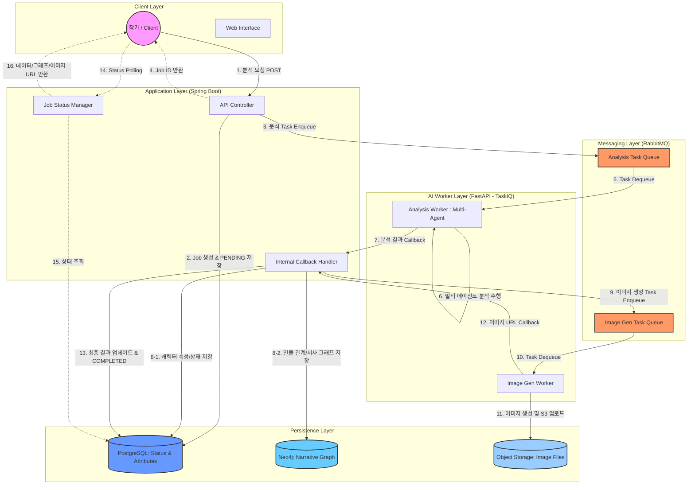
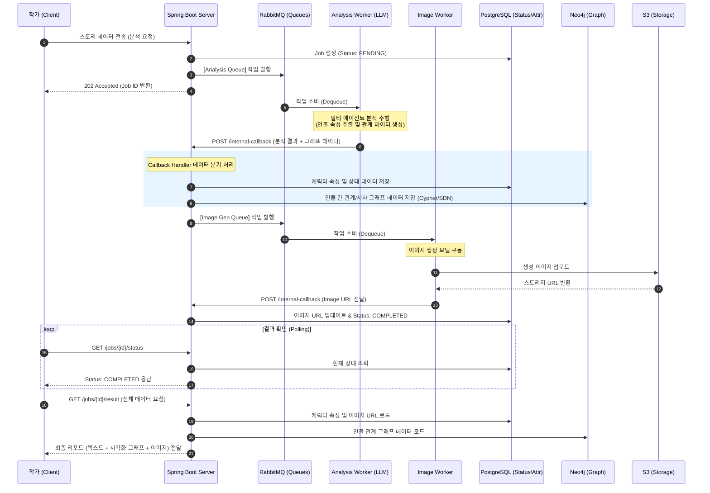

```mermaid
graph TD
    subgraph "Client Layer"
        Writer((작가 / Client))
        WebUI[Web Interface]
    end

    subgraph "Application Layer (Spring Boot)"
        Controller[API Controller]
        JobManager[Job Status Manager]
        CallbackHandler[Internal Callback Handler]
    end

    subgraph "Messaging Layer (RabbitMQ)"
        AnalysisQueue[Analysis Task Queue]
        ImageQueue[Image Gen Task Queue]
    end

    subgraph "AI Worker Layer (FastAPI - TaskIQ)"
        AnalysisWorker[Analysis Worker : Multi-Agent]
        ImageWorker[Image Gen Worker]
    end

    subgraph "Persistence Layer"
        RDB[(PostgreSQL: Status & Attributes)]
        GDB[(Neo4j: Narrative Graph)]
        S3[(Object Storage: Image Files)]
    end

    %% 1. 분석 요청 및 초기 수행
    Writer -->|1. 분석 요청 POST| Controller
    Controller -->|2. Job 생성 & PENDING 저장| RDB
    Controller -->|3. 분석 Task Enqueue| AnalysisQueue
    Controller -.->|4. Job ID 반환| Writer

    %% 2. 비동기 분석 및 결과 반환 (중요 수정 지점)
    AnalysisQueue -->|5. Task Dequeue| AnalysisWorker
    AnalysisWorker -->|6. 멀티 에이전트 분석 수행| AnalysisWorker
    AnalysisWorker -->|7. 분석 결과 Callback| CallbackHandler
    
    %% 3. 스프링 백엔드의 다중 영속화 (Multi-Persistence)
    CallbackHandler -->|8-1. 캐릭터 속성/상태 저장| RDB
    CallbackHandler -->|8-2. 인물 관계/서사 그래프 저장| GDB
    CallbackHandler -->|9. 이미지 생성 Task Enqueue| ImageQueue

    %% 4. 이미지 생성 및 최종 완료
    ImageQueue -->|10. Task Dequeue| ImageWorker
    ImageWorker -->|11. 이미지 생성 및 S3 업로드| S3
    ImageWorker -->|12. 이미지 URL Callback| CallbackHandler
    CallbackHandler -->|13. 최종 결과 업데이트 & COMPLETED| RDB

    %% 5. 결과 확인 흐름
    Writer -.->|14. Status Polling| JobManager
    JobManager -.->|15. 상태 조회| RDB
    JobManager -.->|16. 데이터/그래프/이미지 URL 반환| Writer

    %% 스타일 정의
    style Writer fill:#f9f,stroke:#333,stroke-width:2px
    style AnalysisQueue fill:#f96,stroke:#333,stroke-width:2px
    style ImageQueue fill:#f96,stroke:#333,stroke-width:2px
    style RDB fill:#69f,stroke:#333,stroke-width:2px
    style GDB fill:#6cf,stroke:#333,stroke-width:2px
    style S3 fill:#9cf,stroke:#333,stroke-width:2px
```

```mermaid
sequenceDiagram
    autonumber
    participant Writer as 작가 (Client)
    participant Spring as Spring Boot Server
    participant MQ as RabbitMQ (Queues)
    participant A_Worker as Analysis Worker (LLM)
    participant I_Worker as Image Worker
    participant RDB as PostgreSQL (Status/Attr)
    participant GDB as Neo4j (Graph)
    participant S3 as S3 (Storage)

    %% 1단계: 분석 요청
    Writer->>Spring: 스토리 데이터 전송 (분석 요청)
    Spring->>RDB: Job 생성 (Status: PENDING)
    Spring->>MQ: [Analysis Queue] 작업 발행
    Spring-->>Writer: 202 Accepted (Job ID 반환)

    %% 2단계: 스토리 분석 및 다중 영속화 (Multi-Persistence)
    MQ->>A_Worker: 작업 소비 (Dequeue)
    Note over A_Worker: 멀티 에이전트 분석 수행<br/>(인물 속성 추출 및 관계 데이터 생성)
    A_Worker->>Spring: POST /internal-callback (분석 결과 + 그래프 데이터)
    
    rect rgb(230, 245, 255)
        Note over Spring: Callback Handler 데이터 분기 처리
        Spring->>RDB: 캐릭터 속성 및 상태 데이터 저장
        Spring->>GDB: 인물 간 관계/서사 그래프 데이터 저장 (Cypher/SDN)
    end

    %% 3단계: 이미지 생성 체이닝
    Spring->>MQ: [Image Gen Queue] 작업 발행
    MQ->>I_Worker: 작업 소비 (Dequeue)
    Note over I_Worker: 이미지 생성 모델 구동
    I_Worker->>S3: 생성 이미지 업로드
    S3-->>I_Worker: 스토리지 URL 반환
    I_Worker->>Spring: POST /internal-callback (Image URL 전달)

    %% 4단계: 최종 완료 및 결과 확인
    Spring->>RDB: 이미지 URL 업데이트 & Status: COMPLETED
    
    loop 결과 확인 (Polling)
        Writer->>Spring: GET /jobs/{id}/status
        Spring->>RDB: 현재 상태 조회
        Spring-->>Writer: Status: COMPLETED 응답
    end

    Writer->>Spring: GET /jobs/{id}/result (전체 데이터 요청)
    Spring->>RDB: 캐릭터 속성 및 이미지 URL 로드
    Spring->>GDB: 인물 관계 그래프 데이터 로드
    Spring-->>Writer: 최종 리포트 (텍스트 + 시각화 그래프 + 이미지) 전달
```