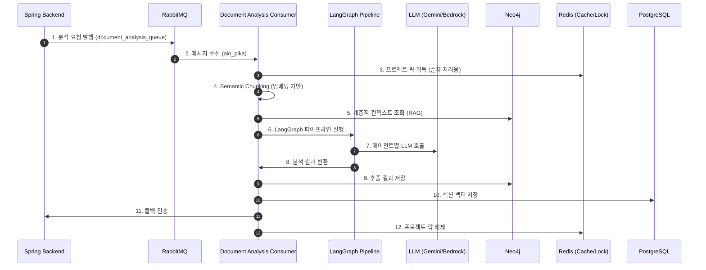
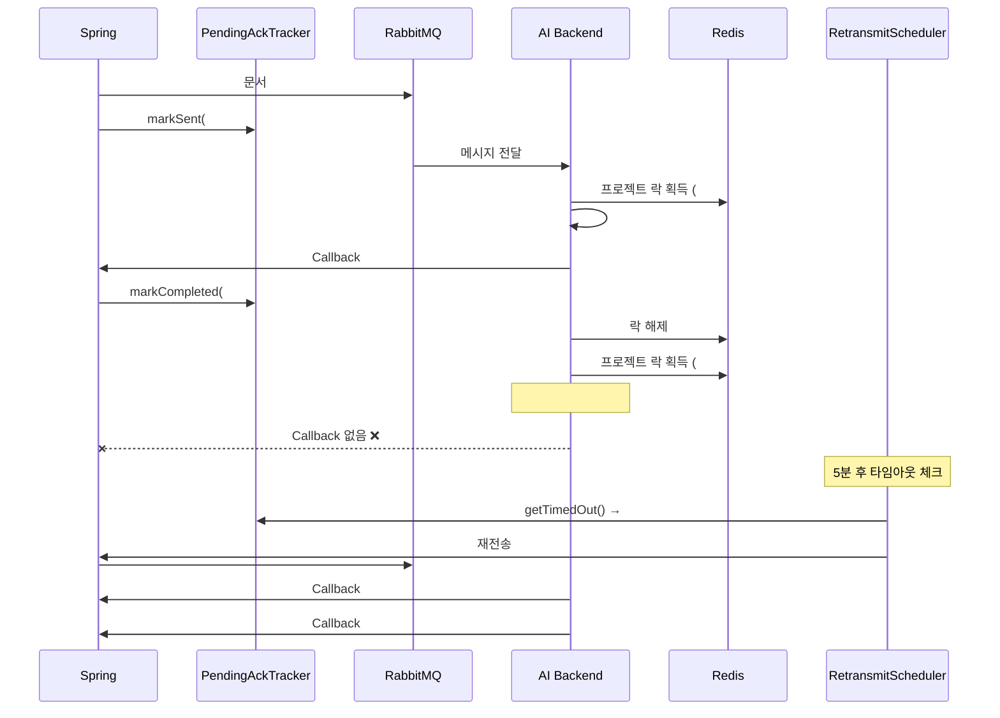
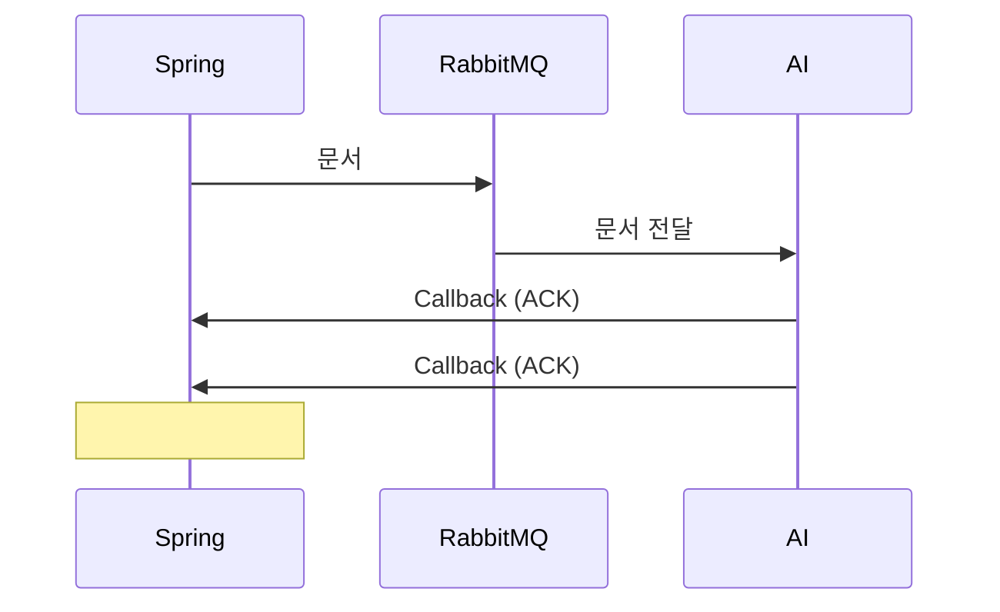
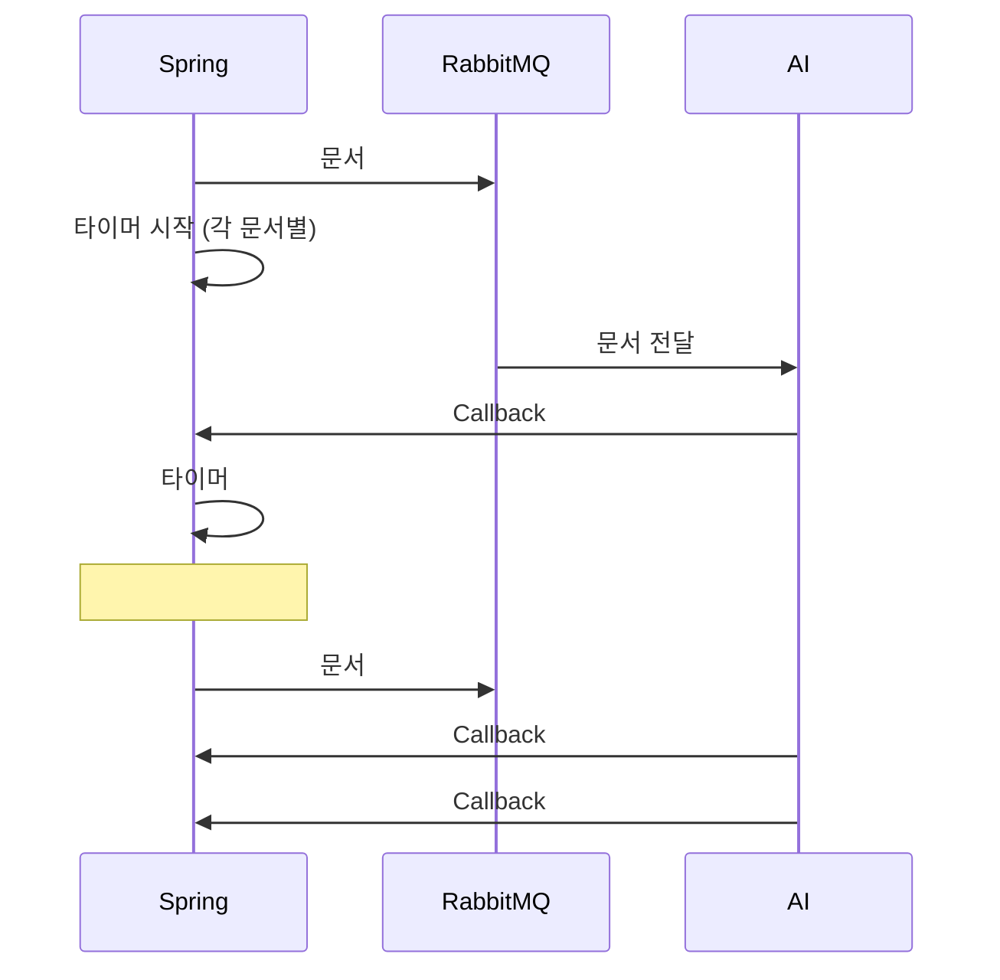
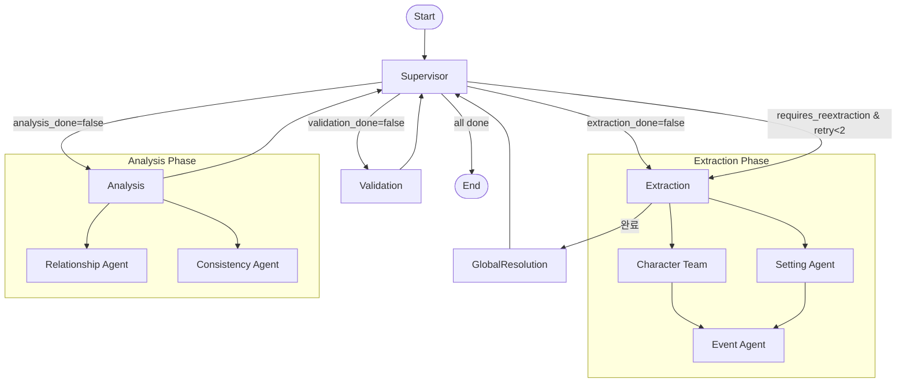
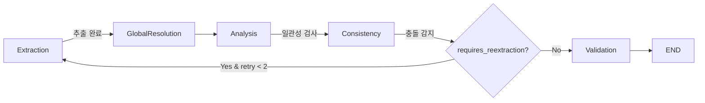

# StoLink AI Backend 시스템 흐름 분석

> **분석 기준**: 실제 코드 기반 분석 (2025-01-18)

---

## 📊 전체 시스템 흐름 다이어그램



---

## 1️⃣ Spring Backend → AI Server (메시지 발행)

### 1.1 트리거
사용자가 문서 분석 요청 시 Spring Backend가 RabbitMQ에 메시지 발행

### 1.2 메시지 구조 (DocumentAnalysisMessage)
| 필드 | 설명 |
|------|------|
| `job_id` | 분석 작업 ID |
| `project_id` | 프로젝트 UUID |
| `document_id` | 문서 UUID |
| `document_order` | 문서 순서 (우선순위 기반 처리용) |
| `content` | **문서 원문** (직접 포함) |
| `callback_url` | 분석 완료 후 콜백 URL |
| `requires_deep_analysis` | 심층 분석 필요 여부 |
| `analysis_type` | `full_manuscript` / `partial_snippet` |
| `trace_id` | 분산 추적 ID |

### 1.3 콘텐츠 전송 방식
1. 메시지에서 `content` 필드 우선 사용
2. 없으면 PostgreSQL에서 `document_id`로 조회 (fallback)

---

## 2️⃣ Message Consumer (RabbitMQ 수신)

### 2.1 메시지 처리 흐름
1. `document_analysis_queue`에서 `DocumentAnalysisMessage` 수신
2. JSON 파싱 → Pydantic 모델 변환
3. 메타데이터 추출 (`trace_id`, `project_id`, `document_id` 등)
4. 분석 파이프라인 실행
5. 결과에 따라 ACK 또는 NACK

---

## 3️⃣ 프로젝트 락 (순차 처리)

### 3.1 목적
- **같은 프로젝트**: `document_order` 순서대로 순차 처리
- **다른 프로젝트**: 병렬 처리 (독립된 소설이므로 영향 없음)

### 3.2 왜 같은 프로젝트는 순차 처리가 가능한가?
> **락 키가 `project_id`별로 분리**되어 있기 때문입니다.
>
> 락 키 형식: `stolink:lock:project:{project_id}`
>
> 예: 프로젝트 A의 락 키는 `stolink:lock:project:A`, 프로젝트 B는 `stolink:lock:project:B`
>
> A 프로젝트의 문서가 락을 획득해도 B 프로젝트의 문서는 **다른 키**이므로 대기하지 않고 바로 락 획득 → LLM 요청 가능

### 3.3 다중 워커 환경에서의 동작 예시
```
[상황] Worker 1, 2, 3이 동시에 메시지 수신

Worker 1: Project A, Chapter 2 (document_order=2)
Worker 2: Project A, Chapter 1 (document_order=1)
Worker 3: Project B, Chapter 5 (document_order=5)

[동작]
1. Worker 1: Redis ZADD(queue:project:A, {job1: 2}) → rank=0 (혼자) → 락 획득 시도
2. Worker 2: Redis ZADD(queue:project:A, {job2: 1}) → rank=0! (더 낮은 score) → job1은 rank=1로 밀림
3. Worker 3: Redis ZADD(queue:project:B, {job3: 5}) → rank=0 (다른 프로젝트) → 바로 락 획득!

[결과]
- Worker 3: 즉시 LLM 분석 시작 (Project B)
- Worker 2: rank=0이므로 락 획득 → LLM 분석 시작 (Project A, Ch.1)
- Worker 1: rank=1이므로 대기... Worker 2 완료 후 → 락 획득 → LLM 분석 (Project A, Ch.2)

→ Project A는 Ch.1 → Ch.2 순서 보장
→ Project B는 Project A와 동시 처리
```

### 3.4 Redis Sorted Set 동작 원리
1. **ZADD**: job을 Sorted Set에 추가 (score = document_order)
2. **ZRANK**: 내 순위 조회 (rank=0이면 가장 낮은 document_order → 내 차례)
3. **SET NX EX**: 원자적 락 획득 (TTL 10분, 데드락 방지)
4. **DELETE + ZREM**: 처리 완료 후 락 해제 및 큐에서 제거

### 3.5 기술적 구현
```python
# 1. Sorted Set에 job 추가
await redis.zadd(queue_key, {job_id: document_order})

# 2. 내 차례가 될 때까지 대기
while True:
    my_rank = await redis.zrank(queue_key, job_id)
    if my_rank == 0:  # 내 차례!
        acquired = await redis.set(lock_key, job_id, nx=True, ex=600)
        if acquired: break
    await asyncio.sleep(1)

# 3. 처리 완료 후 해제
await redis.delete(lock_key)
await redis.zrem(queue_key, job_id)
```

### 3.6 Spring-AI 전체 흐름 (ACK 기반 재전송 포함)



---

## 현재 흐름


---

## 요청 사항: ACK 타임아웃 + 재전송



### 3.7 Spring 측 ACK 추적 구조

| 컴포넌트 | 역할 |
|---------|------|
| `PendingAckTracker` | 전송된 문서 추적 (`ConcurrentHashMap<projectId, Map<documentOrder, 전송시각>>`) |
| `RetransmitScheduler` | 1분마다 타임아웃 체크, 최대 3회 재시도 |

```java
// 1. 문서 전송 시 등록
public void markSent(String projectId, int documentOrder) {
    pendingAcks.computeIfAbsent(projectId, k -> new ConcurrentHashMap<>())
               .put(documentOrder, Instant.now());
}

// 2. Callback 수신 시 완료 처리
public void markCompleted(String projectId, int documentOrder) {
    pendingAcks.get(projectId).remove(documentOrder);
}

// 3. 타임아웃 체크 (5분 초과)
public List<PendingDocument> getTimedOut(Duration timeout) {
    return pendingAcks.entrySet().stream()
        .filter(e -> e.getValue().isBefore(Instant.now().minus(timeout)))
        .collect(toList());
}
```

### 3.8 에러 유형별 처리

| Error Type | Example | Action |
|------------|---------|--------|
| **Retryable** | `LLM_OVERLOAD`, `TIMEOUT`, `NETWORK_ERROR` | Callback 안 보냄 → 타임아웃 시 Spring이 재전송 |
| **Permanent** | `INVALID_CONTENT`, `PARSING_ERROR` | Callback (FAILED) 전송 → `PERMANENTLY_FAILED` 상태로 변경 |

---

## 4️⃣ Semantic Chunking (시맨틱 청킹)

### 4.1 목적
LLM 토큰 제한 내에서 **문맥이 연결된 단락들을 하나의 섹션으로 병합**

### 4.2 왜 병합하는가?
> 단순히 글자 수로 자르면 "캐릭터가 문을 열고..."에서 잘려서 뒷부분의 의미가 손실됩니다.
> **의미적으로 연결된 단락들을 함께 묶으면** LLM이 문맥을 이해하고 더 정확하게 분석할 수 있습니다.

### 4.3 섹션은 어디에 쓰이나요?
1. **LLM 분석 입력**: 각 섹션이 하나의 분석 배치로 사용됨
2. **PostgreSQL 저장**: 섹션별로 콘텐츠 + 임베딩 저장 (벡터 검색용)
3. **증분 분석**: 섹션별 해시 비교로 변경 감지
4. **UI 네비게이션**: 사용자가 문서 내 섹션 간 이동 가능

### 4.4 처리 단계
1. **단락 단위 분리**: 빈 줄(`\n\n`) 기준으로 텍스트 분할
2. **모든 단락의 임베딩 배치 생성**: Gemini API로 각 단락 벡터화 (3072차원)
3. **유사도 기반 병합 결정**:
   - 인접 단락 간 코사인 유사도 계산
   - 유사도 ≥ 0.6 또는 현재 청크 < 800자 → 병합 시도
   - 현재 청크 + 다음 단락 < 4000자 → 병합 가능
4. **섹션 완료 (Flush)**: 조건 불충족 시 현재 버퍼를 섹션으로 저장
5. **섹션 대표 임베딩 생성**: 포함된 모든 단락 임베딩의 평균

### 4.5 왜 4000자로 제한하는가? (토큰 제한)
> LLM에 너무 긴 텍스트를 전송하면 **Context Length Exceeded** (또는 **Token Limit Error**) 에러가 발생합니다.
> 
> - Gemini/OpenAI 모두 **Context Window** 제한이 있음 (예: 128K 토큰)
> - 한 번에 너무 많은 텍스트를 보내면 LLM이 **정확하게 이해하지 못하고** 품질 저하
> - **4000자/섹션**으로 제한하여 안정적인 분석 보장

### 4.6 배치 처리와 컨텍스트 롤링
각 섹션은 **하나의 배치**로 처리되며, 이전 배치 결과가 다음 배치의 컨텍스트로 전달됩니다.

```
┌─────────────┐    ┌─────────────┐    ┌─────────────┐
│  Batch 1    │    │  Batch 2    │    │  Batch 3    │
│  (섹션 1)   │───▶│  (섹션 2)   │───▶│  (섹션 3)   │
└─────────────┘    └─────────────┘    └─────────────┘
       │                  │                  │
       ▼                  ▼                  ▼
  캐릭터 A 추출      캐릭터 A 컨텍스트     캐릭터 A,B 컨텍스트
                    + 캐릭터 B 추출       + 캐릭터 C 추출
```

**컨텍스트 롤링 효과:**
| 문제 | 해결 |
|------|------|
| 배치 1에서 "리안" 추출 → 배치 2에서 "리안 님" 발견 | 컨텍스트에 "리안"이 있으므로 **동일 인물로 인식** |
| 배치마다 독립 분석 시 중복 캐릭터 생성 | **연속성 유지**로 일관된 엔티티 추출 |

### 4.7 기술적 구현
```python
# 코사인 유사도 계산
def _cosine_similarity(vec_a, vec_b):
    a, b = np.array(vec_a), np.array(vec_b)
    return np.dot(a, b) / (np.linalg.norm(a) * np.linalg.norm(b))

# 병합 결정 로직
for i in range(1, len(paragraphs)):
    sim = self._cosine_similarity(chunk_embeddings[-1], embeddings[i])
    current_len = sum(len(p) for p in chunk_buffer)
    
    should_merge = (sim >= 0.6 or current_len < 800)
    can_merge = (current_len + len(next_para)) < 4000
    
    if should_merge and can_merge:
        chunk_buffer.append(next_para)
    else:
        sections.append(finalize_section(chunk_buffer))
        chunk_buffer = [next_para]
```

```python
# 컨텍스트 롤링 (배치 처리 후)
for c in extracted_chars:
    current_context["existing_characters"].append({"name": c.name, "role": c.role})

# 컨텍스트 크기 제한 (오래된 이벤트 제거)
if len(current_context["existing_events"]) > 20:
    current_context["existing_events"] = current_context["existing_events"][-20:]
```

---

## 5️⃣ 계층적 컨텍스트 주입 (RAG)

### 5.1 목적
현재 챕터 분석 시 **이전 챕터의 요약, 캐릭터 정보**를 컨텍스트로 제공하여 일관성 유지

### 5.2 컨텍스트 계층
| Level | 타입 | 내용 |
|-------|------|------|
| 1 | NOVEL | 전체 소설 줄거리 |
| 2 | VOLUME | 권/파트 요약 |
| 3 | CHAPTER | 챕터 요약 |

### 5.3 컨텍스트 구축 단계
1. **전체 소설 요약 조회**: `get_summaries_for_project(level=1)`
2. **현재 권 요약 조회**: `get_summaries_for_project(level=2)`
3. **최근 챕터 요약들 조회**: `get_recent_chapter_summaries(limit=5)`
4. **같은 챕터 내 이전 문서 요약**: Intra-chapter Context
5. **텍스트 임베딩 생성**: 현재 텍스트 앞 2000자 벡터화
6. **유사 캐릭터 검색**: Neo4j Vector Search (`top_k=5`)
7. **유사 이벤트 검색**: Neo4j Vector Search (`top_k=3`)
8. **키워드 기반 캐릭터 추출**: 텍스트에서 기존 캐릭터 이름 매칭
9. **엔티티 중심 컨텍스트 구축**: 캐릭터별 히스토리, 관계, 최근 활동
10. **통합 컨텍스트 텍스트 생성**: 마크다운 형식으로 포맷팅

### 5.4 기술적 구현
```python
# Neo4j Vector Search
query = """
    MATCH (c:Character {project_id: $project_id})
    WHERE c.embedding IS NOT NULL
    WITH c, vector.similarity.cosine(c.embedding, $embedding) AS score
    WHERE score > 0.6
    RETURN c.name, c.role, score
    ORDER BY score DESC LIMIT $top_k
"""
```

---

## 6️⃣ LangGraph 파이프라인

### 6.1 아키텍처: Hierarchical Supervisor Pattern
다중 에이전트 워크플로우를 **상태 기반**으로 오케스트레이션



### 6.2 AnalysisState (공유 상태)
| 카테고리 | 필드 |
|---------|------|
| 입력 데이터 | `content`, `project_id`, `document_id`, `job_id`, `callback_url` |
| 기존 데이터 | `existing_characters`, `existing_events`, `existing_relationships` |
| 추출 결과 | `extracted_characters`, `extracted_events`, `extracted_settings` |
| 분석 결과 | `relationship_graph`, `consistency_report`, `validation_result` |
| 제어 플래그 | `extraction_done`, `analysis_done`, `validation_done`, `retry_count` |

### 6.3 Phase 순서 및 라우팅
| 순서 | Phase | 조건 | 다음 Phase |
|------|-------|------|-----------|
| 1 | Extraction | `extraction_done = False` | Global Resolution |
| 2 | Global Resolution | 추출 완료 후 자동 | Analysis |
| 3 | Analysis | `analysis_done = False` | Validation |
| 4 | Validation | `validation_done = False` | End 또는 재추출 |

### 6.4 Supervisor Router 동작
1. `extraction_done` 확인 → False면 "extraction"
2. `analysis_done` 확인 → False면 "analysis"
3. `validation_done` 확인 → False면 "validation"
4. `requires_reextraction` 확인 → True이고 `retry_count < 2`면 "extraction"
5. 모두 통과하면 `"__end__"`

### 6.5 기술적 구현
```python
from langgraph.graph import StateGraph, END

graph = StateGraph(AnalysisState)
graph.add_node("extraction", extraction_node)
graph.add_node("global_resolution", global_resolution_node)
graph.add_node("analysis", analysis_node)
graph.add_node("validation", validation_node)

graph.add_conditional_edges("supervisor", supervisor_router, {
    "extraction": "extraction",
    "analysis": "global_resolution",
    "validation": "validation",
    "__end__": END
})
```

---

## 7️⃣ Extraction Phase (추출 단계)

### 7.1 2-Phase 추출 전략
- **Phase 1 (병렬)**: Character Team + Setting Agent
- **Phase 2 (순차)**: Event Agent (Phase 1 결과 참조 필요)

### 7.2 Phase 1: Character Team 동작
1. **Identity Agent 실행**: 이름, 역할, 별칭 추출
2. **Appearance Agent 실행**: 외모, 복장 추출
3. **Personality Agent 실행**: 성격 특성, 동기 추출
4. **Relations Agent 실행**: 캐릭터 간 관계 추출
5. **Aggregator 실행**: 
   - 서브 에이전트 결과 수집
   - 이름 정규화 (한글-영문 매핑)
   - 중복 캐릭터 병합
   - FullCharacter 형식으로 변환

### 7.3 Phase 1: Setting Agent 동작
1. 텍스트에서 장소/배경 추출
2. 장소 유형 분류 (실내/실외/가상 등)
3. 분위기, 시대적 배경 추론

### 7.4 Phase 2: Event Agent 동작
1. 추출된 캐릭터 이름 목록 수신
2. 텍스트에서 이벤트 추출
3. 참여자(participants)를 캐릭터 이름과 매핑
4. 시간순 정렬, 인과관계 추론

### 7.5 기술적 구현
```python
async def extraction_node(state):
    # Phase 1: 병렬 실행
    char_task = asyncio.create_task(character_team_graph.ainvoke(state))
    setting_task = asyncio.create_task(setting_extraction_node(state))
    char_result, setting_result = await asyncio.gather(char_task, setting_task)
    
    # Phase 2: 순차 실행
    state["extracted_characters"] = char_result["extracted_characters"]
    state["extracted_settings"] = setting_result["extracted_settings"]
    event_result = await event_extraction_node(state)
    
    return {..., "extraction_done": True}
```

---

## 8️⃣ Global Resolution (엔티티 해결)

### 8.1 목적
LLM이 같은 캐릭터를 다른 이름으로 추출한 경우("리안", "Lian", "리안 님") **하나의 캐릭터로 병합**

### 8.2 매칭 알고리즘 단계
1. **정확 일치 확인**: 정규화된 이름 비교
2. **한글-영문 매핑 확인**: 로마자 변환 테이블 사용
3. **별칭 교차 매칭**: aliases 필드에 상대방 이름 포함 여부
4. **Fuzzy Matching**: rapidfuzz로 유사도 계산

### 8.3 Fuzzy Matching 계산

#### rapidfuzz 3가지 알고리즘

| 알고리즘 | 가중치 | 특징 |
|---------|-------|------|
| `fuzz.ratio` | 50% | 전체 문자열 레벤슈타인 거리 기반 비교 |
| `fuzz.partial_ratio` | 30% | 짧은 문자열이 긴 문자열에 포함되는지 부분 매칭 |
| `fuzz.token_sort_ratio` | 20% | 토큰(단어) 정렬 후 비교 (순서 무시) |

#### 1️⃣ fuzz.ratio (레벤슈타인 거리 기반)
한 문자열을 다른 문자열로 변환하는 데 필요한 **최소 편집 횟수** 기반

```
점수 = (1 - 편집거리/최대길이) × 100
```

| 비교 | 편집 | 점수 |
|------|------|------|
| "abc" vs "abc" | 0회 | 100 |
| "abc" vs "abcd" | 삽입 1회 | ~86 |
| "cat" vs "hat" | 치환 1회 | ~67 |
| "리안" vs "마법사 리안" | 삽입 3회 | ~57 |

> ⚠️ **한계**: 길이 차이가 크면 점수가 급격히 낮아짐

#### 2️⃣ fuzz.partial_ratio (부분 문자열 매칭)
짧은 문자열이 긴 문자열 안에 **완전히 포함**되면 100점

| 비교 | 이유 | 점수 |
|------|------|------|
| "리안" vs "마법사 리안" | "리안"이 포함됨 | **100** |
| "Ian" vs "Ianos" | "Ian"이 포함됨 | **100** |
| "abc" vs "xxabcxx" | "abc"가 포함됨 | **100** |

> ✅ `ratio`의 길이 민감성을 보완

#### 3️⃣ fuzz.token_sort_ratio (토큰 정렬 비교)
단어 순서를 무시하고 정렬 후 비교

| 비교 | 이유 | 점수 |
|------|------|------|
| "리안 마법사" vs "마법사 리안" | 같은 토큰 | **100** |
| "John Smith" vs "Smith John" | 순서만 다름 | **100** |

> ✅ 어순 차이로 인한 미스매칭 방지

#### 가중 평균 계산 예시

**예시 1**: "마법사 리안" vs "리안"
```
ratio        = 57점 (길이 차이)
partial_ratio = 100점 ("리안" 포함)
token_sort   = 57점

가중평균 = (57 × 0.5) + (100 × 0.3) + (57 × 0.2)
        = 28.5 + 30 + 11.4
        = 69.9점 → DIFFERENT
```

**예시 2**: "리안" vs "리안 님"
```
ratio        = 67점
partial_ratio = 100점 ("리안" 포함)
token_sort   = 75점

가중평균 = (67 × 0.5) + (100 × 0.3) + (75 × 0.2)
        = 33.5 + 30 + 15
        = 78.5점 → DIFFERENT (80점 미만)
```

**예시 3**: "이안 마법사" vs "마법사 이안"
```
ratio        = 67점 (순서 다름)
partial_ratio = 67점
token_sort   = 100점 (정렬 후 동일)

가중평균 = (67 × 0.5) + (67 × 0.3) + (100 × 0.2)
        = 33.5 + 20.1 + 20
        = 73.6점 → DIFFERENT
```

> 💡 **Fuzzy Matching만으로는 80점 넘기 어려움** → 정확 일치, 한글-영문 매핑, 별칭 매칭이 먼저 적용되는 이유

### 8.4 매칭 분류
| 점수 | 분류 | 동작 |
|------|------|------|
| ≥ 95 | AUTO_MERGE | 자동 병합 |
| 80-94 | NEEDS_REVIEW | 사용자 확인 필요 |
| < 80 | DIFFERENT | 별개 캐릭터 |

### 8.5. **Union-Find 클러스터링**
   - 모든 캐릭터 쌍 비교
   - 유사도 80 이상이면 union
   - 같은 클러스터 = 동일 캐릭터
   - **Completeness Score**로 Primary 선정 (정보가 가장 풍부한 캐릭터)

### 8.6 Completeness Score란?
> 여러 후보 중 **어떤 캐릭터를 Primary로 선정할지** 결정하는 점수

| 항목 | 점수 |
|------|------|
| Description 길이 | 최대 50점 (0.1점/글자) |
| Traits 개수 | 최대 30점 (5점/개) |
| role 존재 | +5점 |
| status 존재 | +5점 |
| personality_traits 존재 | +5점 |
| visual_traits 존재 | +5점 |
| 이름 길이 < 2 | -50점 (의미 없는 이름) |

예: "리안" (traits 3개, role 있음) vs "Lian" (traits 0개)
→ "리안"이 더 높은 점수 → Primary로 선정, "Lian"은 alias로 병합

### 8.7 기술적 구현
```python
# Union-Find
parent = list(range(n))
def find(i): 
    if parent[i] != i: parent[i] = find(parent[i])
    return parent[i]
def union(i, j): parent[find(j)] = find(i)

# rapidfuzz
from rapidfuzz import fuzz
score = (fuzz.ratio(n1, n2) * 0.5 + 
         fuzz.partial_ratio(n1, n2) * 0.3 + 
         fuzz.token_sort_ratio(n1, n2) * 0.2)
```

---

## 9️⃣ Analysis Phase (분석 단계)

### 9.1 Relationship Analysis 동작
1. 추출된 캐릭터 이름 목록 수집
2. 각 캐릭터의 성격 정보 수집 (관계 추론 힌트)
3. LLM 프롬프트 구성 (관계 유형, 방향성 규칙 포함)
4. JSON 응답 파싱
5. 상세 메트릭 추출:
   - `emotional_bond`: 정서적 유대감 (1-10)
   - `functional_trust`: 기능적 신뢰 (1-10)
   - `value_alignment`: 가치관 일치도 (1-10)
   - `interdependence`: 상호의존도 (1-10)
   - `latent_tension`: 잠재적 긴장감 (1-10)
6. Neo4j Edge 형식으로 변환

### 9.2 Consistency Check 동작
1. **RAG 기반 히스토리 조회**: 이전 챕터 캐릭터/이벤트 검색
2. **LLM 충돌 탐지**: 15가지 충돌 유형 검사
3. **프로그래밍 백업 검증**:
   - 모순 특성 탐지 (`coward` + `brave` 동시 보유)
   - 관계 방향성 검증 (`BETRAYED`인데 `bidirectional: true`)
4. **점수 계산**:
   - 기본 100점
   - HIGH 충돌: -25점
   - MEDIUM 충돌: -10점
   - LOW 충돌: -5점
5. **재추출 결정**: `score ≤ 20` 또는 `HIGH 충돌 ≥ 2`

### 9.3 충돌 유형 예시
| 유형 | 심각도 | 예시 |
|------|--------|------|
| TIMELINE_CONFLICT | HIGH | 죽은 캐릭터가 재등장 |
| CHARACTER_TRAIT_CONFLICT | HIGH | 겁쟁이가 갑자기 용감해짐 |
| SETTING_CONFLICT | HIGH | 사막이 갑자기 설원이 됨 |
| RELATIONSHIP_CONFLICT | MEDIUM | 빌드업 없이 갑자기 적대 |
| INVENTORY_CONFLICT | MEDIUM | 없는 아이템 사용 |

### 9.4 기술적 구현
```python
# 구조화 출력 (Pydantic)
class ConsistencyReport(BaseModel):
    overall_score: int
    requires_reextraction: bool
    conflicts: list[Conflict]

structured_llm = llm.with_structured_output(ConsistencyReport)
result = await chain.ainvoke({...})
```

---

## 🔟 Incremental Analysis (증분 분석)

### 10.1 목적
**변경된 부분만 재분석**하여 시간과 비용 절약

### 10.2 변경 감지 범위
| 감지 대상 | 방법 |
|---------|------|
| **같은 문서 내 변경** | 섹션별 SHA256 해시 비교 |
| **다른 챕터는?** | 각 문서는 독립적으로 분석. 챕터 1 수정 시 챕터 2는 재분석 안 함 (컨텍스트만 갱신) |

### 10.3 질문: 섹션이란? (Section FAQ)

**1. 섹션이 뭔가요?**
> **분석의 최소 단위**입니다.
> 4️⃣번 단계(Semantic Chunking)에서 문맥상 연결된 여러 단락을 하나로 합친 덩어리입니다.
> (예: 단락 A, B, C가 유사하면 [A+B+C]가 하나의 섹션이 됨)

**2. 섹션 번호는 어떻게 생성되나요?**
> 문서(Chapter)를 청킹한 결과 리스트의 **0부터 시작하는 인덱스(순서)**입니다.
> - 첫 번째 덩어리 = Section 0
> - 두 번째 덩어리 = Section 1

**3. Chapter 1과 Chapter 2의 섹션 번호는 따로인가요?**
> **네, 완전히 독립적입니다.**
> 섹션 번호는 해당 **문서(document_id) 내에서만 유효**합니다.
> - Chapter 1의 Section 0
> - Chapter 2의 Section 0
> → `document_id`가 다르므로 서로 다른 데이터로 취급됩니다.

### 10.4 동작 단계
1. **이전 섹션 해시 조회**: DB에서 `document_id`로 이전 분석 해시 가져오기
2. **현재 섹션 해시 계산**: SHA256으로 각 섹션 콘텐츠 해시
3. **변경 지점 감지**:
   - **인덱스 = 섹션 번호** (Section 0, 1, 2, ...)
   - 각 섹션의 해시를 순서대로 비교
   - 불일치 발견 시 해당 섹션 번호 반환
   - 모두 일치하면 -1 반환 (변경 없음)
4. **증분 처리**:
   - 변경 없음: 캐시된 결과 반환
   - 변경 있음: 변경 지점부터만 분석
5. **이전 요약 컨텍스트 주입**: 변경 지점 이전 내용 요약을 프롬프트에 포함

### 10.4 "이전 요약"은 어디서 오나요?
> 이전 분석 시 생성한 **챕터 요약**이 PostgreSQL `document_summaries` 테이블에 저장되어 있습니다.
>
> 조회 방법: `summary_service.get_recent_chapter_summaries(project_id, limit=5)`
>
> 변경 지점 이전 섹션들의 요약도 이와 유사하게 조회하여 LLM 프롬프트에 주입

### 10.5 변경 감지 예시
```
[이전 분석 해시]
Section 0: abc123
Section 1: def456
Section 2: ghi789

[현재 문서 해시]
Section 0: abc123  ✓ 일치
Section 1: xyz999  ✗ 불일치! → change_point = 1
Section 2: ghi789

[결과]
- Section 0: 스킵 (캐시 사용)
- Section 1, 2: 재분석 (change_point부터)
- Section 0 요약을 컨텍스트에 주입
```

### 10.6 기술적 구현
```python
import hashlib

def compute_hash(content): 
    return hashlib.sha256(content.encode()).hexdigest()

def detect_change_point(prev_hashes, sections):
    for i, sec in enumerate(sections):
        current_hash = compute_hash(sec["content"])
        if i >= len(prev_hashes) or prev_hashes[i] != current_hash:
            return i  # 변경 시작점
    return -1  # 변경 없음
```

---

## 1️⃣1️⃣ 결과 저장 및 요약 생성

### 11.1 Neo4j 저장
1. Character 노드 MERGE (이름 + project_id로 중복 방지)
2. Event 노드 CREATE
3. Setting 노드 MERGE
4. Relationship 엣지 CREATE

### 11.2 PostgreSQL 저장
1. 섹션 콘텐츠 저장
2. 섹션 임베딩 저장 (pgvector)
3. 콘텐츠 해시 저장 (증분 분석용)

### 11.3 임베딩이 두 번 저장되나요?
> **아닙니다.** 시맨틱 청킹에서 생성한 임베딩을 **그대로 PostgreSQL에 저장**합니다.
>
> 흐름:
> 1. Semantic Chunking 단계에서 각 단락 임베딩 생성 → 병합 결정에 사용
> 2. 섹션 완성 시 평균 임베딩 계산 (dict에 포함)
> 3. 분석 완료 후 해당 dict를 PostgreSQL에 INSERT
>
> 즉, 임베딩 생성은 1회, 메모리에 보관 후 DB에 저장하는 것

### 11.4 요약 생성 트리거
| Level | 트리거 조건 |
|-------|-----------|
| CHAPTER (3) | 매 문서 분석 완료 시 |
| NOVEL (1) | 5 챕터마다 (글로벌 요약 갱신) |
| VOLUME (2) | 25 챕터마다 |

---

## 1️⃣2️⃣ 콜백/이벤트 발행

### 12.1 레거시 콜백
- Spring Backend의 `callback_url`로 HTTP POST
- `DocumentAnalysisCallback` 페이로드 전송

### 12.2 이벤트 소싱
- `AnalysisCompletedEvent` 또는 `AnalysisFailedEvent`를 RabbitMQ 발행
- Spring Event Consumer가 수신하여 RDB 저장

---

## 1️⃣3️⃣ 임베딩 Redis 캐싱

### 13.1 목적
임베딩 API 호출 비용/시간 절약 (같은 텍스트 반복 요청 방지)

### 13.2 동작 단계
1. 텍스트 정규화 (공백 통일, strip)
2. 해시 기반 캐시 키 생성
3. Redis에서 캐시 조회
4. 캐시 히트 시 즉시 반환
5. 캐시 미스 시 Gemini API 호출
6. 결과를 Redis에 저장 (24시간 TTL)

### 13.3 기술적 구현
```python
cache_key = f"emb:{hash(normalized_text)}"
cached = self._redis.get(cache_key)
if cached: return json.loads(cached)

embedding = gemini.embed(text)
self._redis.setex(cache_key, 86400, json.dumps(embedding))
```

---

## 📋 기술 스택 요약

| 영역 | 기술 | 핵심 구현 |
|------|------|----------|
| **메시지 큐** | RabbitMQ + aio_pika | `IncomingMessage.ack()` |
| **분산 락** | Redis Sorted Set | `ZADD`, `ZRANK`, `SET NX EX` |
| **오케스트레이션** | LangGraph | `StateGraph`, `add_conditional_edges` |
| **LLM 호출** | LangChain | `ChatPromptTemplate` |
| **구조화 출력** | Pydantic | `with_structured_output()` |
| **Fuzzy Matching** | rapidfuzz | `ratio`, `partial_ratio`, `token_sort_ratio` |
| **그래프 DB** | Neo4j | Cypher `MERGE`, `CREATE` |
| **벡터 검색** | pgvector + Neo4j | `vector.similarity.cosine()` |
| **임베딩 캐시** | Redis | `SETEX` (24시간 TTL) |

---

## 🔄 피드백 루프 메커니즘

### 재추출 조건
1. `consistency_report.requires_reextraction = True`
2. `validation_result.action = "retry_extraction"`
3. `retry_count < MAX_EXTRACTION_RETRIES (2)`



---

*문서 생성일: 2025-01-18*
