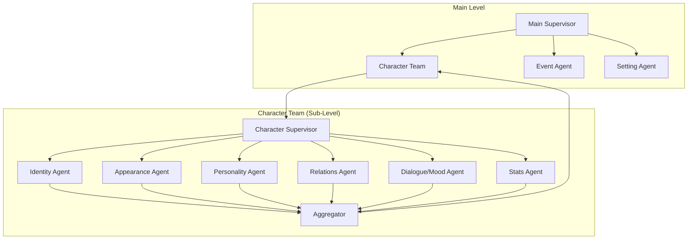

# StoLink AI Backend - Troubleshooting Guide

> **Last Updated**: 2025-12-30

이 문서는 개발 과정에서 발생한 주요 문제와 해결책을 기록합니다.

---

## 목차

1. [Setting Agent - 인물/사건 혼입 문제](#1-setting-agent---인물사건-혼입-문제)
2. [Event Agent - 배경 묘사 혼입 및 참조 매칭 문제](#2-event-agent---배경-묘사-혼입-및-참조-매칭-문제)
3. [Dialogue Agent - Production Level 업그레이드](#3-dialogue-agent---production-level-업그레이드)
4. [Emotion Agent - Production Level 업그레이드](#4-emotion-agent---production-level-업그레이드)
5. [Consistency Agent - Production Level 업그레이드](#5-consistency-agent---production-level-업그레이드)
6. [Plot Integration Agent - Production Level 업그레이드](#6-plot-integration-agent---production-level-업그레이드)
7. [Validator Agent - Production Level 업그레이드](#7-validator-agent---production-level-업그레이드)
8. [Supervisor Agent - Production Level 업그레이드](#8-supervisor-agent---production-level-업그레이드)
9. [Message Schema - 하이브리드 아키텍처 업그레이드](#9-message-schema---하이브리드-아키텍처-업그레이드)
10. [JSON 파싱 오류 - Structured Output 도입](#10-json-파싱-오류-및-스키마-불일치---structured-output-도입)
11. [Job 상태 업데이트 API 연동](#11-job-상태-업데이트-api-연동)
12. [Character Agent - FullCharacter 스키마 확장](#12-character-agent---fullcharacter-스키마-확장)
13. [FullCharacter 스키마 적용 - 전체 에이전트 호환성](#13-fullcharacter-스키마-적용---전체-에이전트-호환성)
14. [Multi-Agent - JSON 파싱 오류 및 AWS Throttling](#14-multi-agent---json-파싱-오류-및-aws-throttling)
15. [Character Agent - Hierarchical Multi-Agent System 리팩토링](#15-character-agent---hierarchical-multi-agent-system-리팩토링)
16. [Appearance Agent - Production Level 업그레이드](#16-appearance-agent---production-level-업그레이드)
17. [Story Extraction - 한글/영문 캐릭터 중복 및 추출 품질 개선](#17-story-extraction---한글영문-캐릭터-중복-및-추출-품질-개선)

---

## 1. Setting Agent - 인물/사건 혼입 문제

### 📅 날짜
2025-12-27

### 🔴 문제 (Problem)
Setting Agent가 배경만 추출해야 하는데, 캐릭터 이름과 행동을 포함함.

**실패 출력 예시**:
```json
{
  "visual_background": "Seojin standing in a dark forest holding a sword..."
}
```

**기대 출력**:
```json
{
  "visual_background": "Dark ancient forest, dense twisted trees, thick fog on ground..."
}
```

### 🟡 원인 분석 (Root Cause)
1. LLM이 "Setting(배경)"과 "Scene(장면)"을 혼동
2. 단순히 "하지 마(Don't)"라고만 지시하면 무시함
3. Gemini Flash/Llama 3 등은 텍스트 요약 성향이 강함

### 🟢 해결책 (Solution)

#### 1. Bad vs Good 예시 (Few-shot Learning)
```
❌ BAD: "Seojin standing in a dark forest holding a sword."
✅ GOOD: "Dark ancient forest, dense twisted trees, thick fog on ground."
```

#### 2. 필드명 변경
| 변경 전 | 변경 후 |
|---------|---------|
| `description` | `static_visual_prompt` |
| `visual_background` | `static_visual_prompt` |

#### 3. Chain of Thought 프로세스
```
1. IDENTIFY: 텍스트에서 캐릭터 이름/행동 동사 찾기
2. REMOVE: 완전히 제거
3. FOCUS: 남은 물리적 환경에만 집중
4. DESCRIBE: 텍스처, 재질, 조명, 색상으로 묘사
5. CREATIVELY INFER: 간단한 묘사면 디테일 추가
```

#### 4. 페널티 경고 추가
```
PENALTY WARNING: If ANY character name or action verb is included, 
the output is INVALID and will be REJECTED.
```

### 📁 수정된 파일
- `app/agents/extraction/setting.py` - 프롬프트 전면 개선
- `app/schemas/settings.py` - `is_primary`, `art_style` 필드 추가

### ✅ 결과
- 인물/사건 완전 제거됨
- 순수 배경 데이터(Clean Background Data) 생성 성공
- 이미지 생성 AI에 직접 사용 가능한 프롬프트 품질 달성

---

## 2. Event Agent - 배경 묘사 혼입 및 참조 매칭 문제

### 📅 날짜
2025-12-27

### 🔴 문제 (Problem)
1. `visual_scene`에 배경 묘사가 포함됨 (Setting Agent와 중복)
2. `participants`가 Character Agent의 이름과 정확히 매칭되지 않음
3. `location_ref`가 Setting Agent의 이름과 매칭되지 않음

**실패 출력 예시**:
```json
{
  "visual_scene": "A man holding a sword in a dark forest with tall trees and fog.",
  "participants": ["the protagonist"],
  "location_ref": "A dark forest where trees are twisted"
}
```

**기대 출력**:
```json
{
  "visual_scene": "A tall man with dark hair gripping a sword, tense posture, alert expression",
  "participants": ["서진"],
  "location_ref": "Dark Forest"
}
```

### 🟡 원인 분석 (Root Cause)
1. Event Agent에게 Character/Setting 정보가 전달되지 않음
2. 프롬프트에 명확한 역할 분리 지시 없음
3. 참조용 데이터 없이 LLM이 자체 생성

### 🟢 해결책 (Solution)

#### 1. Phase 분리 (graph.py)
```python
# Phase 1: Character + Setting (병렬)
# Phase 2: Event (순차 - Phase 1 결과 참조)
```

#### 2. Bad vs Good 예시 추가
```
❌ BAD: visual_scene에 "dark forest with trees"
✅ GOOD: visual_scene에 "intense eye contact, low angle shot" (구도만)
```

#### 3. 참조 데이터 전달
```python
response = await chain.ainvoke({
    "story_text": state["content"],
    "available_characters": ["서진", "이민호", ...],  # Character Agent 결과
    "available_settings": ["Dark Forest", ...],       # Setting Agent 결과
})
```

#### 4. 페널티 경고
```
If visual_scene contains "forest", "trees", "moon", "fog" - REJECTED
```

### 📁 수정된 파일
- `app/agents/graph.py` - 2-Phase Extraction 구현
- `app/agents/extraction/event.py` - 프롬프트 전면 개선
- `app/schemas/events.py` - (이미 Production Level)

### ✅ 결과
- Event의 `visual_scene`에서 배경 묘사 제거
- `participants`가 Character Agent 이름과 정확히 매칭
- `location_ref`가 Setting Agent 이름과 정확히 매칭
- Neo4j 그래프 엣지 자동 생성 가능

---

## 3. Dialogue Agent - Production Level 업그레이드

### 📅 날짜
2025-12-27

### 🔴 문제 (Problem)
1. 기본적인 프롬프트만 있어서 출력 구조가 단순함
2. Character Agent와 이름 매칭이 안 됨
3. Neo4j 엣지 생성에 필요한 속성(formality, power, intimacy)이 없음

**기존 출력**:
```json
{
  "key_dialogues": ["..."],
  "speech_patterns": {}
}
```

### 🟡 원인 분석 (Root Cause)
1. Dialogue Agent가 Character Agent 결과를 참조하지 않음
2. 스키마(`dialogues.py`)에 상세 모델이 있지만 프롬프트에서 활용 안 함
3. 관계성(speaker → listener)이 구조화되지 않음

### 🟢 해결책 (Solution)

#### 1. Character 참조 전달
```python
available_characters = [c.get("name", "") for c in state.get("extracted_characters", [])]
response = await chain.ainvoke({
    "story_text": state["content"],
    "available_characters": json.dumps(available_characters)
})
```

#### 2. 3차원 관계 모델링
- `formality`: "formal", "informal", "mixed"
- `power_dynamic`: "superior", "equal", "subordinate"
- `intimacy_level`: 1-10 정량화

#### 3. Neo4j 엣지 속성 추출
```json
{
  "dialogue_relationships": [
    {
      "speaker": "하나",
      "listener": "서진",
      "formality_to_listener": "formal",
      "power_dynamic": "subordinate",
      "intimacy_level": 7
    }
  ]
}
```

### ⚠️ 주의사항 (Data Integrity)

#### Enum 유효성 검증
LLM이 "polite" 대신 "formal", "lower" 대신 "subordinate" 등 유의어를 출력할 수 있음.
→ Pydantic 또는 후처리에서 허용값 검증 필요

#### 노드 키 무결성
Character Agent가 "Seojin"(영문), Dialogue Agent가 "서진"(한글) 출력 시 매칭 실패
→ 일관된 식별자(Identifier) 사용 권장

### 📁 수정된 파일
- `app/agents/extraction/dialogue.py` - 프롬프트 Production Level 업그레이드
- `tests/test_agents/test_dialogue_analysis.ipynb` - 테스트 노트북 상세화

### ✅ 결과
- `key_dialogues`: 중요 대사 + 숨겨진 의미(subtext) 추출
- `speech_patterns`: 캐릭터별 말투 특성
- `dialogue_relationships`: Neo4j 엣지 속성 (formality, power, intimacy)
- Character Agent 이름과 정확히 매칭

### 💡 향후 개선 사항 (Future Enhancements)

#### 1. 친밀도(Intimacy) 변수 분리
현재: 단일 `intimacy_level` (1-10)
문제: 소꿉친구 설정에도 현재 적대적이면 낮게 측정됨

**제안된 분리**:
```json
{
  "friendliness": 2,      // 현재 우호도 (낮음)
  "bond_strength": 9      // 관계의 깊이/역사 (높음)
}
```
→ "죽이고 싶을 만큼 미우면서도 서로를 가장 잘 아는 애증 관계" 표현 가능

#### 2. 권력 관계 비대칭성 검증
A→B가 "superior"면 B→A는 "subordinate"여야 함
현재: LLM이 상황에 따라 다르게 판단 (하나가 이민호에게 맞서는 태도 = equal)

**검증 로직 추가 제안**:
```python
if power_ab == "superior" and power_ba != "subordinate":
    conflicts.append("Power asymmetry detected")
```

#### 3. 식별자 일관성 강제
이미 `available_characters` 전달로 해결됨
추가 보완: 프롬프트에 **"캐릭터 이름은 반드시 제공된 리스트 표기를 그대로 따를 것"** 명시

---

## 4. Emotion Agent - Production Level 업그레이드

### 📅 날짜
2025-12-27

### 🔴 문제 (Problem)
1. 기본적인 프롬프트로 출력 구조가 단순함 (emotion, intensity만)
2. Character Agent와 이름 매칭이 안 됨
3. 감정 트리거, 표현 방식 등 컨텍스트 부족

### 🟢 해결책 (Solution)

#### 1. 감정 필드 확장
- `primary_emotion`, `secondary_emotion`: 복합 감정 표현
- `trigger`: 감정 유발 원인
- `expression`: 물리적 표현 방식
- `is_hidden`: 숨겨진 감정 여부

#### 2. Neo4j 노드 속성 업데이트
```json
{
  "neo4j_updates": [
    {
      "character_name": "서진",
      "property_updates": {
        "current_emotion": "분노",
        "emotion_intensity": 8,
        "emotion_valence": "negative"
      }
    }
  ]
}
```

### 💡 향후 개선 사항 (Event Sourcing)

현재 방식은 캐릭터 노드의 속성을 덮어쓰기(Overwrite)합니다.
감정 변화의 역사(History)를 추적해야 한다면:

**현재 (State Update)**:
```cypher
SET (Character).emotion = "분노"
```

**고도화 (Event Graph)**:
```cypher
CREATE (c:Character)-[:FELT {timestamp: t, chapter: 3}]->(e:Emotion {type: "분노"})
```

→ 스토리 진행에 따른 감정 변화 궤적(Trajectory) 분석 가능

### 📁 수정된 파일
- `app/agents/extraction/emotion.py` - 프롬프트 Production Level 업그레이드
- `tests/test_agents/test_emotion_tracking.ipynb` - 테스트 노트북 상세화

### ✅ 결과
- `emotion_states`: 상세 감정 분석 (trigger, expression, is_hidden)
- `neo4j_updates`: Character 노드 속성 업데이트용 JSON
- Character Agent 이름과 정확히 매칭

---

## 5. Consistency Agent - Production Level 업그레이드

### 📅 날짜
2025-12-27

### 🔴 문제 (Problem)
1. Dialogue/Emotion Agent 결과를 활용하지 않음 (Level 1 데이터 미통합)
2. 관계 방향성 검증 없음 (BETRAYED/MENTOR는 단방향이어야 함)
3. 참조 무결성 검증 없음 (존재하지 않는 캐릭터 참조 가능)
4. Neo4j-ready 출력 구조 없음

**기존 검증 범위**:
- Character trait 충돌만 감지
- 단순 점수 계산 (HIGH: -25, MEDIUM: -10)

### 🟡 원인 분석 (Root Cause)
1. 초기 구현에서 Level 1 Agent 결과 통합을 고려하지 않음
2. 관계 방향성 규칙(BETRAYED: 배신자→피해자)이 프롬프트에 없음
3. 프로그래매틱 검증이 trait 충돌에만 한정됨

### 🟢 해결책 (Solution)

#### 1. Level 1 Agent 데이터 통합
```python
dialogues = state.get("analyzed_dialogues", {})
emotions = state.get("tracked_emotions", {})
```

#### 2. 충돌 유형 확장
| 충돌 유형 | Severity | 설명 |
|----------|----------|------|
| `CHARACTER_TRAIT_CONFLICT` | HIGH | 모순된 성격 특성 |
| `DIRECTION_CONFLICT` | MEDIUM | BETRAYED/MENTOR 방향성 오류 |
| `REFERENTIAL_INTEGRITY_ERROR` | HIGH | 존재하지 않는 캐릭터 참조 |
| `DIALOGUE_CONSISTENCY_CONFLICT` | LOW-MEDIUM | 대화 패턴-성격 불일치 |
| `EMOTION_CONSISTENCY_CONFLICT` | LOW-MEDIUM | 감정-행동 불일치 |

#### 3. 프로그래매틱 검증 확장
```python
def validate_relationship_directions(relationships: list) -> list:
    """BETRAYED/MENTOR는 bidirectional=false여야 함"""
    ...

def validate_character_references(relationships: list, available_names: set) -> list:
    """모든 source/target이 character list에 존재해야 함"""
    ...
```

#### 4. Neo4j-Ready 출력 추가
```json
{
  "neo4j_validation": {
    "is_valid": true,
    "conflict_count": 0,
    "high_severity_count": 0
  }
}
```

### 📁 수정된 파일
- `app/agents/analysis/consistency.py` - Production Level 전면 개선
- `tests/test_agents/test_consistency_check.ipynb` - 7개 테스트 섹션으로 확장

### ✅ 결과
- Dialogue/Emotion 데이터 교차 검증
- 관계 방향성 자동 검증 (BETRAYED, MENTOR)
- 참조 무결성 자동 검증
- Neo4j 검증 결과 구조화된 출력

### 💡 추가 기능: 자동 해결 전략 (Auto-Resolution Strategy)

각 충돌에 `suggested_action` 및 `final_value_candidate` 필드 제공:

| Action | 설명 |
|--------|------|
| `KEEP_DB_VALUE` | 기존 DB 값 유지 |
| `OVERWRITE_WITH_NEW` | 새 값으로 덮어쓰기 (저위험) |
| `FLAG_FOR_HUMAN` | 인간 검토 필요 |
| `AUTO_FIX` | 시스템 자동 수정 가능 |

**🆕 final_value_candidate 구조** (AUTO_FIX 시):
```json
{
  "table": "relationships",
  "key": {"source": "이민호", "target": "서진", "relation_type": "BETRAYED"},
  "update": {"bidirectional": false}
}
```
→ 별도 연산 없이 바로 UPDATE 쿼리에 바인딩 가능!

**Resolution Summary 출력**:
```json
{
  "resolution_summary": {
    "auto_fixable": 2,
    "ready_for_update": 2,  // 🆕 바로 DB UPDATE 가능한 수
    "needs_human_review": 3,
    "total_conflicts": 6
  }
}
```

**백엔드 로직 예시**:
```python
for conflict in conflicts:
    if conflict['suggested_action'] == 'AUTO_FIX':
        fvc = conflict['final_value_candidate']
        # 바로 UPDATE 쿼리 실행 가능!
        db.execute(f\"\"\"
            UPDATE {fvc['table']} 
            SET {', '.join(f'{k}={v}' for k,v in fvc['update'].items())}
            WHERE source='{fvc['key']['source']}' AND target='{fvc['key']['target']}'
        \"\"\")
```

---

## 6. Plot Integration Agent - Production Level 업그레이드

### 📅 날짜
2025-12-27

### 🔴 문제 (Problem)
1. 기본적인 프롬프트로 단순 요약만 제공
2. 멀티미디어 파이프라인에 필요한 시계열 데이터 없음
3. 이벤트/캐릭터 참조 없이 자체 이름 생성

**기존 출력**:
```json
{
  "plot_summary": "...",
  "foreshadowing": ["..."],
  "tension_level": 5
}
```

### 🟡 원인 분석 (Root Cause)
1. Tension이 단일 숫자로 시간 흐름에 따른 변화 표현 불가
2. 비트 단위 분할 없어 컷 연출/삽화 생성 활용 불가
3. Event Agent 결과 참조하지 않음

### 🟢 해결책 (Solution)

#### 1. Tension Curve 배열 도입
```json
"tension_curve": [3, 5, 7, 8, 6]
```
→ 오디오 빌드업(↑), 드롭(↓) 타이밍 자동 생성 가능

#### 2. Narrative Beats 분할
```json
"narrative_beats": [
  {
    "beat_id": 1,
    "text": "서진과 하나가 어두운 숲에서 만남",
    "beat_type": "SETUP",
    "event_ref": "E001",
    "visual_prompt": "Two figures meeting in dark forest"
  }
]
```
- `beat_type`: SETUP, INCITING_INCIDENT, CLIMAX 등
- `visual_prompt`: 삽화 AI 직접 입력 가능

#### 3. Multimedia Pipeline Summary
```json
{
  "multimedia_summary": {
    "beat_count": 5,
    "tension_curve_length": 5,
    "has_visual_prompts": true,
    "tension_range": {"min": 3, "max": 8, "peak_index": 3}
  }
}
```

### 📁 수정된 파일
- `app/agents/analysis/plot.py` - Production Level 업그레이드
- `tests/test_agents/test_plot_integration.ipynb` - 7개 섹션으로 확장

### ✅ 결과
- 3-Act 구조 + Foreshadowing + Neo4j 엣지
- Tension Curve 배열 (오디오/연출 타이밍용)
- Narrative Beats (컷 편집/삽화 프롬프트용)
- Multimedia Summary (파이프라인 검증용)

### 💡 추가 수정: Tension Curve 빈 배열 문제

**문제**: LLM이 `tension_curve`를 빈 배열 `[]`로 반환하는 경우 발생

**해결**: 프로그래매틱 백업 함수 추가
```python
def generate_fallback_tension_curve(events: list) -> list:
    """이벤트 importance로 tension 자동 생성"""
    return [max(1, min(10, e.get("importance", 5))) for e in events]

def generate_fallback_beats(events: list) -> list:
    """이벤트에서 narrative beats 자동 생성"""
    ...
```

**결과 (로그)**:
```
[PLOT] Generating fallback tension_curve from event importance
[PLOT] Beats: 5, Tension curve: [7, 9, 8, 8, 6]
```
→ Raw Data 배열이 항상 보장됨

---

## 7. Validator Agent - Production Level 업그레이드

### 📅 날짜
2025-12-28

### 🔴 문제 (Problem)
1. 기본적인 True/False 검증만 제공
2. 에러 발생 시 "어디에, 왜" 정보 없음
3. 성능 모니터링 불가

### 🟢 해결책 (Solution)

#### 1. 구조화된 에러 출력
```json
{
  "field": "extracted_characters[0].name",
  "code": "VAL_003",
  "message": "Required field 'name' is missing",
  "value": null
}
```

#### 2. 실행 시간 메트릭
```json
"execution_time_ms": 12.5
```

### 📁 수정된 파일
- `app/agents/validation/validator.py` - 구조화된 에러, 실행 시간
- `tests/test_agents/test_validator.ipynb` - 테스트 케이스

### ✅ 결과
- 8개 에이전트 출력 개별 검증
- 구조화된 에러 리포트 (field, code, message, value)
- 실행 시간 메트릭

---

## 8. Supervisor Agent - Production Level 업그레이드

### 📅 날짜
2025-12-28

### 🔴 문제 (Problem)
1. 요청 추적 불가 - 비동기 환경에서 로그 추적 어려움
2. Validation 실패 시 무한 루프 가능성
3. 최대 재시도 초과 시 처리 방안 없음

### 🟢 해결책 (Solution)

#### 1. Global Trace ID (전역 추적 ID)
```python
def generate_trace_id() -> str:
    return f"req-{date_str}-{short_uuid}"
# 출력: "req-20251228-123456-a1b2c3d4"
```
→ 모든 로그에 요청 추적 ID 포함

#### 2. Supervisor State (재시도 모니터링)
```json
{
  "trace_id": "req-20251228-123456-a1b2c3d4",
  "current_phase": "extraction",
  "retry_counts": {"extraction": 1, "analysis": 0},
  "max_retries": {"extraction": 3, "analysis": 2}
}
```

#### 3. Human Review Node
```python
if retry_count >= MAX_EXTRACTION_RETRIES:
    return "human_review"  # 사람 개입 요청
```
→ 최대 재시도 (3회) 초과 시 사람 개입

### 📁 수정된 파일
- `app/agents/supervisor.py` - trace_id, supervisor_state, human_review_node
- `tests/test_agents/test_supervisor.ipynb` - 9개 테스트 케이스

### ✅ 결과
- **trace_id**: 전역 요청 추적 ID
- **supervisor_state**: 재시도 횟수 모니터링
- **human_review**: 무한 루프 방지 + 사람 개입 라우팅

---

## 9. Message Schema - 하이브리드 아키텍처 업그레이드

### 📅 날짜
2025-12-28

### 🔴 문제 (Problem)
1. `messages.py`의 `AnalysisContext`가 기본 count 정보만 포함
2. `rabbitmq_consumer.py`가 Supervisor와 연동되지 않음
3. 에이전트들이 기존 캐릭터/이벤트 데이터에 접근 불가
4. 분산 추적을 위한 Global Trace ID 미지원

**기존 메시지 스키마**:
```python
class AnalysisContext(BaseModel):
    previous_chapters: list[str] = []
    existing_characters_count: int = 0  # count만
    existing_events_count: int = 0      # count만
```

**기존 데이터 접근 문제**:
- ConsistencyChecker: 기존 캐릭터 속성과 비교 불가
- RelationshipAnalyzer: 기존 관계 데이터 참조 불가
- 일관성 검사가 동일 문서 내에서만 가능

### 🟡 원인 분석 (Root Cause)
1. 초기 설계에서 Spring Boot → FastAPI 방향만 고려
2. FastAPI가 기존 데이터를 조회할 방법이 없었음
3. 메시지 크기 최소화를 위해 count만 전송하도록 설계

### 🟢 해결책 (Solution)

#### 아키텍처 결정: 하이브리드 방식
두 가지 접근 방식의 장점을 결합:

| 옵션 | 설명 | 장단점 |
|------|------|--------|
| **A. Spring Boot 전송** | 기존 데이터를 메시지에 포함 | 빠름, 메시지 크기 증가 |
| **B. FastAPI DB 조회** | 필요시 직접 DB 조회 | 항상 최신, 네트워크 홉 |
| **✅ C. 하이브리드** | 경량 참조 전송 + 필요시 DB 조회 | 균형 잡힌 접근 |

**핵심 원칙**:
- **읽기 (Read)**: FastAPI가 PostgreSQL/Neo4j 직접 조회
- **쓰기 (Write)**: Spring Boot 콜백을 통해 처리

#### 1. 경량 참조 스키마 (`messages.py`)
```python
class ExistingCharacterRef(BaseModel):
    """경량 참조 - 이름 매칭용"""
    id: str
    name: str
    role: Optional[str] = None

class ExistingRelationshipRef(BaseModel):
    """Neo4j 관계 경량 참조"""
    source_name: str
    target_name: str
    relation_type: str
    strength: int = 5

class AnalysisContext(BaseModel):
    """확장된 컨텍스트"""
    chapter_number: Optional[int] = None
    existing_characters: list[ExistingCharacterRef] = []
    existing_events: list[ExistingEventRef] = []
    existing_relationships: list[ExistingRelationshipRef] = []
    existing_settings: list[ExistingSettingRef] = []
    world_rules_summary: Optional[str] = None
```

#### 2. DB 조회 서비스 (`db_query_service.py`) - NEW
```python
class DatabaseQueryService:
    """읽기 전용 DB 조회 서비스"""
    
    async def get_character_details(self, project_id: str, name: str):
        """캐릭터 상세 정보 조회"""
        ...
    
    async def get_all_relationships(self, project_id: str):
        """Neo4j 관계 전체 조회"""
        ...
    
    async def get_world_rules(self, project_id: str):
        """세계관 규칙 조회"""
        ...
```

#### 3. RabbitMQ Consumer 강화 (`rabbitmq_consumer.py`)
```python
class RabbitMQConsumer:
    """프로덕션 레벨 Consumer"""
    
    # 연결 재시도 로직 (최대 5회)
    async def connect(self) -> None:
        for attempt in range(max_retries):
            try: ...
    
    # Global Trace ID 전파
    async def _process_message(self, message):
        trace_id = task_message.trace_id or self._generate_trace_id()
        bound_logger = logger.bind(trace_id=trace_id)
    
    # 헬스 체크
    async def health_check(self) -> dict:
        return {"connected": ..., "consuming": ...}
```

#### 4. Analysis Service 하이브리드 통합 (`analysis_service.py`)
```python
async def run_analysis(task, trace_id, enrich_from_db=False):
    # 1. 메시지에서 초기 상태 생성
    initial_state = await create_initial_state_from_message(task, trace_id)
    
    # 2. 필요시 DB에서 추가 데이터 조회
    if enrich_from_db:
        db_service = await get_db_service()
        initial_state = await enrich_state_with_db(initial_state, db_service)
    
    # 3. 파이프라인 실행
    final_state = await run_analysis_pipeline(...)
```

#### 5. State/Graph 업데이트
```python
# state.py - 새 필드 추가
trace_id: str = ""
chapter_number: Optional[int] = None
world_rules_summary: Optional[str] = None
existing_settings: list[dict] = []  # dict → list 타입 변경

# graph.py - 파라미터 추가
async def run_analysis_pipeline(
    ...,
    existing_settings: list = None,  # NEW
    trace_id: str = "",              # NEW
):
```

### 📁 수정된 파일

| 파일 | 변경 내용 |
|------|----------|
| `app/schemas/messages.py` | 경량 참조 스키마 (ExistingCharacterRef, ExistingEventRef, ExistingRelationshipRef, ExistingSettingRef), trace_id 지원 |
| `app/services/rabbitmq_consumer.py` | 연결 재시도 로직, Global Trace ID 전파, graceful shutdown, 헬스 체크 |
| `app/services/db_query_service.py` | **[NEW]** PostgreSQL/Neo4j 읽기 전용 조회 서비스 |
| `app/services/analysis_service.py` | 하이브리드 통합 - 메시지에서 초기 상태 생성 + 필요시 DB 보강 |
| `app/agents/state.py` | trace_id, chapter_number, world_rules_summary 필드 추가 |
| `app/agents/graph.py` | trace_id, existing_settings 파라미터 추가 |
| `pyproject.toml` | asyncpg>=0.30.0, neo4j>=5.26.0 의존성 추가 |

### ✅ 결과

**데이터 흐름**:
```
Spring Boot 전송: 텍스트 + 경량 참조 (이름, ID 등)
         ↓
FastAPI 수신: AnalysisTaskMessage 파싱
         ↓
[선택적] DB 보강: 컨텍스트가 부족하면 PostgreSQL/Neo4j 직접 조회
         ↓
에이전트 파이프라인 실행: 상세 분석
         ↓
Spring Boot 콜백: 결과 전송
```

**주요 개선점**:
- ✅ 에이전트가 기존 캐릭터/이벤트/관계 데이터에 접근 가능
- ✅ 일관성 검사가 전체 프로젝트 범위에서 가능
- ✅ Global Trace ID로 분산 환경 로그 추적 가능
- ✅ 연결 실패 시 자동 재시도

### ⚠️ 다음 단계 (Implementation Checklist)

1. **의존성 설치**:
   ```bash
   pip install asyncpg neo4j
   ```

2. **Spring Boot 메시지 형식 업데이트**:
   새로운 `AnalysisContext` 스키마에 맞게 메시지 생성

3. **DB 테이블 확인**:
   `characters`, `events`, `settings`, `world_rules` 테이블 존재 확인

4. **환경 변수 설정** (`.env`):
   ```
   POSTGRES_HOST=localhost
   POSTGRES_PORT=5432
   POSTGRES_DB=stolink
   POSTGRES_USER=stolink
   POSTGRES_PASSWORD=stolink123
   
   NEO4J_URI=bolt://localhost:7687
   NEO4J_USER=neo4j
   NEO4J_PASSWORD=stolink123
   ```

### 💡 향후 개선 사항

#### 1. 캐싱 레이어 추가
자주 조회되는 데이터 (캐릭터 목록 등)를 Redis 캐싱:
```python
@cached(ttl=300)
async def get_all_characters(self, project_id: str):
    ...
```

#### 2. Connection Pooling 최적화
현재: min_size=2, max_size=10
프로덕션: 동시 분석 작업 수에 따라 조정 필요

#### 3. Dead Letter Queue 구현
처리 실패한 메시지를 별도 큐로 이동:
```python
# rabbitmq_consumer.py에 DLX 설정 (TODO)
arguments={
    "x-dead-letter-exchange": "stolink.dlx",
    "x-dead-letter-routing-key": "stolink.analysis.failed"
}
```

### 🐛 추가 버그 수정: Callback URL 무시 문제

#### 문제
RabbitMQ 메시지에서 `callback_url`을 `https://webhook.site/...`로 설정해도 항상 `settings.spring_callback_url`로 요청이 전송됨.

**에러 로그**:
```
Callback request error error='All connection attempts failed' job_id=test-job-003
```

#### 원인
`callback_client.py`가 메시지의 `callback_url`을 파라미터로 받지 않고, 항상 설정 파일의 기본 URL을 사용:

```python
# 기존 코드 (문제)
callback_url = f"{self.base_url}/api/internal/ai/analysis/callback"
```

#### 해결
1. `callback_client.py` - `callback_url` 파라미터 추가:
```python
async def send_analysis_callback(
    self,
    ...,
    callback_url: Optional[str] = None  # NEW
) -> bool:
    if callback_url and callback_url.startswith("http"):
        url = callback_url  # 메시지의 URL 직접 사용
    else:
        url = f"{settings.spring_callback_url}/api/internal/ai/analysis/callback"
```

2. `analysis_service.py` - `task.callback_url` 전달:
```python
callback_url = task.callback_url  # 메시지에서 추출
await callback_client.send_analysis_callback(
    ...,
    callback_url=callback_url  # 전달
)
```

#### 테스트 방법
1. RabbitMQ WebUI에서 메시지 발행 (callback_url을 webhook.site로 설정)
2. webhook.site에서 결과 수신 확인

#### 수정된 파일
- `app/services/callback_client.py`
- `app/services/analysis_service.py`

---

## 10. JSON 파싱 오류 및 스키마 불일치 - Structured Output 도입

### 📅 날짜
2025-12-29

### 🔴 문제 (Problem)
1. LLM이 JSON 대신 Markdown 코드 블록(` ```json ... ``` `)으로 감싸서 응답
2. `key=value` 형식(Python repr)이 JSON 대신 출력되는 경우 발생
3. Spring Boot에서 파싱 실패하는 필드 존재 (`location_name`, `description` 누락)

**에러 로그**:
```
Setting JSON parse error: Expecting property name enclosed in double quotes
Character JSON parse error: Invalid control character at: line 45 column 3
```

### 🟡 원인 분석 (Root Cause)
1. 수동 `json.loads()` 파싱의 불안정성
2. 프롬프트 지시만으로는 JSON 형식 보장 불가
3. LLM이 간헐적으로 필수 필드 누락

### 🟢 해결책 (Solution)

#### 1. `ChatBedrockConverse` + `with_structured_output()` 도입
```python
# llm.py
from langchain_aws import ChatBedrockConverse

def get_structured_llm(schema: Type[BaseModel]) -> ChatBedrockConverse:
    base_llm = get_bedrock_llm()
    return base_llm.with_structured_output(schema)
```

#### 2. 에이전트 리팩토링
```python
# Before (수동 파싱)
response = await chain.ainvoke({"story_text": text})
content = response.content.strip()
if content.startswith("```"):
    content = content.split("```")[1]
result = json.loads(content)  # 에러 가능!

# After (Structured Output)
structured_llm = get_structured_llm(SettingExtractionResult)
chain = PROMPT | structured_llm
result = await chain.ainvoke({"story_text": text})
# result는 이미 Pydantic 객체 - 파싱 불필요!
```

#### 3. 스키마 업데이트
| 스키마 | 추가/변경 필드 |
|--------|----------------|
| `SettingExtraction` | `location_name` 추가 |
| `EventExtraction` | `description` 필수화 |
| `PlotIntegrationResult` | `foreshadow_id`, `hint_text` 필수화 |
| `ConsistencyReport` | `resolution_summary`, `neo4j_validation` 추가 |
| `ValidationResult` | 신규 생성 |

### 📁 수정된 파일
- `app/agents/llm.py` - `ChatBedrockConverse` + `get_structured_llm()` 추가
- `app/agents/extraction/character.py` - Structured Output 적용
- `app/agents/extraction/event.py` - Structured Output 적용
- `app/agents/extraction/setting.py` - Structured Output 적용
- `app/agents/analysis/plot.py` - Structured Output 적용
- `app/agents/analysis/consistency.py` - Structured Output 적용
- `app/schemas/plot.py` - Spring Boot 호환 구조로 재작성
- `app/schemas/consistency.py` - `ResolutionSummary`, `Neo4jValidation` 추가
- `app/schemas/validation.py` - 신규 생성
- `app/schemas/callback.py` - `FullAnalysisResult` 업데이트

### ✅ 결과
| 항목 | 전 | 후 |
|------|---|---|
| JSON 파싱 에러 | 간헐적 발생 | 발생 없음 |
| Markdown 블록 제거 | 필요 | 불필요 |
| 타입 검증 | 없음 | Pydantic 자동 검증 |
| 필수 필드 누락 | 발생 가능 | 스키마에서 강제 |

---

## 11. Job 상태 업데이트 API 연동

### 📅 날짜
2025-12-29

### 🔴 문제 (Problem)
사용자에게 분석 작업의 세밀한 진행 상태를 제공할 수 없었음. 기존에는 PENDING → COMPLETED/FAILED만 표시.

### 🟡 원인 분석 (Root Cause)
FastAPI에서 Spring Boot로 중간 상태를 업데이트하는 API가 없었음.

### 🟢 해결책 (Solution)

#### 1. Spring Boot 팀에서 제공한 API 스펙
```http
POST /api/internal/ai/jobs/{jobId}/status
Content-Type: application/json

{
  "status": "ANALYZING",
  "message": "Character Agent 실행 중"
}
```

#### 2. CallbackClient에 `update_job_status()` 메서드 추가
```python
async def update_job_status(
    self,
    job_id: str,
    status: str,
    message: str = None
) -> bool:
    url = f"{settings.spring_callback_url}/api/internal/ai/jobs/{job_id}/status"
    payload = {"status": status}
    if message:
        payload["message"] = message
    # ... HTTP POST 요청
```

#### 3. AnalysisService에 상태 업데이트 통합
| 시점 | 상태 | 메시지 |
|------|------|--------|
| 파이프라인 시작 시 | `ANALYZING` | "Starting multi-agent pipeline" |
| Validator 시작 시 | `VALIDATING` | "Running validation and quality checks" |
| 예외 발생 시 | `FAILED` | 에러 메시지 (200자 제한) |

### 📁 수정된 파일
- `app/services/callback_client.py` - `update_job_status()` 메서드 추가
- `app/services/analysis_service.py` - 상태 업데이트 호출 통합

### ✅ 결과
```
PENDING → PROCESSING → ANALYZING → VALIDATING → COMPLETED
                                            ↘ FAILED
```

사용자에게 더 세밀한 진행 상태 제공 가능.

---

## 12. Character Agent - FullCharacter 스키마 확장

### 📅 날짜
2025-12-29

### 🔴 문제 (Problem)

#### 문제 1: 기존 스키마 필드 부족
- 기존 `CharacterExtraction` 스키마가 기본 정보만 포함 (name, role, visual, personality)
- 게임/롤플레이에 필요한 상세 필드 부족 (age, race, faction, mbti, dialogue tone 등)

#### 문제 2: RelationshipType Enum 오류
LLM이 `FORMER_ALLY`를 출력했으나 Enum에 정의되지 않음:
```
Input should be 'FRIEND', 'ENEMY', ... or 'UNKNOWN'
input_value='FORMER_ALLY'
```

#### 문제 3: LLM이 List 필드에 null 반환
LLM이 `null`을 반환하면 Pydantic `default_factory=list`가 무시되어 검증 오류 발생:
```
Input should be a valid list [type=list_type, input_value=None, input_type=NoneType]
```
영향받은 필드: `personality.flaws`, `personality.values`, `dialogue.catchphrases`, `relations.known_events` 등

#### 문제 4: CurrentMood 필수 필드 오류
`CurrentMood.emotion`이 필수 필드(`str = Field(...)`)로 정의되어 LLM이 null 반환 시 오류:
```
Input should be a valid string [type=string_type, input_value=None, input_type=NoneType]
```

### 🟡 원인 분석 (Root Cause)
1. 초기 스키마가 기본 스토리 분석만 고려
2. `RelationshipType` Enum에 `FORMER_ALLY`, `FORMER_ENEMY` 누락
3. Pydantic v2에서 `default_factory`는 필드가 **없을 때**만 적용, LLM이 **null을 명시적으로 반환**하면 무시됨
4. `CurrentMood` 필드가 Optional이 아닌 필수로 정의됨

### 🟢 해결책 (Solution)

#### 1. 포괄적 스키마 생성 (`character_full.py`)
| 클래스 | 용도 |
|--------|------|
| `CharacterProfile` | 기본 정보 (name, age, gender, race, faction, mbti, backstory) |
| `CharacterAppearance` | 외형 정보 (physique, hair_color, attire, scars_tattoos) |
| `CharacterStats` | 능력치 (str, dex, int, level, skills) |
| `DialogueConfig` | AI 대화 설정 (tone, catchphrases, forbidden_topics) |
| `CombatConfig` | 전투 설정 (elemental_resist, attack_range) |
| **`FullCharacter`** | 위 모든 클래스를 통합한 완전한 캐릭터 모델 |

#### 2. RelationshipType Enum 확장
```python
class RelationshipType(str, Enum):
    FRIEND = "FRIEND"
    ENEMY = "ENEMY"
    # ... 기존 값들 ...
    FORMER_ALLY = "FORMER_ALLY"   # 추가
    FORMER_ENEMY = "FORMER_ENEMY" # 추가
    NEUTRAL = "NEUTRAL"           # 추가
    UNKNOWN = "UNKNOWN"
```

#### 3. field_validator로 null→빈 리스트 변환
```python
from pydantic import field_validator

def none_to_list(v):
    return v if v is not None else []

class DialogueConfig(BaseModel):
    catchphrases: list[str] = Field(default_factory=list)
    forbidden_topics: list[str] = Field(default_factory=list)
    
    @field_validator('catchphrases', 'forbidden_topics', mode='before')
    @classmethod
    def list_none_to_empty(cls, v):
        return none_to_list(v)
```

#### 4. CurrentMood 필수 필드 → Optional 변경
```python
# Before (오류 발생)
emotion: str = Field(..., description="Primary emotion")

# After (null 허용)
emotion: Optional[str] = Field(None, description="Primary emotion")
intensity: Optional[int] = Field(5, ge=1, le=10)
```

### 📁 수정된 파일
- `app/schemas/character_full.py` - 11개 서브 클래스 + field_validator 추가
- `app/schemas/characters.py` - RelationshipType 확장, field_validator 추가, CurrentMood Optional 변경
- `app/agents/extraction/character.py` - 프롬프트 확장, FullCharacterExtractionResult 적용

### ✅ 결과
**새 출력 형식**:
```json
{
  "profile": { "name": "아린", "age": 25, "gender": "female" },
  "role": "protagonist",
  "appearance": { "physique": "athletic", "hair_color": "black" },
  "personality": { "core_traits": ["brave"], "flaws": [], "values": [] },
  "dialogue": { "tone": "formal", "catchphrases": [] },
  "relations": { "relations": [{ "target": "카엘", "type": "FORMER_ALLY" }] }
}
```

**검증 오류 해결**:
- ✅ `FORMER_ALLY` → RelationshipType Enum에 추가됨
- ✅ `null` → 빈 리스트 `[]`로 자동 변환됨
- ✅ `CurrentMood.emotion = null` → 허용됨

### 💡 향후 개선 사항
1. **Spring Boot 스키마 동기화**: `FullCharacter` 스키마를 Spring Boot DTO와 일치시키기
2. **게임 전용 필드 분리**: 소설 분석 시 `stats`, `combat` 섹션 비활성화 옵션

---

## 13. Multi-Agent - FullCharacter 스키마 호환성 문제

### 📅 날짜
2025-12-29

### 🔴 문제 (Problem)
FullCharacter 스키마 적용 후 Dialogue, Emotion, Relationship 등 다른 Agent에서 JSON 파싱 오류 발생:
```
Dialogue JSON parse error: Expecting value: line 1 column 1 (char 0)
Emotion JSON parse error: Expecting value: line 1 column 1 (char 0)
Relationship JSON parse error: Expecting value: line 1 column 1 (char 0)
```

또한 캐릭터 이름이 추출되지 않음:
```json
{
  "profile": { "name": null, "age": null },
  "role": null
}
```

### 🟡 원인 분석 (Root Cause)
1. **스키마 경로 변경**: FullCharacter에서 캐릭터 이름이 `profile.name`에 저장됨
2. **기존 Agent 코드 비호환**: 다른 Agent들이 `c.get("name")`으로 접근하여 `None` 반환
3. **빈 캐릭터 리스트 전달**: `available_characters = []`가 LLM에 전달되어 부적절한 응답 생성

```python
# 기존 코드 (비호환)
available_characters = [c.get("name", "") for c in characters if c.get("name")]
# → FullCharacter에서는 profile.name이므로 빈 리스트 반환
```

### 🟢 해결책 (Solution)
모든 Agent에서 legacy 스키마와 FullCharacter 스키마 모두 지원하도록 수정:

```python
# 수정된 코드 (호환)
available_characters = []
for c in characters:
    name = c.get("name") or (c.get("profile", {}) or {}).get("name")
    if name:
        available_characters.append(name)
```

### 📁 수정된 파일
| 파일 | 수정 위치 |
|------|----------|
| `app/agents/extraction/dialogue.py` | Line 142-150 |
| `app/agents/extraction/emotion.py` | Line 111-120 |
| `app/agents/analysis/relationship.py` | Line 174-183 |
| `app/agents/extraction/event.py` | Line 145-159 |
| `app/agents/analysis/plot.py` | Line 139-144 |
| `app/agents/analysis/consistency.py` | Line 82-88, 147-157 |
| `app/agents/validation/validator.py` | Line 120-130 |

### ✅ 결과
- ✅ 모든 Agent에서 `profile.name` 경로 지원
- ✅ Dialogue/Emotion/Relationship Agent 정상 동작
- ✅ JSON 파싱 오류 해결
- ✅ 기존 legacy 스키마도 하위 호환 유지

---


## 14. Multi-Agent - JSON 파싱 오류 및 AWS Throttling

### 📅 날짜
2025-12-29

### 🔴 문제 (Problem)
1. **ThrottlingException**: AWS Bedrock API 요청 제한 초과
```
ThrottlingException: Too many requests, please wait before trying again.
```

2. **JSON 파싱 오류**: Dialogue, Emotion, Relationship Agent에서 빈 응답 파싱 실패
```
Dialogue JSON parse error: Expecting value: line 1 column 1 (char 0)
Emotion JSON parse error: Expecting value: line 1 column 1 (char 0)
Relationship JSON parse error: Expecting value: line 1 column 1 (char 0)
```

### 🟡 원인 분석 (Root Cause)
1. **Throttling**: 병렬로 다수의 LLM 호출 → API 요청 제한 초과
2. **빈 응답**: 캐릭터가 없거나 텍스트에 대화/감정/관계가 없을 때 LLM이 빈 응답 반환
3. **파이프라인 중단**: JSON 파싱 오류가 에러로 전파되어 전체 파이프라인에 영향

### 🟢 해결책 (Solution)

#### 1. 빈 캐릭터 리스트 체크 추가
```python
if not available_characters:
    print("[DIALOGUE] No characters available, returning empty result")
    return {
        "analyzed_dialogues": {
            "key_dialogues": [],
            "speech_patterns": [],
            "dialogue_relationships": [],
            "neo4j_edges": []
        },
        ...
    }
```

#### 2. 빈 LLM 응답 처리
```python
content = response.content.strip()
if not content:
    print("[DIALOGUE] Empty response from LLM")
    return {"analyzed_dialogues": {...}, ...}
```

#### 3. JSON 오류 시 빈 결과 반환 (파이프라인 중단 방지)
```python
except json.JSONDecodeError as e:
    print(f"[DIALOGUE] JSON parse error: {e}")
    return {
        "analyzed_dialogues": {
            "key_dialogues": [],
            "speech_patterns": [],
            ...
        },
        "messages": [{"role": "dialogue_agent", "content": "Failed to parse, returning empty"}]
    }
```

#### 4. 지수 백오프 재시도 함수 (llm.py)
```python
async def retry_with_backoff(func, *args, **kwargs):
    for attempt in range(MAX_RETRIES):
        try:
            return await func(*args, **kwargs)
        except Exception as e:
            if "ThrottlingException" in str(e):
                delay = min(BASE_DELAY * (2 ** attempt), MAX_DELAY)
                await asyncio.sleep(delay)
            else:
                raise e
```

### 📁 수정된 파일
| 파일 | 수정 내용 |
|------|----------|
| `app/agents/llm.py` | `retry_with_backoff` 함수 추가 |
| `app/agents/extraction/dialogue.py` | 빈 데이터/JSON 오류 처리 |
| `app/agents/extraction/emotion.py` | 빈 데이터/JSON 오류 처리 |
| `app/agents/analysis/relationship.py` | 빈 데이터/JSON 오류 처리, 캐릭터 2명 미만 스킵 |

### ✅ 결과
- ✅ 빈 캐릭터 리스트 시 LLM 호출 없이 빈 결과 반환
- ✅ 빈 LLM 응답 시 JSON 파싱 시도 안함
- ✅ JSON 오류가 에러가 아닌 빈 결과로 처리 → 파이프라인 계속 진행
- ✅ ThrottlingException 시 지수 백오프 재시도 가능

---


## 15. Character Agent - Hierarchical Multi-Agent System 리팩토링

### 📅 날짜
2025-12-29

### 🔴 문제 (Problem)

1. **단일 에이전트 과부하**: 기존 `character.py`가 `FullCharacter` 스키마의 13개 컴포넌트(~87개 필드)를 한 번에 추출
2. **성격 vs 감정 혼동**: 일시적 감정(`두려움`)이 영구적 성격 결함(`flaws`)으로 분류됨
3. **언어 불일치**: 한국어 입력에서 영어 번역 출력 (`암흑회` → `Dark Order`)
4. **Validator 경로 오류**: `profile.name` 대신 최상위 `name`을 찾아 VAL_003 오류 발생
5. **비대칭 관계 미지원**: 배신 관계에서 양방향 모두 같은 유형으로 추출

**complex.json 예시**:
```json
{
  "status": "WARNING",  // COMPLETED이어야 함
  "extracted_characters": [{
    "personality": {
      "flaws": ["두려움"]  // 이것은 current_mood.emotion이어야 함
    },
    "profile": {
      "faction": "Dark Order"  // "암흑회"이어야 함
    }
  }]
}
```

### 🟡 원인 분석 (Root Cause)

1. **LLM 컨텍스트 한계**: 87개 필드를 단일 호출로 추출 → 정확도 저하
2. **프롬프트 불명확**: 성격(영구) vs 감정(일시) 구분 지시 없음
3. **언어 지시 누락**: 출력 언어 규칙이 프롬프트에 없음
4. **Validator 로직 버그**: 중첩 필드 경로(`profile.name`)를 지원하지 않음

### 🟢 해결책 (Solution)

#### 1. Hierarchical Multi-Agent System 아키텍처



**핵심 개념**:
- Main Supervisor 입장에서 Character Team은 **하나의 에이전트**처럼 보임 (캡슐화)
- 내부적으로 Character Supervisor가 6개 서브 에이전트를 관리

#### 2. 서브 에이전트 역할 분리

| 에이전트 | 책임 | 주요 필드 |
|----------|------|-----------|
| **Identity** | 기본 정보 | name, age, role, faction, backstory |
| **Appearance** | 외형 (이미지 생성용) | hair, physique, attire, scars |
| **Personality** | 영구 성격 특성 | core_traits, flaws, values |
| **Relations** | 캐릭터 간 관계 | relationships, known_events |
| **Dialogue/Mood** | 대화 스타일 + 일시 감정 | tone, catchphrases, current_mood |
| **Stats** | 게임 데이터 (optional) | level, HP, skills |

#### 3. 성격 vs 감정 분리 (Personality Agent)

```python
PERSONALITY_EXTRACTION_PROMPT = """
### CRITICAL DISTINCTION ###
✅ core_traits (PERSISTENT): brave, cunning, loyal
✅ flaws (PERSISTENT): impulsive, arrogant, vengeful
❌ NOT personality: fearful (in scary moment), anxious (before battle)

Example: "단호했지만 약간의 두려움이 섞여 있었다"
- core_traits: ["단호함"] ✅
- flaws: [] (두려움 is situational, NOT a flaw)
"""
```

#### 4. 언어 일관성 (모든 서브 에이전트)

```python
### LANGUAGE CONSISTENCY RULE ###
Output ALL text in the SAME language as the input.
If the story is in Korean, all values must be in Korean.
Do NOT translate (e.g., "암흑회" not "Dark Order").
```

#### 5. 비대칭 관계 지원 (Relations Agent)

```python
### RELATIONSHIP ASYMMETRY ###
If A betrayed B:
- A → B: type="BETRAYER"
- B → A: type="FORMER_ALLY"
Create SEPARATE entries for each direction.
```

#### 6. Validator 중첩 경로 수정

```python
# validator.py - 변경 전
"required_fields": ["name", "role"]

# validator.py - 변경 후
"required_fields": ["profile.name", "role"],
"nested_paths": True

def get_nested_value(data: dict, path: str):
    """Get value from nested dict using dot notation."""
    keys = path.split(".")
    value = data
    for key in keys:
        value = value.get(key) if isinstance(value, dict) else None
    return value
```

#### 7. 폴백 전략 (Team Entry Point)

```python
async def character_team_node(state: dict) -> dict:
    try:
        # Hierarchical 시스템 실행
        result = await character_team_graph.ainvoke(team_state)
        return result
    except Exception as e:
        # 실패 시 레거시 단일 에이전트로 폴백
        print(f"[CHARACTER_TEAM] Fallback to legacy: {e}")
        return await legacy_character_extraction(state)
```

### 📁 수정된 파일

#### 신규 파일 (11개)
| 파일 | 설명 |
|------|------|
| `app/agents/extraction/character/__init__.py` | 패키지 초기화 |
| `app/agents/extraction/character/state.py` | CharacterTeamState 정의 |
| `app/agents/extraction/character/identity.py` | Identity Agent |
| `app/agents/extraction/character/appearance.py` | Appearance Agent |
| `app/agents/extraction/character/personality.py` | Personality Agent |
| `app/agents/extraction/character/relations.py` | Relations Agent |
| `app/agents/extraction/character/dialogue_mood.py` | Dialogue/Mood Agent |
| `app/agents/extraction/character/stats.py` | Stats Agent |
| `app/agents/extraction/character/aggregator.py` | 결과 병합 |
| `app/agents/extraction/character/supervisor.py` | 내부 라우팅 |
| `app/agents/extraction/character/team.py` | 진입점 + 폴백 |

#### 수정된 파일
| 파일 | 수정 내용 |
|------|----------|
| `app/agents/graph.py` | `character_team_node` import로 변경 |
| `app/agents/validation/validator.py` | 중첩 경로 검증 (`profile.name`) |
| `app/agents/extraction/character.py` → `character_legacy.py` | 폴백용으로 이름 변경 |

#### 테스트 파일
| 파일 | 설명 |
|------|------|
| `tests/test_agents/test_character_team.ipynb` | 개별 에이전트 + 통합 테스트 |

### ✅ 결과

1. **성능 향상**: 87개 필드 → 6개 에이전트로 분산 (각 ~15개 필드)
2. **정확도 향상**: 
   - `두려움`이 `current_mood.emotion`에 올바르게 추출
   - `암흑회`가 한국어로 유지
   - 비대칭 관계 (BETRAYER/FORMER_ALLY) 지원
3. **Validator 오류 해결**: `profile.name` 중첩 경로 검증 성공
4. **안정성**: 폴백 전략으로 실패 시에도 결과 반환

### 💡 향후 개선 사항

1. **병렬 실행**: 현재 순차 실행 → asyncio.gather로 6개 에이전트 동시 실행
2. **캐싱**: 동일 텍스트에 대한 서브 에이전트 결과 캐싱
3. **다른 도메인 확장**: Event, Setting에도 동일한 Hierarchical 패턴 적용 가능

---

## 16. Appearance Agent - Production Level 업그레이드

### 📅 날짜
2025-12-29

### 🔴 문제 (Problem)

Appearance Agent 출력에 `null` 값이 많이 포함되어 다음 시스템에서 문제 발생:

```json
"skin_tone": null,
"nose": null,
"mouth": null,
"expression": null
```

| 시스템 | 문제 |
|--------|------|
| **Image Gen AI** | 프롬프트에 null 포함 시 일관성 없는 결과 |
| **Game Engine (C++/C#)** | NullReferenceException 발생 |
| **Shader/UI** | 색상 파싱 불가 |

### 🟡 원인 분석 (Root Cause)

1. **Null 처리 부재**: 원본 텍스트에 묘사 없으면 null 그대로 반환
2. **색상 비정규화**: "검은", "은빛" 같은 자연어 → 렌더링 엔진에서 파싱 불가
3. **프롬프트 분산**: 개별 필드 조합 로직이 백엔드에서 추가 필요
4. **스타일 미지정**: 화풍/장르 정보 없이 이미지 생성 시 일관성 상실

### 🟢 해결책 (Solution)

4가지 Production 기능 추가:

#### 1. Null Fallback Strategy

```python
ROLE_DEFAULTS = {
    "protagonist": {"physique": "athletic", "skin_tone": "fair", "expression": "determined"},
    "antagonist": {"physique": "imposing", "skin_tone": "pale", "expression": "cold"},
    "default": {"physique": "average", "skin_tone": "unspecified", "expression": "neutral"},
}

# null 대신 "unspecified" 또는 role-based default 사용
if not result.get("physique"):
    result["physique"] = defaults.get("physique", "average")
```

#### 2. Color Normalization

자연어 색상 → 구조화된 데이터 (Hex + Category)

```python
COLOR_MAP = {
    "검은": {"en": "black", "hex": "#000000", "category": "BLACK"},
    "은빛": {"en": "silver", "hex": "#C0C0C0", "category": "SILVER"},
    "회색": {"en": "gray", "hex": "#808080", "category": "GRAY"},
    # ... 20+ 색상
}
```

출력:
```json
"hair_color_normalized": {
  "description": "검은",
  "hex_code": "#000000",
  "category": "BLACK"
}
```

#### 3. Prompt Aggregation

Image AI에 바로 사용 가능한 통합 프롬프트 생성:

```python
def generate_visual_prompt(data: dict, style: str) -> str:
    parts = [
        data.get("physique"),
        f"{data.get('hair_color')} hair",
        f"{data.get('eyes')} eyes",
        # ... 모든 시각적 요소 결합
    ]
    return ", ".join(parts) + f", {style}"
```

출력:
```json
"full_visual_prompt": "athletic, fair skin, 검은 hair, 긴 머리, sharp eyes, silver sword, fantasy illustration"
```

#### 4. Style Context

화풍/장르 메타데이터 추가:

```json
"style_context": {
  "art_style": "fantasy illustration",
  "rendering_engine": "Unreal Engine 5"
}
```

### 📁 수정된 파일

| 파일 | 수정 내용 |
|------|----------|
| `app/agents/extraction/character/appearance.py` | COLOR_MAP, ROLE_DEFAULTS, post_process_appearance() 추가 |
| `app/agents/extraction/character/aggregator.py` | 새 필드 (hair_color_normalized, full_visual_prompt, style_context) 반영 |
| `tests/test_agents/test_character_appearance.ipynb` | Production 필드 검증 테스트 추가 |

### ✅ 결과

**Before:**
```json
{
  "hair_color": "검은",
  "skin_tone": null,
  "expression": null
}
```

**After:**
```json
{
  "hair_color": "검은",
  "hair_color_normalized": {
    "description": "검은",
    "hex_code": "#000000",
    "category": "BLACK"
  },
  "skin_tone": "fair",
  "expression": "determined",
  "full_visual_prompt": "athletic, fair skin, 검은 hair, sharp eyes, fantasy illustration",
  "style_context": {
    "art_style": "fantasy illustration",
    "rendering_engine": "Unreal Engine 5"
  }
}
```

1. **Null 제거**: 모든 주요 필드에 fallback 값 적용
2. **렌더링 호환**: Hex 색상 코드로 Shader/UI 직접 연동 가능
3. **Image AI 연동**: `full_visual_prompt`를 DALL-E 3/Stable Diffusion에 바로 전달
4. **일관성**: `style_context`로 생성물 톤 앤 매너 고정

---


## 17. Story Extraction - 한글/영문 캐릭터 중복 및 추출 품질 개선

### 📅 날짜
2025-12-30

### 🔴 문제 (Problem)

1. **한글/영문 캐릭터 중복**: "베라(Vera)"가 "베라"와 "Vera" 두 캐릭터로 분리 추출
2. **이벤트 추출 실패**: JSON string 반환 시 list_type 유효성 검사 오류
3. **인벤토리 중복**: `equipped_items`와 `bag_items`에 동일 아이템 중복
4. **안대/액세서리 누락**: 베라의 검은 안대가 appearance에서 누락
5. **Role 오류**: 적대적 행동하는 베라가 "other"로 추출 (antagonist여야 함)
6. **Plot 할루시네이션**: 이벤트가 없을 때 가상의 event_ref (E001-E009) 생성
7. **existing_characters 미반영**: 페이로드의 기존 캐릭터 ID가 무시됨

### 🟡 원인 분석 (Root Cause)

1. 모든 sub-agent가 독립적으로 캐릭터 추출 → 한글/영문 혼용 발생
2. LLM이 JSON 배열 대신 문자열 반환 → Pydantic 유효성 검사 실패
3. 프롬프트에 equipped/bag 분리 규칙 없음
4. 프롬프트에 안대, 마스크 등 face accessory 추출 지시 없음
5. antagonist 판별 컨텍스트 클루 없음
6. Plot Agent가 빈 이벤트 배열에도 narrative_beats 생성 시도
7. Aggregator가 context의 existing_characters를 참조하지 않음

### 🟢 해결책 (Solution)

#### 1. 모든 캐릭터 Sub-Agent에 한글 이름 규칙 추가
```
### CRITICAL: NAME EXTRACTION RULE ###
When a character is introduced as "베라(Vera)", use ONLY the Korean name.
❌ BAD: "name": "Vera"
✅ GOOD: "name": "베라"
```

#### 2. EventExtractionResult에 JSON string parser 추가 (`events.py`)
```python
@field_validator('events', mode='before')
def parse_events_string(cls, v):
    if isinstance(v, str):
        return json.loads(cleaned_string)
    return v
```

#### 3. Inventory 중복 방지 규칙 추가 (`inventory.py`)
```
### CRITICAL: NO DUPLICATION RULE ###
An item can ONLY be in ONE place:
- HOLDING/WEARING → equipped_items ONLY
- IN A BAG/STORED → bag_items ONLY
```

#### 4. Face Accessory 추출 규칙 추가 (`appearance.py`)
```
### IMPORTANT: FACE ACCESSORIES ###
- "오른쪽 눈에는 검은 안대" → eyes: "wearing black eyepatch on right eye"
- "얼굴에 흉터" → scars_tattoos: ["facial scar"]
```

#### 5. Antagonist 판별 규칙 추가 (`identity.py`)
```
- Attacks/threatens the protagonist → antagonist
- Commands others to harm → antagonist
- "눈빛이 살기로 번뜩였다" → role: "antagonist"
```

#### 6. Plot Agent 빈 이벤트 가드 추가 (`plot.py`)
```python
if not events:
    return {
        "plot_integration": {
            "narrative_beats": [],  # NO hallucinated event_refs
            "tension_curve": [],
            ...
        }
    }
```

#### 7. Aggregator에 existing_characters 병합 로직 추가
```python
existing_characters = context.get("existing_characters") or []
for ec in existing_characters:
    existing_lookup[ec["name"]] = ec  # ID 재사용

char_id = existing_lookup.get(name, {}).get("id") or f"char-{name}-{n}"
```

### 📁 수정된 파일

| 파일 | 수정 내용 |
|------|----------|
| `app/schemas/events.py` | JSON string→list parser validator |
| `app/agents/extraction/character/identity.py` | 한글 이름 규칙 + antagonist 판별 |
| `app/agents/extraction/character/appearance.py` | 한글 이름 + face accessory + category 소문자 |
| `app/agents/extraction/character/personality.py` | 한글 이름 규칙 |
| `app/agents/extraction/character/dialogue_mood.py` | 한글 이름 규칙 |
| `app/agents/extraction/character/relations.py` | 한글 이름 규칙 + 할루시네이션 방지 |
| `app/agents/extraction/character/inventory.py` | 한글 아이템명 + 중복 방지 규칙 |
| `app/agents/extraction/character/stats.py` | 한글 이름 규칙 |
| `app/agents/analysis/plot.py` | 빈 이벤트 가드 |
| `app/agents/extraction/character/aggregator.py` | existing_characters ID 재사용 + category 소문자 |

### ✅ 결과

| 문제 | Before | After |
|------|--------|-------|
| 캐릭터 수 | 6개 (중복) | 3개 |
| 이벤트 추출 | 실패 (list_type) | 성공 (E001-E005) |
| 인벤토리 | 중복 발생 | 분리됨 |
| 안대 | 누락 | 추출됨 |
| Role | "other" | "antagonist" |
| Plot event_refs | 할루시네이션 | 빈 배열 |
| existing ID | 무시됨 | 재사용됨 |
| category 대소문자 | "UNSPECIFIED" | "unspecified" |
| 관계 history | 할루시네이션 | 명시적 데이터만 |

#### 11. 동적 이름 중복 제거 (`aggregator.py`) - 2024-12-30

**문제**: 프롬프트 규칙에도 불구하고 sub-agent들이 한글/영어 이름을 혼용하여 같은 인물이 2개로 추출됨
- `identity.py` → "베라", `stats.py` → "Vera" → 2개 캐릭터 생성

**해결책 1**: 스토리 패턴 기반 동적 매핑
```python
def extract_name_pairs_from_text(story_text: str) -> dict:
    """스토리에서 "베라(Vera)" 패턴 자동 추출"""
    pattern = r'([\uAC00-\uD7AF]+)\s*\(\s*([A-Za-z]+)\s*\)'
    # {"Vera": "베라", "Lian": "리안", ...}
```

**해결책 2**: 음역(Romanization) 기반 매칭 (패턴 없을 때 폴백)
```python
KOREAN_TO_ROMANIZATION = {
    "리": ["ri", "li", "ree", "lee"],
    "안": ["an", "ahn"],
    "베": ["be", "ve", "bae"],
    "티": ["ti", "tee"],
    "오": ["o", "oh"],
    # ... +40개 음절
}

def find_romanization_match(korean_names, english_names) -> dict:
    """'리안' → ['rian', 'lian', ...] 생성 후 'Lian'과 매칭"""
```

**작동 원리**:
1. 스토리에서 `한글(영문)` 패턴 감지 → 동적 매핑
2. 패턴 없는 영문 이름은 음역 매칭으로 한글 이름과 연결
3. 모든 이름 정규화 후 같은 인물 데이터 병합

**결과**: "리안"만 나오고 "리안(Lian)" 패턴 없어도 "Lian" 자동 병합

---

#### 12. 추출 정확도 개선 (`inventory.py`, `dialogue_mood.py`, `identity.py`) - 2024-12-30

**문제**: 스토리와 추출 결과 간 불일치 발생
- 리안의 단검이 `equipped_items`에 누락
- 베라의 "황금빛 두루마리"가 `quest_items`에 누락  
- "쥐새끼처럼 빠르네"가 베라가 아닌 리안의 `catchphrases`에 잘못 귀속
- 티오가 "앳된 얼굴의 소년"으로 묘사되었으나 `age` 추론 안됨

**해결책**:

1. **inventory.py - QUEST 아이템 및 무기 추출 강화**
```python
### CRITICAL: QUEST ITEMS ###
- 황금빛 두루마리 → QUEST item (베라 소유)
- 영원의 성배 → QUEST item (if possessed)

### WEAPON EXTRACTION ###
단검을 잡다/들다/뽑다 → WEAPON equipped_items
Example: "리안은 이를 악물며 단검을 고쳐 잡았다" → 리안 has 단검
```

2. **dialogue_mood.py - catchphrase 화자 귀속 규칙**
```python
### CRITICAL: CATCHPHRASE ATTRIBUTION ###
⚠️ A catchphrase belongs to the SPEAKER, NOT the target!
Example: 베라 said "여전히 쥐새끼처럼 빠르네, 리안."
❌ BAD: 리안.catchphrases = ["쥐새끼처럼 빠르다"]  
✅ GOOD: 베라.catchphrases = ["쥐새끼처럼 빠르네"]
```

3. **identity.py - 나이 추론 규칙**
```python
- age: Exact age or estimate if mentioned
  * "앳된 얼굴의 소년" → age inference: young/teen
  * "소년" → infer age as teen (10-19)
  * "노인" → infer age as elderly (60+)
```

**수정된 파일**:
- `app/agents/extraction/character/inventory.py`
- `app/agents/extraction/character/dialogue_mood.py`
- `app/agents/extraction/character/identity.py`

---

#### 13. Character Team Recursion Limit 무한 루프 (`graph.py`, `identity.py`) - 2024-12-30

**문제**: `Recursion limit of 25 reached without hitting a stop condition`
- Character Agent가 무한 루프에 빠져 `characters: []` 반환
- Event Agent는 성공하지만 참조할 캐릭터가 없음

**원인 분석**:
1. `identity.py` 예외 발생 시 `completed_agents`에 "identity" 미추가
2. Supervisor가 계속 `identity` 단계로 라우팅 → 무한 루프

**해결책**:
1. `identity.py` - 예외 시에도 `completed_agents`에 "identity" 추가
2. `graph.py` - `recursion_limit=50` 설정

**수정된 파일**: `app/agents/graph.py`, `app/agents/extraction/character/identity.py`

---

#### 14. age_group 및 role 추론 개선 (`aggregator.py`) - 2024-12-30

**문제**: 
- 티오가 "앳된 얼굴의 소년"으로 묘사되었으나 `visual.age_group: null`
- 모든 캐릭터의 `role: "other"` (protagonist/antagonist 구분 안됨)

**원인 분석**:
1. aggregator에서 `age_group`이 항상 `None`으로 하드코딩됨
2. role 추론이 Identity Agent 결과에만 의존 → 실패 시 "other" 폴백

**해결책**:

1. **age_group 추론 함수 추가**
```python
AGE_GROUP_KEYWORDS = {
    "teen": ["소년", "소녀", "앳된", "teenager"],
    "child": ["아이", "어린이"],
    "elderly": ["노인", "할아버지"]
}

def infer_age_group(appearance_data, story_text):
    search_text = f"{visual_prompt} {story_text}".lower()
    for age_group, keywords in AGE_GROUP_KEYWORDS.items():
        if any(kw in search_text for kw in keywords):
            return age_group
    return None
```

2. **role 추론 컨텍스트 기반 강화**
```python
def infer_role_from_context(name, relations_data, story_text):
    # ENEMY 관계 + 공격 키워드 → antagonist
    # 피해/도망 키워드 → protagonist
```

**수정된 파일**: `app/agents/extraction/character/aggregator.py`

---

#### 15. 캐릭터 추출 정확도 버그 수정 (`aggregator.py`, `dialogue_mood.py`) - 2024-12-30

**문제**:
1. **role 반전**: 리안(protagonist)이 "antagonist"로, 티오(supporting)이 "protagonist"로 추출
2. **age_group 오류**: 모든 캐릭터가 "child"로 추출됨
3. **catchphrase 귀속 오류**: 베라가 한 말이 리안에게 귀속됨
4. **appearance 혼동**: 베라의 검은 안대가 리안에게도 적용됨

**원인 분석**:
1. `infer_role_from_context`가 전체 스토리에서 키워드 검색 → 모든 캐릭터에 동일 role 적용
2. `infer_age_group`이 전체 스토리에서 "아이" 키워드 먼저 발견 → 모두 "child"
3. LLM이 대사 대상을 화자로 잘못 귀속
4. appearance 데이터가 캐릭터 간 혼합됨 (별도 수정 필요)

**해결책**:

1. **캐릭터별 문맥 추출 함수 추가**
```python
def get_character_context(name: str, story_text: str, window: int = 100) -> str:
    # 캐릭터 이름 주변 ±window 문자만 추출
```

2. **age_group 우선순위 검색**
```python
priority_order = ["teen", "elderly", "adult", "child"]  # child가 마지막
```

3. **role 추론 개선** - 스코어 기반
```python
antagonist_score, protagonist_score = 0, 0
# 키워드 카운트 후 비교
```

4. **catchphrase 화자 검증**
```python
def validate_catchphrase_speaker(phrase, speaker_name, story_text):
    # 스토리에서 실제 화자인지 확인
```

**수정된 파일**: `app/agents/extraction/character/aggregator.py`, `app/agents/extraction/character/dialogue_mood.py`

---

#### 16. Role 및 Catchphrase 추론 로직 2차 개선 (`aggregator.py`, `dialogue_mood.py`) - 2024-12-30

**문제**:
1. **Role 추론 실패**: 베라(antagonist)가 "protagonist"로, 리안(protagonist)이 "other"로 추론됨
2. **Catchphrase 귀속 실패**: "쥐새끼처럼 빠르네, 리안" → 리안에게 잘못 귀속 (베라가 말함)

**원인 분석**:
1. **Role**: 관계 설명에서 `name.lower() in desc` 조건이 피해자도 공격자로 인식
2. **Catchphrase**: 대사 내에서 언급된 이름을 화자로 오인 (리안은 대사 대상)

**해결책**:

1. **Role 추론 개선** - 위치 기반 공격자/피해자 판단
```python
# 이름 위치 < 공격 단어 위치 → 공격자
name_pos = desc.find(name.lower())
attack_pos = min([desc.find(kw) for kw in ["공격", "죽이", "위협"]])
if name_pos < attack_pos:
    antagonist_score += 3  # Attacker
```

2. **Catchphrase 검증 개선** - 화자 vs 대상 구분
```python
# 대사 앞(attribution)에 이름 있으면 화자
# 대사 안에만 이름 있으면 대상 (거부)
speaker_in_attribution = speaker_name in context_before
speaker_only_in_dialogue = speaker_name in phrase_context and not speaker_in_attribution
if speaker_only_in_dialogue:
    return False  # Target, not speaker
```

**수정된 파일**: `app/agents/extraction/character/aggregator.py`, `app/agents/extraction/character/dialogue_mood.py`

---

## 템플릿 (새 이슈 추가 시 사용)

```markdown
## N. [에이전트명] - [문제 요약]

### 📅 날짜
YYYY-MM-DD

### 🔴 문제 (Problem)
[문제 설명]

### 🟡 원인 분석 (Root Cause)
[원인]

### 🟢 해결책 (Solution)
[해결 방법]

### 📁 수정된 파일
- [파일 목록]

### ✅ 결과
[결과]
---

#### 18. Role 추론 미적용 및 Catchphrase 검증 우회 버그 수정 - 2024-12-30

**문제**:
1. **Role 추론 미적용**: `infer_role_from_context` 함수가 정의되어 있었지만, LLM이 `protagonist`를 반환하면 **추론 자체가 실행되지 않았음**.
2. **Catchphrase 검증 우회**: 대사가 story_text에서 찾아지지 않으면 `True` (통과)를 반환하여 **잘못된 귀속이 그대로 유지됨**.

**원인 분석**:
```python
# 기존 코드 (aggregator.py)
if extracted_role == "other" or not extracted_role:
    inferred_role = infer_role_from_context(...)  # protagonist일 때 실행 안됨!
```
```python
# 기존 코드 (dialogue_mood.py)
if phrase_pos == -1:
    return True  # 찾지 못하면 무조건 통과!
```

**해결책**:
1. **Role 추론**: LLM 결과와 관계없이 **항상** `infer_role_from_context` 실행. 관계 데이터 기반 분석이 더 신뢰도 높음.
```python
# 수정된 코드
inferred_role = infer_role_from_context(name, rel_data, story_text)
if inferred_role:
    final_role = inferred_role  # 추론 결과 우선
```

2. **Catchphrase 검증**: 대사를 찾지 못하면 **거부**(False)로 변경. 3단계 검색 전략 도입.
```python
# 수정된 코드
if phrase_pos == -1:
    return False  # 검증 불가 시 거부
```

**수정된 파일**: `aggregator.py`, `dialogue_mood.py`

---

#### 19. Multi-Tier 모델 전략 도입 - 2024-12-30

**문제**: Claude 3 Haiku 모델만 사용하여 복잡한 추론(Role, 관계 분석)에서 정확도 부족.

**해결책**: 에이전트별 중요도에 따라 3개 tier 모델 할당.

| Tier | 모델 | 에이전트 |
|------|------|----------|
| basic | Claude 3 Haiku | inventory, stats |
| standard | Claude 3.5 Sonnet | personality, appearance |
| advanced | Claude 3.5 Sonnet v2 | identity, relations, dialogue_mood |

**수정된 파일**: `llm.py`, 모든 character extraction 에이전트

---

## 템플릿 (새 이슈 추가 시 사용)

```markdown
## N. [에이전트명] - [문제 요약]

### 📅 날짜
[YYYY-MM-DD]

### 🔍 문제
[문제 설명]

### 💡 원인 분석
[원인]

### ✅ 해결 방법
[해결 방법]

### 📁 수정된 파일
- [파일 목록]

### ✅ 결과
[결과]
```

