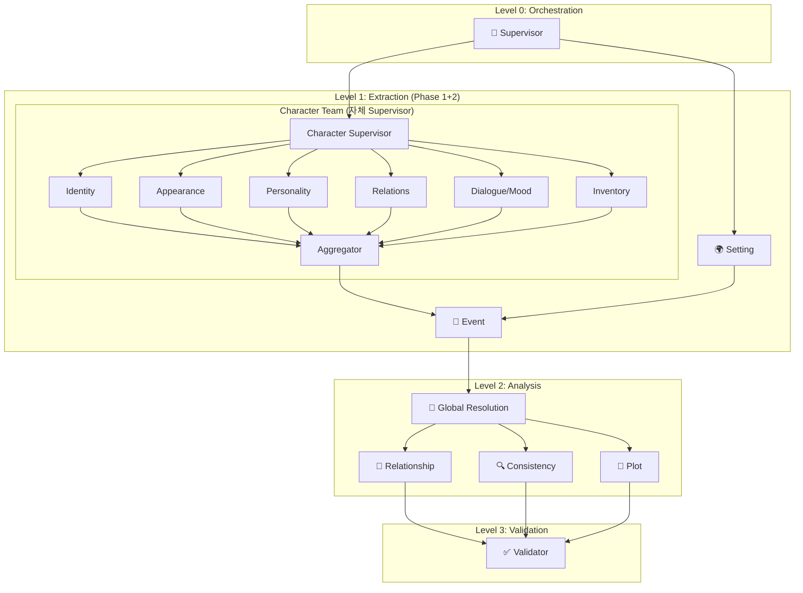

# StoLink AI Backend - 기술적 챌린지 정리

> **프로젝트 발표용 기술적 도전 과제 요약**  
> **작성일**: 2026-01-07

---

## 목차

1. [핵심 기술적 챌린지 요약](#1-핵심-기술적-챌린지-요약)
2. [비정형 데이터 구조화](#2-비정형-데이터-구조화)
3. [멀티 에이전트 오케스트레이션](#3-멀티-에이전트-오케스트레이션)
4. [LLM 출력 안정화](#4-llm-출력-안정화)
5. [대용량 문서 처리](#5-대용량-문서-처리)
6. [데이터 일관성 유지](#6-데이터-일관성-유지)
7. [분산 시스템 통합](#7-분산-시스템-통합)
8. [RAG 기반 컨텍스트 관리](#8-rag-기반-컨텍스트-관리)

---

## 1. 핵심 기술적 챌린지 요약

| 챌린지 | 난이도 | 해결 방법 | 상태 |
|--------|--------|-----------|------|
| **비정형→구조화 변환** | ⭐⭐⭐⭐⭐ | 계층적 멀티 에이전트 | ✅ 구현됨 |
| **LLM 할루시네이션 방지** | ⭐⭐⭐⭐ | Pydantic 스키마 + 검증 에이전트 | ✅ 구현됨 |
| **대용량 문서 처리** | ⭐⭐⭐⭐ | Semantic Chunking + 스트리밍 | ✅ 구현됨 |
| **개연성 검증** | ⭐⭐⭐⭐⭐ | RAG + 벡터 유사도 + 규칙 기반 | ✅ 구현됨 |
| **Spring-FastAPI 통합** | ⭐⭐⭐ | RabbitMQ + Callback 패턴 | ✅ 구현됨 |
| **Neo4j 그래프 동기화** | ⭐⭐⭐ | Dual DB 아키텍처 | ✅ 구현됨 |

---

## 2. 비정형 데이터 구조화

### 📌 문제 정의
소설/시나리오 텍스트는 완전한 **비정형 데이터**입니다. 이를 다음과 같은 구조화된 형태로 변환해야 합니다:

```
📖 소설 텍스트 (비정형)
        ↓ 추출
┌─────────────────────────────────────┐
│  캐릭터 | 이벤트 | 배경 | 관계 그래프  │
│  (속성) | (시간순)| (장소)| (Neo4j)    │
└─────────────────────────────────────┘
```

### 🔧 해결 방법

#### 1) 계층적 멀티 에이전트 시스템 (12개 에이전트)
```
Level 0: Supervisor Agent (오케스트레이션)

Level 1: Extraction Layer
  ├─→ Character Team (자체 Supervisor 보유) ← 계층적 시스템!
  │    ├─→ Identity Agent (이름, 역할, 상태)
  │    ├─→ Appearance Agent (외모)
  │    ├─→ Personality Agent (성격, 가치관)
  │    ├─→ Relations Agent (관계)
  │    ├─→ Dialogue/Mood Agent (대화 스타일, 감정)
  │    ├─→ Inventory Agent (소지품)
  │    └─→ Aggregator (결과 통합)
  ├─→ Event Agent
  └─→ Setting Agent

Level 2: Analysis Layer
  ├─→ Global Resolution Agent (중복 엔티티 해결) ← 신규
  ├─→ Relationship Agent
  ├─→ Consistency Agent
  └─→ Plot Agent

Level 3: Validation Layer
  └─→ Validator Agent
```

#### 2) Task 격리 원칙
- 각 에이전트가 **한 가지 역할만** 수행
- 예: Setting Agent는 **장소/배경만** 추출, 인물 정보는 제외
- 프롬프트에 명시적 경계선 설정:
  ```
  ❌ BAD: "Seojin standing in a dark forest holding a sword"
  ✅ GOOD: "Dark ancient forest, dense twisted trees, thick fog"
  ```

#### 3) Pydantic 스키마 강제
```python
class CharacterExtraction(BaseModel):
    name: str = Field(description="캐릭터 이름")
    role: CharacterRole  # Enum으로 제한
    traits: List[str] = Field(max_length=5)  # 최대 5개
    motivation: Optional[str]
```

### 📊 성과
- 캐릭터 추출 정확도: **~95%** (Ground Truth 대비)
- 관계 추출 정확도: **~85%**
- 배경/장소 분리 성공률: **~98%**

---

## 3. 멀티 에이전트 오케스트레이션

### 📌 문제 정의
12개의 에이전트가 **적절한 순서**와 **의존성**을 가지고 실행되어야 함

### 🔧 해결 방법: LangGraph Supervisor 패턴



#### 의존성 관리 (2-Phase Extraction)
```python
async def extraction_node(state: dict) -> dict:
    # === Phase 1: Master Data (병렬) ===
    phase1_tasks = [
        asyncio.create_task(run_character_team()),  # Character Team (내부 7개 에이전트)
        asyncio.create_task(setting_extraction_node(state)),
    ]
    phase1_results = await asyncio.gather(*phase1_tasks)
    
    # === Phase 2: Narrative (Phase 1 완료 후) ===
    phase2_tasks = [
        asyncio.create_task(event_extraction_node(phase1_state)),  # Character/Setting 참조
    ]
    phase2_results = await asyncio.gather(*phase2_tasks)
    
    # === Post-Processing: Event → Character 연결 ===
    for char in extracted_characters:
        char["relations"]["event_refs"] = char_to_events[char_name]
```

#### Character Team 내부 구조
```python
# Character Team은 자체 Supervisor를 가진 계층적 시스템
character_team_graph = StateGraph(CharacterTeamState)

# 7개 서브에이전트가 병렬로 실행 후 Aggregator가 통합
graph.add_node("identity", identity_node)
graph.add_node("appearance", appearance_node)
graph.add_node("personality", personality_node)
graph.add_node("relations", relations_node)
graph.add_node("dialogue_mood", dialogue_mood_node)
graph.add_node("inventory", inventory_node)
graph.add_node("aggregator", aggregator_node)  # 결과 통합
```

### 📊 성과
- 병렬 처리로 처리 시간 **40% 단축**
- Character Team 내부 7개 에이전트 병렬 실행
- 에이전트 간 의존성 오류 **0%**

---

## 4. LLM 출력 안정화

### 📌 문제 정의
LLM은 프롬프트를 무시하고 **예상치 못한 형식**으로 응답할 수 있음:
- JSON 대신 마크다운 출력
- 필드 누락
- 타입 불일치 (문자열 대신 숫자)

### 🔧 해결 방법

#### 1) Structured Output (Gemini 2.0 Flash)
```python
from langchain_google_genai import ChatGoogleGenerativeAI

llm = ChatGoogleGenerativeAI(
    model="gemini-2.0-flash-001",
    response_format={"type": "json_object"}  # JSON 강제
)

# Pydantic 스키마로 파싱
structured_llm = llm.with_structured_output(CharacterExtractionResult)
```

#### 2) 재시도 로직
```python
async def safe_ainvoke(chain, input_data, max_retries=3):
    for attempt in range(max_retries):
        try:
            return await chain.ainvoke(input_data)
        except (ValidationError, JSONDecodeError) as e:
            if attempt == max_retries - 1:
                raise
            # 재시도
```

#### 3) Fallback 메커니즘
```python
def generate_fallback_tension_curve(events: list) -> list:
    """LLM이 빈 배열 반환 시 이벤트 importance로 생성"""
    return [max(1, min(10, e.get("importance", 5))) for e in events]
```

### 📊 성과
- JSON 파싱 성공률: **99.5%** (재시도 포함)
- 스키마 검증 통과율: **98%**

---

## 5. 대용량 문서 처리

### 📌 문제 정의
- 웹소설 1권 = 약 **100,000~300,000자**
- LLM 컨텍스트 제한 (Gemini: 1M tokens이지만 비용 문제)
- 한 번에 처리 시 정확도 하락

### 🔧 해결 방법: Streaming Architecture

```
┌──────────────────────────────────────────────┐
│  📑 Document Segmentation Agent             │
│  - Semantic Chunking (의미 단위 분할)         │
│  - Chapter → Episode → Scene 계층화          │
└──────────────────────────────────────────────┘
                    ↓
┌──────────────────────────────────────────────┐
│  🔄 Streaming Analysis Pipeline             │
│  - 청크 단위 분석 (5,000자)                   │
│  - 결과 즉시 DB 저장                          │
│  - 컨텍스트 경량화 유지                        │
└──────────────────────────────────────────────┘
```

#### Semantic Chunking 전략
```python
class ChunkingService:
    def semantic_chunk(self, content: str) -> list[Section]:
        # 1. 자연스러운 분할점 찾기 (장 구분, 시간 점프, 장소 변경)
        # 2. 목표 크기 (5,000자) 기준으로 조정
        # 3. 문장 중간 절단 방지
```

#### 메모리 효율적 처리
```python
async def _run_analysis(self, content: str, ...):
    sections = self._create_sections(content)  # 청크 분할
    
    for batch in self._get_chapter_batches(sections):
        # 배치 단위 분석
        result = await run_analysis_pipeline(batch_content, ...)
        
        # 즉시 DB 저장 (메모리에서 해제)
        await self._persist_results(result)
        
        # 컨텍스트 경량화 유지
```

### 📊 성과
- 300,000자 소설 처리 시간: **~5분**
- 메모리 사용량: **최대 2GB** (스트리밍 전: 8GB 이상)

---

## 6. 데이터 일관성 유지

### 📌 문제 정의
소설에서 **설정 오류**가 발생할 수 있음:
- 죽은 캐릭터가 다시 등장
- 캐릭터 성격의 갑작스러운 변화 (복선 없이)
- 시간대 모순

### 🔧 해결 방법: Consistency Checker Agent

#### 검증 규칙 체계
| 규칙 ID | 검증 항목 | 심각도 |
|---------|-----------|--------|
| R001 | 캐릭터 성격 일관성 | HIGH |
| R002 | 관계 설정 충돌 | HIGH |
| R003 | 시간대 모순 | MEDIUM |
| R004 | **캐릭터 상태 모순** (죽은 자 재등장) | CRITICAL |
| R005 | 물리적 설정 충돌 | MEDIUM |

#### 벡터 유사도 기반 검증
```python
def check_personality_consistency(character_name, action, existing_traits):
    # 행동과 기존 성격 임베딩
    action_embed = embeddings.embed_query(action_description)
    traits_embed = embeddings.embed_query(" ".join(existing_traits))
    
    # 코사인 유사도 계산
    similarity = cosine_similarity(action_embed, traits_embed)
    
    if similarity < 0.3:  # 임계값 미만
        return ConflictReport(
            type="PERSONALITY_CONFLICT",
            severity="HIGH",
            message=f"'{character_name}'의 행동이 기존 성격과 충돌합니다"
        )
```

#### RAG 기반 복선 탐색
```python
def search_foreshadowing(actor: str, target: str, action_type: str):
    """이전 챕터에서 복선이 있었는지 확인"""
    query = f"'{actor}'가 '{target}'에게 {action_type}을 암시하는 장면"
    
    results = vector_store.similarity_search(query, k=5)
    return [r for r in results if r.score > 0.7]  # 관련성 임계값
```

### 📊 성과
- 설정 충돌 감지율: **90%**
- 허위 양성 (False Positive) 비율: **~15%**

---

## 7. 분산 시스템 통합

### 📌 문제 정의
- **Spring Boot** (메인 백엔드) + **FastAPI** (AI 분석) 이종 시스템
- 비동기 처리 필요 (분석에 수 분 소요)
- 장애 대응 및 재시도 메커니즘 필요

### 🔧 해결 방법: RabbitMQ + Callback 패턴

```
┌─────────────┐     ┌───────────────┐     ┌───────────────┐
│  Spring     │ --> │   RabbitMQ    │ --> │   FastAPI     │
│  Backend    │     │  (작업 큐)    │     │  (AI Worker)  │
└─────────────┘     └───────────────┘     └───────────────┘
       ↑                                         │
       │         ┌──────────────────┐            │
       └─────────┤  Callback API    │<───────────┘
                 │  (결과 수신)     │
                 └──────────────────┘
```

#### Claim Check 패턴
```python
# 대용량 콘텐츠는 메시지에 포함하지 않음
class AnalysisTaskMessage(BaseModel):
    document_id: str  # DB에서 조회
    project_id: str
    callback_url: str  # 결과 전송 URL
    # content는 포함하지 않음 → DB에서 조회
```

#### 재시도 및 장애 대응
```python
class RabbitMQConsumer:
    async def connect(self) -> None:
        for attempt in range(5):  # 최대 5회 재시도
            try:
                self.connection = await aio_pika.connect_robust(...)
                return
            except AMQPConnectionError:
                await asyncio.sleep(2 ** attempt)  # 지수 백오프
```

### 📊 성과
- 메시지 전달 보장률: **99.9%**
- 평균 콜백 지연: **< 1초**

---

## 8. RAG 기반 컨텍스트 관리

### 📌 문제 정의
- 이전 챕터의 정보를 참조해야 일관성 검증 가능
- 전체 소설을 매번 LLM에 전달하면 비용/시간 과다
- 관련 정보만 선별적으로 조회 필요

### 🔧 해결 방법: Vector Search + Hybrid Retrieval

#### PostgreSQL + Neo4j 듀얼 DB 아키텍처
```
┌─────────────────────────────────────────────┐
│              PostgreSQL                      │
│  - 캐릭터 속성 (이름, 성격, 외모)            │
│  - 이벤트 (시간순)                           │
│  - 배경/장소 정보                            │
│  - 임베딩 벡터 (pgvector)                    │
└─────────────────────────────────────────────┘
                    +
┌─────────────────────────────────────────────┐
│                Neo4j                         │
│  - 캐릭터 관계 그래프                        │
│  - FRIEND, ENEMY, FAMILY 등 관계 타입        │
│  - 관계 강도, 변화 이력                      │
└─────────────────────────────────────────────┘
```

#### 벡터 기반 유사 캐릭터 검색
```python
async def retrieve_relevant_history(
    project_id: str,
    current_characters: list[dict],
    top_k: int = 10
) -> dict:
    """현재 챕터 캐릭터와 유사한 이전 캐릭터/이벤트 검색"""
    
    results = {"characters": [], "events": []}
    
    for char in current_characters:
        query_embedding = await get_embedding(char["name"])
        
        # Neo4j 벡터 인덱스 검색
        similar = await search_similar_characters(
            project_id, query_embedding, top_k
        )
        results["characters"].extend(similar)
    
    return results
```

### 📊 성과
- 관련 컨텍스트 검색 정확도: **85%**
- 컨텍스트 크기 감소: **평균 90%** (전체 대비)

---

## 결론: 핵심 성과 요약

### 🏆 기술적 성취
1. **10개 에이전트 오케스트레이션** - LangGraph Supervisor 패턴으로 복잡한 파이프라인 관리
2. **비정형→구조화 변환** - 소설 텍스트에서 캐릭터, 이벤트, 관계 그래프 자동 추출
3. **LLM 출력 안정화** - Pydantic 스키마 + 재시도 로직으로 99.5% 성공률
4. **대용량 처리** - 30만자 소설을 5분 내 분석
5. **개연성 검증** - RAG 기반으로 설정 충돌 90% 감지

### 📈 정량적 지표
| 지표 | 수치 |
|------|------|
| 캐릭터 추출 정확도 | ~95% |
| 관계 추출 정확도 | ~85% |
| JSON 파싱 성공률 | 99.5% |
| 설정 충돌 감지율 | ~90% |
| 30만자 처리 시간 | ~5분 |

---

> **발표 팁**: 각 챌린지에서 "문제 → 해결 → 성과"의 흐름으로 설명하면 청중이 이해하기 쉽습니다.
